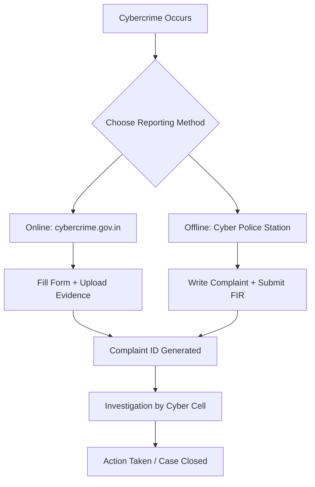

# Unit - 3

## Cyber Crimes
- Types fo Cyber Crimes
- Cyber Crimes targeting Computer systems Mobiles
- Data diddling attacks
- Spyware
- Logic bombs
- Data breach
- Online scams and frauds
- Darknet
- Illegal trades
- Drug trafficking
- Human trafficking
- Social media Scams & Frauds
- Impersonation
- Identity theft
- Job scams
- Misinforamtion
- Fake news cyber crime against persons
- Cyber gromming
- Child pornography
- Cyber Staking
- Social Engineering attacks
- Cyber Police Stations
- Crime reporting procedure
- Case Studies
- Attack on IoT devices
- Attacks on Mailchimp

- Exercises:
    - Reporting phishing emails.
    - Demonstration of email phishing attack and preventive measures.

---
---

# 🧠 **Cyber Crimes**

## 🔍 **Introduction**

A **cybercrime** is any criminal activity that involves a **computer, network, or digital device** as the **target**, **tool**, or **environment** of the crime.

Cybercrimes can:

* Steal or destroy information.
* Disrupt services.
* Exploit personal data or cause financial damage.
* Harm individuals, organizations, or governments.

---

## 🧩 **Classification of Cyber Crimes**

Cybercrimes can be broadly classified into **three major categories**:

| Category                                   | Description                                                              | Example                                      |
| ------------------------------------------ | ------------------------------------------------------------------------ | -------------------------------------------- |
| **1. Crimes Against Individuals**          | Directly target a person’s identity, data, or reputation.                | Identity theft, cyberstalking, cyberbullying |
| **2. Crimes Against Property**             | Target data, digital assets, or systems of organizations or individuals. | Hacking, ransomware, phishing                |
| **3. Crimes Against Government / Society** | Attack government networks or cause social/political unrest.             | Cyber terrorism, misinformation campaigns    |

---

## 💻 **1. Crimes Against Individuals**

These crimes harm or exploit individual users through manipulation, theft, or harassment.

| Type                 | Description                                                                  | Example                                        |
| -------------------- | ---------------------------------------------------------------------------- | ---------------------------------------------- |
| **Identity Theft**   | Stealing someone’s personal details (like Aadhar, PAN, bank info) for fraud. | Using stolen credit card for online purchases. |
| **Cyberstalking**    | Harassing someone online repeatedly, often with threats.                     | Sending threatening messages on social media.  |
| **Phishing & Fraud** | Deceptive emails or websites to steal credentials.                           | Fake bank login pages.                         |
| **Cyberbullying**    | Sending abusive or humiliating messages online.                              | Posting false rumors about someone.            |
| **Online Scams**     | Fraudulent online sales, job scams, or lottery scams.                        | Fake job offer demanding “security deposit.”   |

---

## 🏢 **2. Crimes Against Property**

These target organizations, companies, or digital infrastructures.

| Type                             | Description                                               | Example                                               |
| -------------------------------- | --------------------------------------------------------- | ----------------------------------------------------- |
| **Hacking**                      | Unauthorized access to systems or data.                   | Exploiting weak passwords to enter a database.        |
| **Ransomware**                   | Encrypting files and demanding payment to unlock them.    | WannaCry, Petya attacks.                              |
| **Denial of Service (DoS/DDoS)** | Overloading a server or network to make it unavailable.   | Flooding a website with fake traffic.                 |
| **Malware Infections**           | Installing malicious software like Trojans or spyware.    | Keyloggers stealing credentials.                      |
| **Data Diddling**                | Altering data before or during entry into a system.       | Modifying accounting entries in a database.           |
| **Logic Bombs**                  | Malicious code triggered by a specific condition or date. | Code that deletes files when employee leaves company. |

---

## 🏛️ **3. Crimes Against Government or Society**

These target government systems, national infrastructure, or social stability.

| Type                           | Description                                           | Example                                                        |
| ------------------------------ | ----------------------------------------------------- | -------------------------------------------------------------- |
| **Cyber Terrorism**            | Attacking systems to cause fear or disruption.        | Disabling power grids or hospital systems.                     |
| **Espionage**                  | Spying to steal state or defense secrets.             | APT (Advanced Persistent Threat) attacks on military networks. |
| **Hacktivism**                 | Hacking for political or ideological purposes.        | Anonymous defacing government websites.                        |
| **Misinformation & Fake News** | Spreading false content to manipulate public opinion. | False election results or communal rumors.                     |
| **Cyberwarfare**               | State-sponsored cyber attacks between countries.      | Attacks on Ukraine’s power grid (by Russia-linked actors).     |

---

## 🌐 **4. Emerging Forms of Cyber Crime**

Modern technologies have created **new types of cybercrimes** beyond traditional hacking.

| Emerging Crime            | Description                                           | Example                                         |
| ------------------------- | ----------------------------------------------------- | ----------------------------------------------- |
| **Cryptocurrency Crimes** | Fraud, theft, or money laundering via crypto.         | Fake Bitcoin investment platforms.              |
| **Deepfake Attacks**      | Using AI-generated videos/images for manipulation.    | Fake political speech videos.                   |
| **IoT Attacks**           | Exploiting smart devices like CCTV, routers.          | Botnets using IoT cameras (e.g., Mirai botnet). |
| **Cyber Grooming**        | Predators befriending minors online for exploitation. | Adults posing as teens on social media.         |
| **Cyber Trafficking**     | Illegal trade via dark web.                           | Drug or human trafficking using cryptocurrency. |

---

## 🔒 **5. Common Tools Used in Cyber Crimes**

| Tool Type             | Used For                         | Example Tools            |
| --------------------- | -------------------------------- | ------------------------ |
| **Phishing Kits**     | Fake login pages                 | BlackEye, Evilginx       |
| **Malware Builders**  | Create custom Trojans            | SpyNote, DarkComet       |
| **Password Crackers** | Steal or brute-force credentials | John the Ripper, Hashcat |
| **Network Sniffers**  | Capture traffic                  | Wireshark, Ettercap      |
| **Anonymity Tools**   | Hide attacker identity           | Tor, VPN, Proxychains    |

---

## 🧠 **Diagram – Classification of Cyber Crimes**

```
                 ┌────────────────────────┐
                 │      Cyber Crimes      │
                 └────────────┬───────────┘
                              │
    ┌─────────────────────────┼───────────────────────────┐
    │                         │                           │
Crimes Against           Crimes Against            Crimes Against
 Individuals               Property                  Government
(e.g. identity theft)   (e.g. hacking, DDoS)     (e.g. cyber terrorism)
```

---

## ⚖️ **6. Real-World Case Studies**

| Case                           | Description                                                                       | Type                                       |
| ------------------------------ | --------------------------------------------------------------------------------- | ------------------------------------------ |
| **WannaCry (2017)**            | Ransomware attack affecting 150+ countries, exploiting Windows SMB vulnerability. | Cybercrime against property                |
| **Cambridge Analytica (2018)** | Misuse of Facebook data to influence elections.                                   | Crime against society                      |
| **Stuxnet (2010)**             | U.S.-Israel cyberweapon targeting Iran’s nuclear program.                         | Cyberwarfare                               |
| **Mirai Botnet (2016)**        | Exploited IoT devices to cause global DDoS.                                       | IoT attack                                 |
| **Colonial Pipeline (2021)**   | Ransomware attack disrupting U.S. fuel supply chain.                              | Cybercrime against critical infrastructure |

---

## ✅ **Summary Table**

| Category            | Target        | Example                | Impact                       |
| ------------------- | ------------- | ---------------------- | ---------------------------- |
| Against Individuals | People        | Identity Theft         | Financial & emotional damage |
| Against Property    | Organizations | Ransomware             | Financial loss, downtime     |
| Against Government  | State Systems | Cyber Terrorism        | National security threat     |
| Emerging Crimes     | Tech Systems  | Deepfakes, IoT Attacks | Manipulation, espionage      |

---

## 🧩 **Key Takeaway**

> Cybercrime is no longer limited to hacking computers — it now encompasses everything from **financial frauds and ransomware** to **AI-based misinformation and national-level cyberwarfare**.
> Understanding these categories helps cybersecurity professionals design better **defense, detection, and response** strategies.

---

# 🧠 **Cyber Crimes Targeting Computer Systems and Mobiles**

---

## 🌐 **1. Introduction**

Computers and mobile devices are now the **primary entry points** for attackers because they:

* Store personal and financial data.
* Are connected to the internet 24×7.
* Run vulnerable software or apps.
* Often lack strong security controls.

Hence, cybercriminals target these systems to **steal data**, **gain unauthorized access**, or **cause disruption**.

---

## 💻 **2. Cyber Crimes Targeting Computer Systems**

These crimes specifically exploit vulnerabilities in desktop computers, servers, or networks.

### 🔹 **2.1. Common Computer System Attacks**

| Attack Type                 | Description                                                    | Example                                                       |
| --------------------------- | -------------------------------------------------------------- | ------------------------------------------------------------- |
| **Hacking**                 | Unauthorized access to computer systems or data.               | Breaking into a company server to steal customer information. |
| **Malware Infection**       | Using malicious software to control or damage a system.        | Trojan horse sending system data to attacker.                 |
| **Ransomware**              | Encrypts system files and demands payment to unlock.           | WannaCry, Petya ransomware.                                   |
| **Data Diddling**           | Altering data during entry, processing, or transmission.       | Changing transaction values in accounting systems.            |
| **Logic Bombs**             | Malicious code that triggers at a specific condition or time.  | Code that deletes all records if an employee leaves.          |
| **Denial of Service (DoS)** | Flooding a network or service to make it unavailable.          | Overloading a web server with fake requests.                  |
| **SQL Injection**           | Injecting malicious queries into database-driven applications. | Attacker extracts database records from a vulnerable website. |
| **Keylogging**              | Recording keystrokes to capture passwords.                     | Installing keylogger software on office computers.            |

---

### ⚙️ **2.2. How Computer Attacks Work (Simplified Diagram)**

```
User → (opens phishing email) 
          ↓
     Malware Installed
          ↓
Attacker gains remote access
          ↓
Steals / encrypts / modifies data
```

---

### 🔒 **2.3. Example Tools Used**

| Tool                     | Purpose                                  |
| ------------------------ | ---------------------------------------- |
| **Metasploit Framework** | Exploitation and penetration testing.    |
| **Nmap**                 | Scanning and mapping vulnerable systems. |
| **Wireshark**            | Packet sniffing to capture credentials.  |
| **John the Ripper**      | Password cracking.                       |
| **Mimikatz**             | Extracts stored Windows credentials.     |

---

### ⚠️ **2.4. Real Case Examples (Computer Crimes)**

| Case                    | Description                                                              | Target              | Year |
| ----------------------- | ------------------------------------------------------------------------ | ------------------- | ---- |
| **WannaCry Ransomware** | Exploited SMB vulnerability in Windows, affecting 200k systems globally. | Computers           | 2017 |
| **SolarWinds Attack**   | Supply-chain hack infecting U.S. government systems.                     | Corporate servers   | 2020 |
| **NotPetya**            | Destructive ransomware attack disguised as update.                       | Enterprise networks | 2017 |

---

## 📱 **3. Cyber Crimes Targeting Mobile Devices**

Mobile phones have become **mini-computers**, holding sensitive data such as:

* Banking credentials
* Location history
* Personal photos and messages

This makes them **high-value targets** for cybercriminals.

---

### 🔹 **3.1. Common Mobile-Based Attacks**

| Attack Type               | Description                                                      | Example                                     |
| ------------------------- | ---------------------------------------------------------------- | ------------------------------------------- |
| **Mobile Malware**        | Apps with malicious code that steal data or track activity.      | Joker malware (on Android Play Store).      |
| **Spyware / Stalkerware** | Monitors calls, messages, GPS location.                          | Pegasus spyware targeting journalists.      |
| **SIM Swapping**          | Social engineering trick to gain control of a victim’s SIM card. | Attacker receives OTP meant for victim.     |
| **Phishing (Smishing)**   | Fraudulent SMS messages with malicious links.                    | Fake SMS from “bank” asking for KYC update. |
| **App Cloning**           | Fake versions of popular apps with malware.                      | Fake WhatsApp clones spreading Trojans.     |
| **Public Wi-Fi Attacks**  | Capturing data sent over unsecured Wi-Fi.                        | Using fake “Free Airport Wi-Fi” hotspots.   |
| **Bluetooth Exploits**    | Using Bluetooth to inject malware or steal data.                 | BlueBorne vulnerability attacks.            |
| **Cryptojacking**         | Using mobile CPU to mine cryptocurrency secretly.                | Hidden mining apps draining battery.        |

---

### 🔒 **3.2. How Mobile Attacks Work**

```
User → Installs infected app
          ↓
Malware requests permissions (camera, mic, contacts)
          ↓
Attacker gains data access & remote control
```

---

### ⚙️ **3.3. Example Tools for Mobile Exploitation**

| Tool            | Platform | Description                                                     |
| --------------- | -------- | --------------------------------------------------------------- |
| **AndroRAT**    | Android  | Remote Administration Tool for Android devices.                 |
| **ZAnti**       | Android  | Network penetration testing tool.                               |
| **Drozer**      | Android  | Tests security of Android apps.                                 |
| **iRET / iSpy** | iOS      | Security testing and reverse engineering tools for iPhone apps. |

---

### ⚠️ **3.4. Real Case Examples (Mobile Crimes)**

| Case                | Description                                                      | Platform    | Year      |
| ------------------- | ---------------------------------------------------------------- | ----------- | --------- |
| **Pegasus Spyware** | NSO Group’s spyware used to target activists and journalists.    | Android/iOS | 2019–2021 |
| **Joker Malware**   | Infected 1,700+ Android apps, stole SMS and billing info.        | Android     | 2020      |
| **Flubot**          | Spread via SMS links, stealing banking credentials.              | Android     | 2021      |
| **XcodeGhost**      | Injected malicious code into iOS apps distributed via App Store. | iOS         | 2015      |

---

## 🧰 **4. Comparison: Computer vs Mobile Cyber Crimes**

| Aspect                   | Computer System                         | Mobile Device                   |
| ------------------------ | --------------------------------------- | ------------------------------- |
| **Attack Entry Point**   | Email, network ports, outdated software | Apps, SMS, Wi-Fi, Bluetooth     |
| **Common Attacks**       | Ransomware, data breaches, DoS          | Spyware, phishing, SIM swap     |
| **Detection Difficulty** | Easier (antivirus, logs)                | Harder (closed OS, hidden apps) |
| **User Awareness**       | Moderate                                | Low (users install random apps) |
| **Impact**               | Financial and operational               | Financial and privacy-related   |

---

## 🧠 **5. Prevention Techniques**

| Threat Type             | Preventive Measure                                              |
| ----------------------- | --------------------------------------------------------------- |
| **Malware/Ransomware**  | Use antivirus and update OS regularly.                          |
| **Phishing**            | Don’t click on suspicious links.                                |
| **Unauthorized Access** | Use strong passwords & MFA.                                     |
| **Spyware**             | Restrict app permissions and install only from official stores. |
| **SIM Swap**            | Use PIN lock for SIM and contact carrier for alerts.            |
| **Wi-Fi Attacks**       | Avoid public Wi-Fi or use VPN.                                  |

---

## 🧩 **6. Diagram – Cyber Attacks on Systems vs Mobiles**

```
        ┌──────────────────────────────┐
        │     Cyber Attacks Target     │
        └────────────┬─────────────────┘
                     │
     ┌───────────────┴───────────────┐
     │                               │
 ┌───────────────┐             ┌───────────────┐
 │ Computer      │             │ Mobile        │
 │ Systems       │             │ Devices       │
 └───────────────┘             └───────────────┘
 │ Hacking       │             │ Spyware       │
 │ Ransomware    │             │ Phishing SMS  │
 │ Data Diddling │             │ SIM Swapping  │
 │ DoS Attacks   │             │ App Cloning   │
 └───────────────┘             └───────────────┘
```

---

## ✅ **7. Summary**

| Point              | Description                                                                                          |
| ------------------ | ---------------------------------------------------------------------------------------------------- |
| **Focus**          | Cybercriminals target both computers and mobiles for financial, espionage, and surveillance motives. |
| **Common Attacks** | Malware, ransomware, spyware, phishing, SIM swap, data theft.                                        |
| **Protection**     | Use updated security software, avoid suspicious links/apps, enable encryption and MFA.               |

---

## 🧠 **Key Takeaway**

> Both **computers** and **mobiles** have become gateways to digital life — compromising them gives attackers full control over our personal, financial, and organizational data.
> Hence, **endpoint protection** and **user awareness** are crucial defenses.

---

# 🧠 **Topic: Data Diddling Attacks**

#### 📘 **Definition**

A **Data Diddling Attack** is a **cybercrime** in which data is **altered, modified, or manipulated before or during input into a computer system**, and then **changed back to its original form after processing** to avoid detection.
It’s one of the oldest forms of cyber attacks, often done by insiders who have access to the system.

---

#### ⚙️ **How It Works**

1. **Input Phase:**
   The attacker modifies the input data before it enters the system.
   Example: Changing “Salary = ₹50,000” to “₹80,000”.

2. **Processing Phase:**
   The system processes the tampered data normally, unaware of the change.

3. **Output Phase:**
   The attacker may change the data back to the original value to hide evidence.

4. **Result:**
   The attacker benefits from the **altered outcome**, such as unauthorized fund transfers, incorrect reports, or manipulated results.

---

#### 💻 **Common Targets**

* **Banking systems** (to alter transaction amounts)
* **Accounting and payroll software**
* **Billing and invoicing systems**
* **Database input forms**
* **Data entry points** (forms, web apps, sensors)

---

#### 🧩 **Example**

A payroll clerk changes employee A’s salary from ₹30,000 to ₹50,000 before payroll processing, and after the payment is done, changes it back to ₹30,000 to avoid suspicion.

---

#### 🚨 **Consequences**

* Financial losses
* Falsified records and reports
* Damage to organizational reputation
* Legal and regulatory penalties
* Compromised data integrity

---

#### 🛡️ **Prevention and Protection**

1. **Input Validation:**
   Check all user input for correctness and format.
2. **Access Control:**
   Restrict who can modify or enter data.
3. **Audit Trails:**
   Maintain logs of all data changes.
4. **Checksums and Hashing:**
   Detect unauthorized data modification.
5. **Encryption:**
   Protect data during transmission and storage.
6. **User Authentication:**
   Ensure only authorized personnel access sensitive systems.

---

#### 🧠 **Summary Table**

| Aspect         | Description                                  |
| -------------- | -------------------------------------------- |
| **Type**       | Insider or system-based cyber attack         |
| **Objective**  | Alter data for personal or financial gain    |
| **Detection**  | Difficult without audit logs                 |
| **Example**    | Changing financial records before processing |
| **Prevention** | Strong authentication, auditing, validation  |

---

# 🧠 **Topic: Spyware**

---

#### 📘 **Definition**

**Spyware** is a type of **malicious software (malware)** that **secretly monitors and collects user information** without their knowledge or consent.
It spies on the user's activities such as keystrokes, browsing habits, login credentials, and personal data, and then sends that information to an attacker.

---

#### ⚙️ **How Spyware Works**

1. **Infection:**

   * Comes bundled with free software downloads.
   * Enters through malicious email attachments or fake software updates.
   * May be installed through drive-by downloads (infected websites).

2. **Execution:**
   Once installed, it runs silently in the background without noticeable signs.

3. **Data Collection:**
   Gathers information such as:

   * Browsing history
   * Passwords and credit card details
   * Email and chat logs
   * System information

4. **Transmission:**
   Sends the collected data to a **remote attacker’s server**.

---

#### 🧩 **Common Types of Spyware**

| Type                         | Description                                                                |
| ---------------------------- | -------------------------------------------------------------------------- |
| **Keylogger**                | Records every keystroke typed by the user (useful for stealing passwords). |
| **Password Stealer**         | Extracts stored credentials from browsers or apps.                         |
| **Banking Trojan**           | Designed to capture online banking information.                            |
| **Adware (Spyware subtype)** | Tracks browsing habits to display targeted ads.                            |
| **System Monitor**           | Tracks all system activities, including screenshots and clipboard data.    |

---

#### 💻 **Examples of Spyware**

* **CoolWebSearch:** Redirects browsers to malicious websites.
* **FinFisher:** Used for government surveillance.
* **DarkComet RAT:** Gives remote access to attacker for spying.
* **SpySheriff:** Pretends to be an antivirus but steals data.

---

#### 🚨 **Effects of Spyware**

* Slows down system performance.
* Causes browser hijacking (redirects pages).
* Steals sensitive data (passwords, banking info).
* Violates user privacy.
* May install additional malware.

---

#### 🛡️ **Prevention and Protection**

1. **Install trusted antivirus/anti-spyware tools** (e.g., Malwarebytes, Windows Defender).
2. **Avoid clicking on suspicious links or ads.**
3. **Download software only from official sources.**
4. **Keep your OS and apps updated.**
5. **Use a firewall** to block unauthorized network traffic.
6. **Regularly monitor installed applications and browser extensions.**

---

#### 🧠 **Summary Table**

| Aspect          | Details                              |
| --------------- | ------------------------------------ |
| **Category**    | Malware                              |
| **Goal**        | Secretly collect user data           |
| **Spreads via** | Freeware, emails, fake downloads     |
| **Example**     | Keyloggers, Adware, Banking Trojans  |
| **Prevention**  | Antivirus, firewall, secure browsing |

---

# Logic bombs — what they are, how they work, and how to defend against them

---

## 1) Definition (short)

A **logic bomb** is malicious code intentionally placed inside a system that **executes a harmful action when a specific condition is met** — for example, on a certain date, when a user is deleted, when an account balance reaches X, or when a piece of software is uninstalled. It’s an attack that lies dormant until its trigger occurs.

---

## 2) Typical characteristics

* **Trigger-based:** executes only when preconditions occur (time, file change, system state).
* **Dormant period:** can sit undetected for long periods.
* **Targeted payload:** may delete files, corrupt databases, encrypt data, alter values, or disable services.
* **Often insider-enabled:** planted by someone with privileged access (developer, admin, contractor).
* **Hard to detect:** looks like legitimate code unless you know what to look for.

---

## 3) Real-world examples / case studies

* **Maroochy Shire sewage attack (2000):** a disgruntled contractor manipulated control systems causing sewage releases. Often cited as an example of malicious logic in OT systems (industrial control logic).
* **Stuxnet (2010):** not a simple logic bomb, but contained conditional triggers that only executed under very specific industrial conditions — a high-profile example of “payload activation” logic.
* **Insider sabotage cases (e.g., corporate incidents in 2000s):** employees and ex-employees have planted timed or state-based destructive code on enterprise systems (these incidents underline the insider risk).

(These are cited as high-level cases to illustrate effects; they are documented widely in public reporting and academic literature.)

---

## 4) Common triggers

* Specific **date/time** (e.g., at midnight on X date)
* Presence or absence of a **file** or **process**
* A particular **user action** (e.g., deleting an account)
* **Business-condition** (e.g., account balance falls below/above threshold)
* Detection of a **forensic tool** or debugging environment (self-destruct)

---

## 5) Typical payloads (harms caused)

* Data deletion or corruption
* Data tampering (e.g., changed financial records)
* Service disruption (stop processes, delete system binaries)
* Backdoor activation or enabling remote access
* Triggering ransomware or wiping backups

---

## 6) How to detect logic bombs (practical approaches)

* **Code review / secure development lifecycle (S-SDLC):** mandatory peer review and approvals for changes to production code.
* **Version control & signed releases:** require all production code to come from tracked VCS branches and signed build artifacts.
* **File integrity monitoring (FIM):** tools such as Tripwire, OSSEC, or AIDE to detect unexpected binary or script changes.
* **Host-based monitoring (HIDS):** watch for unusual process invocations, scheduled tasks, or one-off cron jobs.
* **SIEM alerting:** correlate unusual change events (new startup scripts, deleted files, new scheduled tasks) with user actions and source IPs.
* **Behavioral detection:** monitor for anomalous system calls, unexpected privilege-escalating actions, or irregular patterns (e.g., large deletes at odd hours).
* **Change control logs & build pipelines:** enforce that only authorized CI/CD pipelines deploy code to prod.
* **Static analysis / secret scanning:** static code analysis to flag hard-coded triggers, calendar-based logic, or hidden conditional branches.
* **Whitelisting & application allowlisting:** restrict what binaries/scripts may run on critical hosts.

---

## 7) How to prevent / harden systems

* **Least privilege:** admins/devs get only the minimum permissions required; separate duties (dev vs deploy; build vs run).
* **Separation of duties:** different people must approve, build, and deploy code to production.
* **Signed builds & reproducible builds:** only run artifacts signed by CI/CD and verifiable from source.
* **Strict change management:** require tickets, code review, automated tests, approvals, and deployment logs.
* **Immutable infrastructure:** replace servers with known-good images rather than patching in-place.
* **Regular backups + air-gapped copies:** ensure you can restore if a logic bomb destroys data.
* **Periodic audits:** scheduled and surprise audits of cron jobs, scheduled tasks, services, and startup scripts.
* **Disable dev tools in prod:** don’t leave compilers, debuggers, or scripting shells on critical production hosts.
* **Monitor for unusual time-based activity:** alert on large operations scheduled at non-business hours.

---

## 8) Forensics & incident response (if suspected)

* **Isolate affected hosts** (network isolation) to prevent spread or data exfiltration.
* **Preserve evidence:** snapshot disks, save memory images, preserve logs and build artifacts.
* **Timeline reconstruction:** identify when the malicious code was introduced, by whom, and through which pipeline.
* **Code provenance:** check VCS commits, CI logs, binary signatures, reviewer approvals.
* **Root cause:** determine trigger and payload logic to ensure remediation covers all variants.
* **Legal / HR:** coordinate with legal counsel and HR for insider investigations; engage law enforcement when appropriate.

---

## 9) Example detection queries / checks (safe, defensive)

* **Find recently modified executables / scripts** (Linux):

```bash
# list files changed in last 7 days under /usr/local/bin and /etc/cron*
find /usr/local/bin /etc/cron* -type f -mtime -7 -ls
```

* **Audit scheduled tasks** (crontab):

```bash
# list system crontabs and user crontabs
sudo ls -l /etc/cron* /var/spool/cron/crontabs
crontab -l -u someuser
```

* **Check suspicious startup units** (systemd):

```bash
sudo systemctl list-unit-files --state=enabled
sudo systemctl status suspicious.service
```

* **Compare binary hashes to known-good baselines** (example):

```bash
sha256sum /usr/local/bin/important_binary
# compare this to known-good value stored in your inventory
```

(These examples are defensive-only: to help you audit or detect changes.)

---

## 10) Risk assessment & governance considerations

* **Insider threat program:** background checks, monitoring, and rapid deprovisioning when employees leave.
* **Access reviews:** periodic attestation of who has admin/deployer rights.
* **SLAs for emergency response & backup restores** to reduce impact if an activation occurs.
* **Insurance / legal prep:** ensure incident response contracts and cyber insurance are in place.

---

## 11) Summary — quick checklist

* Enforce code reviews + signed CI/CD deployments ✅
* Implement FIM / HIDS / SIEM and baselines ✅
* Apply least privilege & separation of duties ✅
* Keep air-gapped backups and test restores regularly ✅
* Audit scheduled tasks/startup scripts frequently ✅
* Prepare IR plan for insider-triggered sabotage ✅

---

# 🔐 **Data Breach — Complete Guide**

---

## 1) Definition (short)

A **data breach** is an incident in which **sensitive, protected or confidential data** is **accessed, disclosed, stolen, or used** by an unauthorized actor. Data breaches can involve personal data, financial records, trade secrets, source code, credentials, or any information meant to be private.

---

## 2) Types of Data Breaches

* **Unauthorized access / Exfiltration** — attacker copies data out of systems (remote breach).
* **Accidental disclosure** — misconfigured cloud bucket, email sent to wrong recipient.
* **Insider breach** — employee or contractor intentionally or negligently leaks data.
* **Physical theft** — lost/stolen laptops, USB drives, backup tapes.
* **Third-party / supply chain breach** — vendor compromise exposes your data.
* **Privilege abuse** — valid credentials used maliciously.
* **Ransomware-driven breach** — extortion + data leak (attacker encrypts and threatens to publish data).

---

## 3) Typical Causes

* Unpatched vulnerabilities / zero-days
* Weak or stolen credentials (password reuse, no MFA)
* Misconfigured cloud storage (S3 buckets, Azure blobs)
* Phishing & social engineering
* Lack of network segmentation / flat networks
* Excessive privileges / poor IAM lifecycle
* Insufficient logging & monitoring
* Poor third-party risk management

---

## 4) Breach Lifecycle (high-level)

```
Reconnaissance → Initial Compromise → Escalation → Lateral Movement → Data Discovery → Exfiltration → Monetization / Disclosure
```

Each phase may take minutes to months (APTs).

---

## 5) Commonly Exfiltrated Data

* Personally Identifiable Information (PII): names, DOB, SSN/Aadhaar, addresses
* Financial data: card numbers, bank accounts
* Credentials: usernames/passwords, API keys, tokens
* Health records (PHI)
* Intellectual property / source code
* Customer lists and business contracts

---

## 6) Detection & Indicators of a Breach (what to watch for)

* Unusual outbound traffic spikes (to rare IPs or cloud storage).
* Unexpected data archive creation (tar/zip) and long-running uploads.
* Creation of new user accounts or privileged account changes.
* Multiple failed logins followed by success from foreign IPs.
* Alerts from EDR/AV (suspicious process spawning, LOLBAS).
* Discovery of known tool signatures (exfiltration tools, web shells).
* SIEM alerts about exfil patterns, unusual DNS queries, or data leakage rules.

---

## 7) Defensive Forensics & Investigation (examples — defensive only)

Use these to investigate suspected breach — do **not** run on a production system without approvals. Preserve evidence.

**Collect volatile data first (memory, network connections):**

```bash
# List established network connections
ss -tunap

# Show recent file changes
sudo find / -mount -mtime -1 -ls

# Check last logins
last -a

# Check scheduled tasks / cron entries
sudo crontab -l
sudo ls -l /etc/cron* /var/spool/cron

# Search for large archive files in home/www
sudo find / -type f -iname "*.zip" -o -iname "*.tar.gz" -size +10M -ls
```

**Log analysis (examples):**

```bash
# Failed SSH login attempts
sudo zgrep "Failed password" /var/log/auth*

# Web server access from suspicious IP
sudo awk '{print $1}' /var/log/nginx/access.log | sort | uniq -c | sort -nr | head

# Search logs for known exfil destination
sudo grep -R "s3.amazonaws.com/attacker-bucket" /var/log -n
```

**Preserve evidence:**

* Snapshot VM / take disk image (forensic copy).
* Export relevant logs (auth, web, firewall, proxy, DNS) with timestamps.
* Record timestamps, commands used, and chain-of-custody.

---

## 8) Immediate Incident Response — First 24 hours (playbook)

1. **Activate IR team & incident commander** (follow your IR plan).
2. **Triage & scope** — identify affected systems, data types, and initial impact.
3. **Contain** — isolate affected hosts or network segments (avoid wiping evidence).
4. **Preserve evidence** — take memory images, collect logs, snapshot disks.
5. **Eradicate** — remove malware/backdoor after evidence captured; patch exploited vulnerabilities.
6. **Recover** — restore systems from clean backups, validate integrity.
7. **Communicate** — internal stakeholders, legal, compliance, affected customers (see notification rules).
8. **Post-Incident** — root cause analysis, patch gaps, update controls, lessons learned.

---

## 9) Notification & Legal Considerations

* **Know applicable laws & timelines**: GDPR (data subject & supervisory authority notifications), local IT Act/regulations, HIPAA (health data), PCI-DSS obligations. Many jurisdictions require notification within defined windows (e.g., GDPR: 72 hours to supervisory authority).
* **Engage legal counsel** and data protection officer early.
* **Prepare breach notification** content: what happened, what data exposed, what you’re doing, and mitigation steps for affected parties.
* **Regulatory recordkeeping**: retain investigation logs, decisions, and evidence for audits.

> *Note:* exact legal timelines and fines depend on jurisdiction; follow your legal team and compliance frameworks.

---

## 10) Communication Templates (concise)

**Internal alert (to execs / board):**

* What happened (brief)
* Systems affected & scope (preliminary)
* Data types potentially exposed
* Immediate containment and next steps
* ETA for next update

**Customer notification (concise):**

* What occurred and timeframe
* Data elements potentially affected
* Actions you’ve taken and what customers should do (e.g., change passwords, watch for phishing)
* Contact info for questions & support

---

## 11) Remediation & Hardening (post-breach)

* Patch exploited CVEs and perform emergency patching for similar systems.
* Rotate credentials, revoke leaked keys/tokens, force password resets and re-issue credentials.
* Enforce MFA across privileged and user accounts.
* Harden configurations (disable unused ports/services; secure cloud storage).
* Improve network segmentation and zero-trust access controls.
* Deploy or improve DLP (Data Loss Prevention) to detect exfil attempts.
* Regular backups with air-gapped or immutable storage; verify restore processes.
* Improve monitoring: EDR, SIEM rules for exfil/abnormal activity, DNS monitoring.

---

## 12) Prevention Controls (technical & organizational)

**Technical**

* Strong IAM: principle of least privilege, role-based access, just-in-time privilege escalation
* Multi-Factor Authentication (MFA) everywhere
* Encryption at rest and in transit (TLS, disk encryption)
* DLP & outbound traffic monitoring
* EDR/AV & behavioral detection
* Network egress filtering and proxying
* Hardened, minimal images for servers (immutable infrastructure)

**Organizational**

* Security awareness training (phishing simulation)
* Clear third-party risk assessments and contractual security requirements
* Regular vulnerability scanning & patch management cadence
* Secure SDLC with code reviews/audits and secrets management (no hard-coded credentials)
* Incident response plan & tabletop exercises

---

## 13) Measurement & KPIs

* **Mean Time to Detect (MTTD)** — target: days → hours → minutes
* **Mean Time to Contain (MTTC)** — how quickly containment occurs
* **Mean Time to Recover (MTTR)** — restore operations from backup
* **Number of breached records** — monitor for trend reduction
* **Percentage of critical vulnerabilities patched within SLA**

---

## 14) Example Case Studies (short)

* **Equifax (2017)** — unpatched Apache Struts vulnerability led to massive PII exposure. Lesson: vulnerability management matters.
* **Capital One (2019)** — misconfigured cloud firewall and stolen credentials led to S3 data leak. Lesson: cloud config and IAM controls are critical.
* **Colonial Pipeline (2021)** — ransomware attack caused operational disruption and gasoline shortages; included data exfiltration threat. Lesson: OT/IT segmentation and backups essential.

---

## 15) Post-Incident: Lessons Learned & Reporting

* Conduct a **Post Incident Review (PIR)** with technical and business stakeholders.
* Update IR playbooks, patch management, monitoring rules, and user training based on findings.
* Implement continuous improvement and re-run tabletop exercises simulating similar breach scenarios.
* Report to regulators if required, and prepare publicly-acceptable disclosure statements.

---

## 16) Quick Printable Checklist (for immediate use)

**If you suspect a data breach:**

* [ ] Activate Incident Response team & ticket with timestamp
* [ ] Isolate affected hosts / network segment (avoid rebooting if memory capture needed)
* [ ] Collect volatile data (memory, process list, network connections)
* [ ] Gather logs — firewall, proxy, web, auth logs — for the relevant timeframe
* [ ] Snapshot disks / create forensic copies (preserve chain-of-custody)
* [ ] Disable compromised credentials & rotate secrets immediately
* [ ] Patch exploited vulnerabilities / revoke exposed keys
* [ ] Notify Legal & Compliance; check notification obligations & timelines
* [ ] Prepare customer/partner communication template (if required)
* [ ] Restore from verified backups and validate integrity before bringing online
* [ ] Perform root cause analysis and document lessons learned

---

## 17) Useful Defensive Commands (repeated, concise)

```bash
# Show network connections and processes
sudo ss -tunap

# List files modified in last 24 hours
sudo find / -mtime -1 -ls

# Check for large outgoing traffic by process (Linux)
sudo nethogs

# List recent auth failures
sudo zgrep "Failed password" /var/log/auth* | tail -n 100

# Find archives (possible exfil) >50MB
sudo find / -type f \( -iname "*.zip" -o -iname "*.tar.gz" \) -size +50M -ls
```

---

## 18) Final Summary (one-liner)

A **data breach** is a failure to keep sensitive data confidential or secure; prevention relies on strong identity controls, patching, monitoring, encryption, DLP, and well-rehearsed incident response — detection speed and remediation are what limit damage.

---

# 💻 **Online Scams and Frauds**

---

## 1) Introduction

**Online scams and frauds** are deceptive activities conducted through the internet with the **intention of stealing money, data, or identities** from victims.
These scams exploit **human trust**, **lack of awareness**, and **technological loopholes** to trick individuals or organizations into providing sensitive information or making financial transactions.

---

## 2) Definition

> **Online Scam/Fraud:**
> A fraudulent scheme performed over the internet to deceive victims for personal or financial gain using fake identities, false promises, or malicious digital tools.

---

## 3) Characteristics of Online Scams

| Characteristic         | Description                                                                  |
| ---------------------- | ---------------------------------------------------------------------------- |
| **Deception**          | The attacker pretends to be a legitimate entity (bank, government, company). |
| **Social Engineering** | Manipulation of human psychology rather than system hacking.                 |
| **Scalability**        | Can target thousands of victims at once via email, SMS, or ads.              |
| **Anonymity**          | Attackers hide behind fake accounts, VPNs, or Tor.                           |
| **Speed**              | Transactions happen instantly, often making recovery impossible.             |
| **Automation**         | Use of bots, fake websites, or scripts for mass attacks.                     |

---

## 4) Common Types of Online Scams & Frauds

### 📨 **1. Phishing**

* Fake emails or websites imitate legitimate organizations (banks, shopping sites).
* Goal: Steal login credentials, OTPs, or financial data.
* **Example:** Fake “Your account will be locked” email from a bank.

---

### 📱 **2. Smishing (SMS Phishing)**

* Fraudulent text messages with malicious links.
* **Example:** “Your parcel is on hold — click here to verify your address.”

---

### ☎️ **3. Vishing (Voice Phishing)**

* Attackers call pretending to be from a bank, IRS, or tech support.
* **Goal:** Convince victim to reveal OTPs, CVV, or install remote-access tools.

---

### 💸 **4. Advance-Fee Fraud**

* Victim is promised a large reward but must pay a small “processing fee” first.
* **Example:** Nigerian Prince scam, lottery scams, or fake job offers.

---

### 🛒 **5. E-Commerce Scams**

* Fake online shopping websites offering huge discounts.
* Victim pays, but never receives the product.
* Some sites also steal credit card details.

---

### 💰 **6. Investment & Crypto Scams**

* Fake investment platforms promising “guaranteed returns”.
* **Examples:** Ponzi schemes, fake trading apps, crypto rug-pulls.

---

### 🧠 **7. Tech Support Scams**

* Pop-ups claim “Your PC is infected! Call support now.”
* Victim gives remote access or pays fake service charges.

---

### ❤️ **8. Romance Scams**

* Criminals create fake profiles on dating apps/social media.
* Build emotional connection → ask for money, crypto, or personal data.

---

### 🏦 **9. Banking & Credit Card Fraud**

* Cloned banking apps, keyloggers, or phishing sites steal card details or UPI PINs.

---

### 📦 **10. Online Marketplace & Job Scams**

* Fake recruiters ask for “registration fees.”
* Fraudsters on OLX/Facebook Marketplace send fake UPI payment links.

---

### 🕵️ **11. Identity Theft**

* Using stolen PII (Aadhaar, PAN, passport) to open accounts or take loans.

---

### 🌐 **12. Fake News & Misinformation Scams**

* Used to manipulate public opinion or lure victims into fraudulent investments or political scams.

---

## 5) Stages of an Online Scam

| Stage                        | Description                                                           |
| ---------------------------- | --------------------------------------------------------------------- |
| **1. Target Identification** | Selecting individuals or groups (e.g., senior citizens, job seekers). |
| **2. Approach**              | Contact via email, SMS, social media, or call.                        |
| **3. Deception**             | Creating trust using fake profiles or websites.                       |
| **4. Action**                | Asking for money, credentials, or OTP.                                |
| **5. Exploitation**          | Stealing money/data, identity misuse.                                 |
| **6. Exit & Laundering**     | Using crypto, prepaid cards, or mule accounts to hide tracks.         |

---

## 6) Psychological Manipulation Techniques

| Technique     | Explanation                                 |
| ------------- | ------------------------------------------- |
| **Authority** | Pretend to be official (bank, police).      |
| **Urgency**   | “Act now or your account will be blocked!”  |
| **Fear**      | Threat of legal action, account suspension. |
| **Greed**     | “You’ve won ₹1,00,000!”                     |
| **Sympathy**  | “I need money for my mother’s operation.”   |
| **Curiosity** | “Check who viewed your profile.”            |

---

## 7) Case Studies

### 🧾 **Case 1: OLX Fraud (India)**

* Scammer pretended to be an army officer selling goods cheaply.
* Sent fake payment links via UPI.
* Victims lost money when clicking “request money” links.

### 🪙 **Case 2: Crypto Investment Scam**

* Fake trading apps promised daily 10% returns.
* Victims invested large sums; app vanished after few weeks.

### 🏦 **Case 3: Phishing Attack on a Bank**

* Attackers sent fake emails appearing as the bank’s official update.
* Thousands entered credentials; attackers withdrew funds via mule accounts.

---

## 8) Preventive Measures

### 👨‍💻 **Technical Measures**

* Use **spam filters** and **email authentication (SPF, DKIM, DMARC)**.
* Keep **antivirus, browsers, and OS updated**.
* Always **check URL** (https, padlock icon, domain spelling).
* Avoid clicking links in **unsolicited messages**.
* Use **two-factor authentication (2FA)**.
* Monitor bank accounts for unusual activity.
* Enable **transaction alerts (SMS/email)**.

---

### 🧠 **Awareness Measures**

* Never share OTPs or banking info with anyone.
* Verify job offers and e-commerce sites manually.
* Beware of deals that sound “too good to be true”.
* Educate family members (especially elders).
* Report scams to cybercrime portals.

---

## 9) Reporting & Legal Actions (India)

| Step                           | Details                                                                      |
| ------------------------------ | ---------------------------------------------------------------------------- |
| **Cybercrime Portal**          | [https://cybercrime.gov.in](https://cybercrime.gov.in) — register complaint. |
| **Helpline Number**            | `1930` — for financial frauds (works pan-India).                             |
| **Local Cyber Police Station** | Lodge FIR if money/data stolen.                                              |
| **Bank Coordination**          | Inform bank immediately to block account/card.                               |

---

## 10) Tools to Identify Scams (Defensive Use)

| Tool                     | Use                                           |
| ------------------------ | --------------------------------------------- |
| **VirusTotal**           | Check if a link or file is malicious.         |
| **Whois Lookup**         | Identify domain registration details.         |
| **ScamAdviser**          | Check website trust score.                    |
| **Google Safe Browsing** | Reports malicious URLs.                       |
| **Reverse Image Search** | Verify fake profile pictures (Romance scams). |

---

## 11) How Organizations Can Protect Themselves

* Conduct **Security Awareness Training** for employees.
* Implement **anti-phishing simulations**.
* Use **email gateways with phishing protection**.
* Maintain **incident response procedures** for scams targeting employees (CEO fraud, BEC).
* Perform **regular audits of payment workflows** to detect fraud.

---

## 12) Consequences of Online Scams

| Impact Type       | Example                                        |
| ----------------- | ---------------------------------------------- |
| **Financial**     | Money loss, card fraud, ransomware payment.    |
| **Reputational**  | Business trust loss, brand damage.             |
| **Legal**         | Penalties for data mishandling or breach.      |
| **Psychological** | Depression, anxiety, embarrassment in victims. |

---

## 13) Flow Diagram — Typical Online Scam

```
Victim Receives Message
        ↓
Trust Built (Social Engineering)
        ↓
Action Taken (Click/Payment)
        ↓
Data/Money Stolen
        ↓
Attacker Launders/Deletes Evidence
        ↓
Victim Reports (If Aware)
```

---

## 14) Summary

* Online scams rely more on **psychology than hacking**.
* Awareness, verification, and caution are your best defense.
* Always **pause before you pay or click**.
* Report every scam attempt — it helps cyber police identify larger fraud rings.

---

## 15) Quick Safety Checklist ✅

* [ ] Verify sender identity (email, phone, website).
* [ ] Never share OTPs, passwords, or CVVs.
* [ ] Check URLs — “https” and correct spelling.
* [ ] Don’t fall for urgency or fear tactics.
* [ ] Use MFA for all accounts.
* [ ] Educate friends and family.
* [ ] Report suspicious links or calls immediately.

---

# 🌑 Darknet — overview

**Darknet** = the portion of the internet that is *intentionally hidden* and accessible only with specialized software or configurations.
It is a subset of the **deep web** (content not indexed by search engines), but **not all deep web = darknet**. The darknet is specifically designed for anonymity.

---

## 🔎 Surface Web vs Deep Web vs Darknet (quick table)

| Layer           | What it contains                                          | How you reach it                                   | Indexed by search engines?  |
| --------------- | --------------------------------------------------------- | -------------------------------------------------- | --------------------------- |
| **Surface Web** | Public websites (news, Wikipedia, Google)                 | Regular browsers (Chrome/Firefox)                  | ✅ Yes                       |
| **Deep Web**    | Private/behind-auth pages (bank accounts, CRM, intranets) | Regular browsers + credentials                     | ❌ No                        |
| **Darknet**     | Hidden services, anonymous marketplaces, private forums   | Specialized anonymity networks (Tor, I2P, Freenet) | ❌ No — intentionally hidden |

---

## 🧩 How the Darknet is structured (high level)

* **Anonymity networks** (examples): **Tor**, **I2P**, **Freenet**.
* **Hidden services**: Sites whose addresses are not DNS names but special addresses (e.g., `.onion` for Tor).
* **No central index**: You don’t “search” the darknet the way you search the surface web; discovery is via links, directories, forums, or private invites.
* **Peer-to-peer & relays**: Traffic is routed through volunteer nodes/relays to conceal origin and destination.

(Again, this is conceptual — I won’t provide step-by-step access instructions.)

---

## ⚖️ Uses — legal and illegal

### Legal / legitimate uses

* **Whistleblowing platforms** (anonymity for sources).
* **Privacy-seeking journalism & research** (secure tips to reporters).
* **Circumventing censorship** (activists in repressive regimes).
* **Secure communications** for sensitive, legal purposes.

### Illegal / harmful uses (common)

* **Drug marketplaces** (buying/selling narcotics).
* **Weapons and contraband trade**.
* **Hacking tools, malware-as-a-service, stolen data markets** (credentials, databases).
* **Fraud & money-laundering services**.
* **Child sexual abuse content** and other violent criminal content (subject to law enforcement takedowns).
* **Fraudulent services** (scams, fake IDs).

> Real-world darknet activity mixes both legitimate privacy use and criminal marketplaces — the latter attract most media/LE attention.

---

## 🛠️ Common features of darknet marketplaces & forums (what makes them distinct)

* **Anonymity of buyers & sellers** (pseudonyms, escrow).
* **Cryptocurrency payments** (Bitcoin, Monero — often with laundering steps).
* **Escrow & reputation systems** to build trust among anonymous users.
* **Vendor feedback** and forums for dispute resolution.
* **Evolving opsec** — vendors and buyers use layered anonymization, VPNs, multisig, mixers (to obfuscate funds).

---

## ⚠️ Risks to users and organizations

**For individuals:**

* Scams, fraud, theft (vendors abscond with money).
* Malware and targeted attacks (downloads, links).
* Legal exposure — purchasing illegal items is prosecutable.

**For organizations:**

* **Data exposure**: Stolen credentials and company data sold on darknet markets.
* **Credential stuffing & fraud**: Leaked credentials lead to account takeover.
* **Reputational damage** if company data appears for sale.
* **Targeted threat intelligence**: adversaries may coordinate attacks or sell zero-days.

---

## 🔎 How defenders & investigators monitor the darknet (high-level, defensive)

* **Darknet OSINT / Threat Intel**: Security teams subscribe to monitored feeds or use commercial services that crawl and index darknet marketplaces and forums for indicators (leaked emails, credentials, database dumps).
* **Honeypots & sinkholes**: Deploy decoy assets to attract attackers and capture TTPs (tactics, techniques, procedures).
* **Data leak monitoring**: Watchlists for company domains, e-mails, or API keys appearing on darknet postings.
* **Law enforcement collaboration**: Police and CERTs coordinate takedowns and share intelligence.
* **Digital forensics**: Trace cryptocurrency flows, analyze posts for operational details, and map vendor reputations.

> Defensive teams focus on *indicators of compromise*, not on interacting with illegal services.

---

## 📚 Notable historical case studies (high level)

* **Silk Road (2011–2013)** — one of the first high-profile darknet marketplaces for drugs; founder Ross Ulbricht was arrested in 2013 after a multi-year investigation. The case highlighted how law enforcement can trace activity despite attempts at anonymity.
* **AlphaBay (2014–2017)** — large darknet market shut down in 2017 in an international takedown; demonstrated global cooperation between law enforcement agencies.
* **Playpen (2014)** — an illicit child sexual abuse site that law enforcement took over and ran for a limited time to identify visitors — an ethically controversial but legally sanctioned investigation technique in some jurisdictions.

(These are well-documented public cases; I’m summarizing them at a high level.)

---

## 🧾 Legal & ethical considerations

* **Accessing or purchasing illegal goods** on the darknet is a crime in many jurisdictions.
* **Possession of certain content (e.g., CSAM)** is a serious criminal offense; merely viewing may be illegal.
* **Law enforcement operations** sometimes engage with darknet content under strict legal frameworks — civilians should not attempt to replicate such activities.
* Academics or journalists wanting to study the darknet should use **institutional review boards**, legal counsel, and safe research practices.

---

## 🛡️ What organizations and individuals should do (practical, safe advice)

### For organizations

* **Monitor for data leaks**: use third-party darknet monitoring or threat-intel feeds to detect sales of corporate credentials or data.
* **Harden authentication**: enforce MFA, password hygiene, and rotation for all employees.
* **Segment networks** and enforce least privilege so that leaked credentials have limited value.
* **Incident readiness**: include darknet-related scenarios in tabletop exercises (e.g., customer data for sale).
* **Vendor risk management**: require suppliers to report breaches and rotate keys/credentials if compromise suspected.

### For individuals / students

* **Don’t attempt to buy or download anything illegal**.
* **Use strong, unique passwords + MFA** — leaked credentials are the most common commodity sold on darknet markets.
* **Be aware of scams & malware** — many darknet downloads contain malware.
* **If you discover your data for sale**, report it to your employer, bank, and local cybercrime authority; change passwords and monitor accounts.

---

## 🔐 Cryptocurrency & laundering (brief, high-level)

* Darknet markets historically used Bitcoin; over time, privacy coins (e.g., Monero) and mixing services became popular to obscure fund flows.
* Law enforcement has developed blockchain analytics to trace many flows; laundering is neither simple nor foolproof.

---

## 🔬 Research & academic interests

* The darknet is studied to understand **criminal markets, governance, pricing of stolen data, and how disclosure propagates**.
* Ethical research uses controlled methods (IRB, legal counsel) and focuses on *defensive outcomes*.

---

## ✅ Summary (tl;dr)

* **Darknet = intentionally hidden, anonymity-focused part of the internet** (subset of deep web).
* It hosts **both legitimate privacy tools and illegal marketplaces**; criminals sell drugs, data, malware, and stolen credentials.
* **Risks**: scams, malware, legal exposure, data leakage for individuals and organizations.
* **Defenders**: monitor for leaked data, harden authentication, cooperate with law enforcement, and use threat-intel feeds — but do **not** engage in illegal activity.
* **Historical takedowns (Silk Road, AlphaBay)** show the darknet is not immune to law enforcement.

---

# Illegal trades (on the darknet) — what they are, how they operate, risks, and how defenders & law enforcement respond

---

## 1) What “Illegal Trades” Means (short)

**Illegal trades** are commercial exchanges of goods or services that violate laws — commonly facilitated on darknet marketplaces, closed forums, or peer-to-peer channels. These trades often use anonymity tools (Tor, I2P), cryptocurrencies, and escrow/reputation mechanisms to reduce buyer/seller risk.

---

## 2) Common Categories of Illegal Trades

| Category                                    |                                                     What’s traded | Why it’s attractive to criminals                                 |
| ------------------------------------------- | ----------------------------------------------------------------: | ---------------------------------------------------------------- |
| **Drugs & controlled substances**           |      Narcotics, prescription drugs, novel psychoactive substances | High demand, profit margins, global buyers                       |
| **Weapons & explosives**                    |                        Guns, ammunition, explosives, weapon parts | Market for illegal weapon procurement (dangerous)                |
| **Stolen data**                             | Databases, credit-card dumps, login credentials, personal records | Enables fraud, identity theft, account takeover                  |
| **Counterfeit goods & documents**           |         Fake IDs, passports, diplomas, counterfeit brand products | Identity fraud, bypass KYC, resale                               |
| **Malware & hacking services**              |      Ransomware-as-a-service, zero-day exploits, botnets-for-hire | Monetize attacks; low-skill actors can rent services             |
| **Financial fraud goods**                   |                   Bank routing info, forged checks, carding tools | Direct monetary theft or laundering                              |
| **Illicit services**                        |  Hit-for-hire (threat), money mules, human smuggling coordination | Facilitate other crimes (very high risk)                         |
| **Human trafficking & sexual exploitation** |        Trafficking coordination, exploitative services (criminal) | Severe human-rights abuses — subject to law enforcement priority |

> Note: Some markets also sell “gray” items (e.g., forged academic certificates) that are illegal but not violent. All are criminal in most jurisdictions.

---

## 3) How These Trades Function — High-Level Mechanics

1. **Listing & Reputation**

   * Vendors list items with descriptions, price, shipping terms, or service terms.
   * Reputation systems (reviews/escrow) help buyers choose trusted vendors.

2. **Payment**

   * Mostly cryptocurrency (Bitcoin historically; privacy coins like Monero are common for opsec).
   * Mixers/tumbling or layering attempts to obfuscate fund provenance.

3. **Communication & Delivery**

   * Encrypted messaging (PGP) for negotiations and instructions.
   * Physical goods shipped via mail with obfuscation, or digital goods delivered via download links.
   * Services delivered remotely (e.g., malware, hacking).

4. **Escrow & Dispute Resolution**

   * Market provides escrow to hold funds until buyer confirms receipt.
   * Dispute processes and moderators exist to arbitrate fraud between anonymous parties.

5. **Operational Security (OpSec)**

   * Vendors/buyers use multiple pseudonyms, VPNs, Tor, and layered crypto conversions to hide identities.

---

## 4) Typical Risks and Harms

* **To buyers:** Scams (vendor disappears), malware infections, arrest/prosecution, receiving dangerous or adulterated goods (drugs/weapons).
* **To sellers:** Law enforcement infiltration, asset seizure, violent reprisals from competitors.
* **Societal harms:** Increased drug trafficking, violence, proliferation of weapons, large-scale identity theft, and exploitation (human trafficking, CSAM).
* **For organizations:** Stolen corporate data sold enabling fraud, insider threats, reputational & financial harm.

---

## 5) Indicators that an Organization’s Data Is Being Traded

* Mentions of company domain, employee emails, or internal dataset samples appearing in darknet chatter or dumps.
* Credential stuffing attacks or mass login attempts after a darknet listing.
* Sudden appearance of company data in paste sites or data-leak markets.

---

## 6) Law Enforcement & Investigation (defensive overview)

* **Undercover & traditional police work:** long-running investigations combine cyber forensics, undercover buys, and international cooperation.
* **Blockchain analysis:** tracing cryptocurrency flows can link transactions to exchanges and real-world identities (with KYC).
* **Takedowns:** coordinated seizures of servers, arrests, and marketplace closures (e.g., Silk Road, AlphaBay).
* **Prosecution:** often requires combining digital evidence (server logs, wallet links) with human intelligence (informants, money-mule networks).

> Defensive note: individuals and non-Law Enforcement actors should **not** attempt undercover interactions. Report sightings to CERTs, law enforcement, or your organization’s SOC.

---

## 7) How Organizations Should Respond & Protect Themselves

### Immediate actions if you detect your data for sale:

* **Contain & investigate:** identify impacted systems, scope the leak, preserve logs.
* **Rotate credentials & revoke exposed secrets:** API keys, certificates, passwords.
* **Notify incident response & legal:** follow IR playbook and legal reporting obligations.
* **Monitor for subsequent abuse:** watch for fraud patterns enabled by the leak.

### Proactive defenses:

* **Data minimization & encryption** — limit what can be leaked; encrypt data at rest & in transit.
* **Strong identity controls** — MFA, strong password policy, IAM reviews.
* **DLP (Data Loss Prevention)** — detect and block sensitive data exfil.
* **Darknet monitoring services** — subscribe to reputable threat-intel feeds that notify about leaked corp data.
* **Vendor & third-party risk management** — ensure suppliers protect your data.
* **Employee awareness & insider controls** — least privilege, logging, user behavior analytics.

---

## 8) Typical Examples / Case Studies (high-level)

* **Stolen Credit-Card Dumps:** marketplaces sell credit card dumps from breaches; buyers use them for fraud.
* **Database Sales:** full customer DBs (emails, SSNs, phone numbers) sold to spammers, fraudsters.
* **Malware Ransomware-as-a-Service (RaaS):** developers sell ransomware kits or affiliate programs to deploy ransomware widely.
* **Counterfeit Documents Market:** forged passports and IDs used to open bank accounts or bypass KYC, facilitating money laundering and trafficking.

(These are factual, public examples used in many academic and law-enforcement reports.)

---

## 9) Preventive & Policy Recommendations (for organizations & policymakers)

* **Legal & regulatory:** strengthen data breach notification laws, KYC controls on cryptocurrency exchanges, and international cooperation for darknet investigations.
* **Operational:** maintain asset inventories, patching discipline, and least-privilege access controls.
* **Financial controls:** AML/CFT (anti-money-laundering / counter-financing of terrorism) monitoring for crypto flows.
* **Public awareness:** educate users about scams, phishing, and the legal consequences of buying illegal goods.

---

## 10) Reporting Channels & How to Act (if you find illegal trades or your data for sale)

* **Your local law enforcement / cybercrime unit** (many countries have dedicated cybercrime cells).
* **National CERT / Computer Emergency Response Team** (for your country).
* **Platform abuse reports** (if data appears on indexed paste sites or forums).
* **Banks/payment providers** (if financial fraud is ongoing).
* **Specialized reporting portals** (e.g., in India — cybercrime portal; use local equivalents elsewhere).

---

## 11) Quick-reference Diagram (conceptual)

```
[Vendor] --lists--> [Darknet Market] --buyer pays (crypto)--> [Vendor]
     ↑                                              ↓
  Reputation, escrow, PGP                      Delivery (mail or digital)
     ↑                                              ↓
  Law enforcement infiltration, blockchain analysis, tips → Takedown/Arrest
```

---

## 12) Ethical and Safety Notes (important)

* I will **not** provide instructions for buying, shipping, or otherwise participating in illegal trades.
* If you are a student/researcher interested in studying darknet markets, do so under institutional review (IRB) and legal counsel — use passive, defensive OSINT and licensed threat-intel feeds rather than trying to interact directly.

---

# Drug trafficking — complete, defensive, non-actionable overview

Below is a focused, exam/lecture-ready treatment of **drug trafficking**: definitions, actors, supply chains, darknet role, routes & methods (high-level), harms, laws (including Indian law), detection & investigative approaches (defensive & lawful only), prevention & public-health responses, and short case studies. I intentionally avoid any procedural instructions that could enable criminal activity.

---

## 1) Definition (short)

**Drug trafficking** is the production, transportation, distribution, sale or supply of illegal drugs (controlled substances) across local, national or international borders. It includes the entire value chain from cultivation/manufacture → wholesale distribution → retail sale to consumers.

---

## 2) Common substances involved

* **Illicit drugs:** heroin, cocaine, methamphetamine, MDMA (ecstasy), LSD.
* **Prescription/drug-of-abuse diversion:** fentanyl, oxycodone, benzodiazepines.
* **New psychoactive substances (NPS):** designer synthetics that mimic traditional drugs.
* **Cannabis** (varies by jurisdiction — illegal trafficking vs regulated markets).

---

## 3) Typical supply-chain stages (high-level)

| Stage                            | Actors                                           | Role                                                         |
| -------------------------------- | ------------------------------------------------ | ------------------------------------------------------------ |
| **Production / Manufacture**     | Growers, chemists, illicit labs                  | Cultivate plants (opium, coca, cannabis) or synthesize drugs |
| **Processing / Refinement**      | Processors, lab operators                        | Convert raw materials to consumable forms                    |
| **Wholesale Distribution**       | Cartels, organised crime groups, brokers         | Move bulk quantities across regions/borders                  |
| **Onward Distribution / Retail** | Street gangs, dealers, online vendors            | Break down bulk into retail units; sell to consumers         |
| **Money Laundering**             | Money mules, crypto mixers, complicit businesses | Convert illicit proceeds into seemingly legitimate funds     |

---

## 4) The darknet and online facilitation (high level)

* **Marketplaces & forums**: Anonymous markets (historically Silk Road, AlphaBay) facilitate vendor listings, escrow, and reviews.
* **Payment**: Cryptocurrencies used to move funds; vendors may launder proceeds through mixers or exchanges.
* **OpSec**: Vendors/buyers attempt to use anonymizing tech (Tor, VPNs) and encrypted messaging — defenders focus on detection and ILLEGAL-activity reporting, not usage advice.
* **Distribution**: Some darknet vendors ship physical packages via postal/courier systems (hidden in regular parcels) — this is illegal and monitored by law enforcement.

> Defensive note: darknet presence increases risks for organizations (stolen data sold, emergence of new substances), and for individuals (fraud, contaminated drugs).

---

## 5) Common trafficking methods (non-procedural overview)

* Overland smuggling across borders (concealment in vehicles, hidden compartments)
* Maritime shipments (container concealment)
* Air cargo and couriers (exploiting logistics flows)
* Postal/courier shipments (small packages hidden among legitimate goods)
* Street-level distribution networks and social networks
* Online sales with physical delivery (marketplace vendors shipping parcels)

(These are descriptive categories used by investigators and policymakers; I do NOT give step-by-step techniques.)

---

## 6) Harms & public-health impacts

* **Health:** Overdoses (including fentanyl/contaminated supplies), infectious disease spread (injecting drug use), long-term morbidity.
* **Social:** Family breakdown, crime, homelessness.
* **Economic:** Loss of productivity, enforcement & healthcare costs.
* **Security:** Violence, corruption, destabilization in communities and states.

---

## 7) Legal frameworks (examples)

### International

* **Single Convention on Narcotic Drugs (1961)** and **Convention on Psychotropic Substances (1971)** — UN treaties that form the basis for global drug control policy.
* **UN Convention against Illicit Traffic in Narcotic Drugs and Psychotropic Substances (1988)** — focused on trafficking and money laundering.

### India (example, relevant to you)

* **Narcotic Drugs and Psychotropic Substances Act (NDPS), 1985** — primary law criminalizing production, possession, sale and transport of narcotic substances; contains penalties and mechanisms for seizure and prosecution.
* Enforcement agencies include **Narcotics Control Bureau (NCB)**, state police cybercrime units, customs, and revenue authorities.

### Other jurisdictions

* Most countries have criminal laws covering manufacture, import/export, possession with intent to distribute, and money-laundering offences.

---

## 8) Indicators of trafficking (for defenders, investigators & organizations)

*(High-level indicators useful for detection and reporting — not a how-to for traffickers.)*

**Operational / logistic indicators**

* Unusual parcel patterns: frequent small, similar-sized packages from diverse origins.
* Repeated use of particular forwarding addresses or PO boxes by different senders.
* Multiple low-value cash deposits or structured cash activity at accounts.

**Online indicators**

* Accounts advertising “no questions asked” sales, coded language in listings, sudden appearance of product keywords on forums.
* Emergence of new vendor handles offering novel substances or unusual shipping options.

**Public-health indicators**

* Spike in overdoses in a geographic area, new clinical presentations (adverse reactions to novel substances).

**Financial indicators**

* Rapid movement of funds through unregulated crypto exchanges, use of mixers, unexplained cash flows into seemingly legitimate businesses.

---

## 9) Investigative & enforcement approaches (defensive summary)

Law enforcement uses a mix of traditional policing and cyber/financial forensics. Common lawful approaches include:

* **Intelligence and analysis:** OSINT, tip lines, informants, cross-border intelligence sharing.
* **Financial investigations:** AML tracing, blockchain analytics to follow crypto flows to exchanges with KYC.
* **Controlled deliveries & undercover operations:** Carefully-authorized operations run under legal oversight.
* **Interdiction at borders:** Targeted customs and postal screening guided by intelligence.
* **Forensic analysis:** Seized samples are lab-tested to identify substances (important for prosecution and public health alerts).
* **Interagency cooperation:** Customs, police, public health, and international bodies (INTERPOL, UNODC) coordinate.

> Defensive/legal note: these are descriptions of lawful practice. Civilians should report suspected trafficking to authorities; they must never attempt undercover operations themselves.

---

## 10) Prevention & disruption strategies (policy & operational)

* **Supply-side interventions:** Target major producers and transport networks via international cooperation.
* **Demand-reduction & treatment:** Evidence-based addiction treatment, harm-reduction services (needle exchange, naloxone), public education.
* **Border & postal controls:** Risk-based screening, canine units, intelligence-led inspections.
* **Financial controls:** Strengthened AML/KYC for crypto exchanges, monitoring for mule accounts.
* **Digital disruption:** Takedowns of online marketplaces, blocking listings for illegal drugs, cooperating with platforms.
* **Community programs:** Social services to reduce vulnerability and recidivism.

---

## 11) Public health harm-reduction (essential)

* **Naloxone** distribution and training to reverse opioid overdoses.
* **Drug-checking services** to test substances and warn users about contaminants (where legal).
* **Accessible treatment & psychosocial support** to reduce demand and harm.
* **Rapid overdose surveillance** to detect contaminated supply and trigger alerts.

---

## 12) Case studies (high level)

### Silk Road (2011–2013)

* A Tor-based marketplace where vendors sold drugs and other illegal goods; it introduced online escrow/reputation systems and bitcoin payments. Law enforcement dismantled it and prosecuted the operator. It’s often discussed as a turning point in online drug markets.

### Postal/courier interdictions

* Many countries report that the rise in small-parcel courier traffic has shifted how illicit drugs are moved: enforcement increasingly focuses on risk-scoring postal packages and using analytics to target suspicious consignments.

(These are publicly documented, defensive case studies useful for teaching.)

---

## 13) Reporting & what to do if you suspect trafficking

* **If you are a member of the public:** report suspicious shipments, adverts, or activity to local police, the national narcotics agency (e.g., India’s NCB), or local cybercrime/cyberpolice units. Do **not** confront suspected traffickers.
* **If you are in healthcare:** report unusual overdose clusters to public health authorities immediately.
* **If you are in industry (logistics, e-commerce):** report suspicious shippers/consignments to your internal security and to law enforcement; keep relevant records (tracking numbers, sender details) for investigators.

---

## 14) Ethical, legal and safety notes

* I will **not** provide operational instructions for trafficking (shipping concealment, synthesis/production techniques, darknet marketplace operation).
* Discussion here is strictly **preventive, legal, and public-health oriented**.
* If you are researching this academically, do so under institutional oversight and legal counsel.

---

## 15) Quick summary (one page)

* **What:** Drug trafficking = production → distribution → sale of illegal drugs.
* **Why it matters:** Causes health crises, funds organized crime, undermines stability.
* **Where it operates:** Physical networks, postal/courier systems, and increasingly online/darknet marketplaces.
* **How to respond:** Combine law enforcement interdiction, AML/financial tracing, public-health harm reduction, and community prevention.
* **Legal note (India):** NDPS Act is the primary statute; report to NCB/police if you suspect trafficking.

---

# **Human Trafficking in Cyberspace**

---

#### 🔍 **Introduction**

**Human trafficking** is one of the most heinous crimes facilitated through **cyberspace** in the digital age. It involves the **recruitment, transportation, harboring, or sale of persons** using **force, fraud, or coercion** for purposes such as forced labor, sexual exploitation, or organ trade.

With the growth of the **internet, dark web, and social media**, traffickers have adapted their operations, using online tools for **recruitment, advertisement, communication, and payment** — making it a major **cyber-enabled crime**.

---

### 💡 **How Cyber Technology Facilitates Human Trafficking**

| **Platform/Technology**                         | **Usage by Traffickers**                                                                   | **Example**                                                                    |
| ----------------------------------------------- | ------------------------------------------------------------------------------------------ | ------------------------------------------------------------------------------ |
| **Social Media (Facebook, Instagram, TikTok)**  | Luring victims through fake job offers, modeling opportunities, or romantic relationships. | A trafficker posing as a recruiter for “modeling agency” contacts young women. |
| **Online Job Portals**                          | Posting fake jobs abroad requiring “security deposits.”                                    | Victims pay or are taken overseas and exploited.                               |
| **Messaging Apps (WhatsApp, Telegram, Signal)** | Encrypted communication between traffickers and clients.                                   | Traffickers use secret groups to discuss “deals.”                              |
| **Dark Web Markets**                            | Sale of people, organs, or child exploitation content.                                     | Darknet forums advertise “domestic workers” with coded language.               |
| **Cryptocurrency Payments**                     | Enables anonymous financial transactions.                                                  | Payments for illegal services or ransom.                                       |
| **Cloud Storage & Hidden Services**             | Used to store and distribute illegal content (videos, documents).                          | Victims’ data and photos are used for extortion.                               |

---

### ⚙️ **Cyber Techniques Used in Human Trafficking**

| **Technique**                     | **Description**                                                                           |
| --------------------------------- | ----------------------------------------------------------------------------------------- |
| **Phishing & Social Engineering** | Manipulating victims via fake promises, emotional relationships, or deceitful offers.     |
| **Identity Theft**                | Creating fake identities to gain trust or bypass law enforcement detection.               |
| **Anonymization Tools**           | Using VPNs, TOR, or proxy servers to hide the origin of online activity.                  |
| **Data Mining**                   | Collecting victims’ personal data from social media for targeting vulnerable individuals. |

---

### 🚨 **Indicators of Cyber-Facilitated Trafficking**

| **Category**               | **Indicators**                                                               |
| -------------------------- | ---------------------------------------------------------------------------- |
| **Online Behavior**        | Profiles with multiple identities, fake photos, or vague employment details. |
| **Communication Patterns** | Frequent contact from unknown foreign recruiters.                            |
| **Financial Transactions** | Use of crypto wallets for small, frequent transactions.                      |
| **Content Distribution**   | Sharing illegal videos or ads related to “escort services” or “adoption.”    |

---

### 🧠 **Case Study: The Backpage.com Incident**

**Backpage.com**, once a classified ads website, was **shut down by the FBI in 2018** for facilitating **sex trafficking** — especially involving minors.

* **How it worked:** Traffickers posted escort or adult service ads with code words.
* **Law enforcement action:** The founders were arrested, and millions of dollars were seized.
* **Impact:** Highlighted how a legal-looking platform could be misused for trafficking through disguised listings.

---

### 🛡️ **Preventive and Mitigation Measures**

| **Level**                | **Measure**                                                                                          |
| ------------------------ | ---------------------------------------------------------------------------------------------------- |
| **Government**           | Strengthen cyber laws against trafficking; collaborate internationally for digital evidence sharing. |
| **Law Enforcement**      | Use AI and data analytics to identify trafficking patterns online.                                   |
| **Organizations**        | Monitor platforms for suspicious posts; implement reporting mechanisms.                              |
| **Individuals**          | Be cautious with online job offers and strangers on social media.                                    |
| **Technology Companies** | Deploy machine learning models to detect and remove trafficking-related content.                     |

---

### ⚖️ **Legal Provisions**

| **Law / Regulation**                             | **Description**                                                                                         |
| ------------------------------------------------ | ------------------------------------------------------------------------------------------------------- |
| **IT Act, 2000 (India)**                         | Section 67B prohibits publishing or transmitting material depicting children in sexually explicit acts. |
| **Indian Penal Code (IPC)**                      | Sections 370–373 deal with human trafficking and exploitation.                                          |
| **UN Palermo Protocol (2000)**                   | Defines and criminalizes human trafficking internationally.                                             |
| **US Trafficking Victims Protection Act (TVPA)** | Criminalizes trafficking and supports victim rehabilitation.                                            |

---

### 💬 **Summary**

* Cyber technology has **amplified** the reach and anonymity of human trafficking networks.
* **Social media, dark web, and cryptocurrencies** are major enablers.
* **Digital forensics, AI monitoring, and international cooperation** are critical for detection and prevention.
* Public **awareness** and **vigilance** remain key to combating trafficking in cyberspace.

---

# 📱 **Social Media Scams & Frauds**

---

#### 🔍 **Introduction**

Social media scams and frauds are **deceptive activities** carried out on platforms like **Facebook, Instagram, Twitter (X), LinkedIn, WhatsApp, and Telegram** to **steal personal data, money, or identities**.
Scammers exploit **trust, curiosity, and emotions** of users through **fake profiles, links, giveaways, job offers, and emotional manipulation**.

---

### ⚠️ **Why Social Media Is a Target**

| **Reason**                    | **Explanation**                                                |
| ----------------------------- | -------------------------------------------------------------- |
| **Huge User Base**            | Billions of users = more potential victims.                    |
| **Ease of Identity Creation** | Fake profiles can be made in seconds.                          |
| **Lack of Verification**      | Many users don’t verify information or sender identity.        |
| **Emotional Triggers**        | Scammers use fear, greed, or sympathy to manipulate victims.   |
| **Fast Sharing**              | False information spreads rapidly (misinformation, fake news). |

---

### 💣 **Common Types of Social Media Scams**

| **Type**                          | **Description**                                                                   | **Example**                                                                                 |
| --------------------------------- | --------------------------------------------------------------------------------- | ------------------------------------------------------------------------------------------- |
| **1. Phishing Scams**             | Fake login pages or DMs ask for credentials.                                      | A link pretending to be “Instagram support” asks you to log in to avoid account suspension. |
| **2. Fake Giveaways & Contests**  | Scammers promise prizes for sharing posts or paying small “fees.”                 | “Win an iPhone 15! Just share this post and send ₹499 for registration.”                    |
| **3. Impersonation Scams**        | Fake accounts of celebrities, friends, or officials ask for money or information. | A “friend” messages you urgently asking for money.                                          |
| **4. Romance Scams**              | Scammers develop fake romantic relationships to extort money or information.      | Someone on Facebook confesses love and later requests “help with visa fees.”                |
| **5. Investment Scams**           | Offers unrealistic profits through crypto, forex, or stock investments.           | “Double your money in 24 hours — DM us for details.”                                        |
| **6. Job & Work-from-Home Scams** | Fraudulent recruiters promise jobs in exchange for fees.                          | “Pay ₹1000 training fee, get hired by Amazon.”                                              |
| **7. Lottery & Prize Scams**      | Victims receive fake messages saying they won a prize.                            | “Congratulations! You won ₹1 crore in KBC Lottery.”                                         |
| **8. Fake Shopping Pages**        | Fraudulent e-commerce stores take money without delivering goods.                 | Instagram page sells branded shoes at 80% discount — disappears after payment.              |
| **9. Malware Links / Clickbait**  | Links install spyware or steal data when clicked.                                 | “See who viewed your profile” → redirects to phishing site.                                 |
| **10. Deepfake & AI Scams**       | Use AI-generated videos/voices to impersonate real people.                        | Fake video of a CEO asking employees to transfer funds.                                     |

---

### 🧠 **How These Scams Work**

```text
Step 1: Scammer creates fake identity/profile.
Step 2: Gains trust via interaction (DMs, comments, posts).
Step 3: Sends malicious link or emotional request.
Step 4: Victim clicks link or transfers money.
Step 5: Scammer deletes account and disappears.
```

---

### 🧩 **Example Scenario**

**Fake Instagram Support Page Scam:**

1. Victim receives a message: “Your account violates our community guidelines. Log in here to prevent suspension.”
2. The link opens a **fake Instagram login page** (phishing).
3. Victim enters credentials → scammer gains access.
4. Account is hijacked and used for more scams.

---

### 💻 **Technical Aspects of Social Media Scams**

| **Aspect**                   | **Explanation**                                                                        |
| ---------------------------- | -------------------------------------------------------------------------------------- |
| **Spoofed URLs**             | Slightly modified domain names (e.g., `insta-support.com` instead of `instagram.com`). |
| **Malicious Short Links**    | URLs hidden with services like bit.ly.                                                 |
| **Fake Verification Badges** | Imitation of blue ticks to appear official.                                            |
| **Bots & Automation**        | Used to spread scams faster via DMs or comments.                                       |
| **Social Engineering**       | Psychological manipulation to make victims act impulsively.                            |

---

### 🚨 **Real-World Case Study**

**Case: The “LinkedIn Crypto Investment Scam” (2022)**

* Scammers posed as **financial advisors** on LinkedIn.
* Built trust through professional chats and “portfolio success” screenshots.
* Victims were directed to fake investment platforms resembling real ones.
* Losses exceeded **$1 billion globally**, according to the FBI.

---

### 🛡️ **How to Protect Yourself**

| **Action**                                 | **Description**                                                           |
| ------------------------------------------ | ------------------------------------------------------------------------- |
| **Verify profiles**                        | Check username spelling, followers, post history, and mutual connections. |
| **Avoid clicking unknown links**           | Especially in DMs, comments, or suspicious posts.                         |
| **Enable 2FA (Two-Factor Authentication)** | Prevents unauthorized access.                                             |
| **Check URLs carefully**                   | Official sites usually use HTTPS and verified domains.                    |
| **Don’t share personal info online**       | Especially bank details or OTPs.                                          |
| **Report suspicious accounts/posts**       | All platforms have built-in reporting tools.                              |
| **Educate others**                         | Awareness is the best defense.                                            |

---

### ⚖️ **Legal Provisions in India**

| **Law / Section**              | **Description**                                                  |
| ------------------------------ | ---------------------------------------------------------------- |
| **IT Act, 2000 – Section 66C** | Punishment for identity theft.                                   |
| **IT Act, 2000 – Section 66D** | Punishment for cheating by personation using computer resources. |
| **IPC Section 420**            | Cheating and dishonestly inducing delivery of property.          |
| **IPC Section 500**            | Defamation through false online posts.                           |

---

### 🧭 **Summary**

* Social media scams exploit **human psychology**, **trust**, and **platform features**.
* They often involve **phishing, impersonation, fake job offers, or investment promises**.
* Awareness, **2FA**, and **reporting suspicious behavior** are critical defenses.
* Governments and platforms continuously enhance detection using **AI and digital forensics**.

---
# **Impersonation in Cybersecurity**
---

#### 🔍 **Introduction**

**Impersonation** in cybersecurity refers to the **act of pretending to be someone else — an individual, organization, or authority — to deceive victims and gain unauthorized access to information, systems, or money.**

It is a **social engineering** technique where attackers exploit **trust and credibility** rather than hacking technical systems directly.

---

### 💡 **Definition**

> **Impersonation Attack:**
> A cyber attack where a malicious actor assumes the identity of a trusted person or entity (e.g., a friend, boss, or service provider) to trick victims into revealing confidential information, clicking malicious links, or transferring money.

---

### ⚙️ **How Impersonation Works**

| **Step**                     | **Description**                                                                             |
| ---------------------------- | ------------------------------------------------------------------------------------------- |
| **1. Information Gathering** | Attacker collects target’s data (name, photo, job role, social media info).                 |
| **2. Identity Creation**     | Creates a **fake email**, **social media account**, or **website** resembling the real one. |
| **3. Engagement**            | Contacts victim pretending to be someone trustworthy (e.g., manager, IT admin).             |
| **4. Exploitation**          | Requests sensitive data, login credentials, or payments.                                    |
| **5. Exit**                  | Once the victim complies, attacker disappears after completing the scam.                    |

---

### 💣 **Common Types of Impersonation Attacks**

| **Type**                                               | **Description**                                                            | **Example**                                                   |
| ------------------------------------------------------ | -------------------------------------------------------------------------- | ------------------------------------------------------------- |
| **1. Email Impersonation (Business Email Compromise)** | Attackers send emails mimicking executives or vendors.                     | Fake email from “CEO” requesting urgent fund transfer.        |
| **2. Social Media Impersonation**                      | Fake profiles used to scam users or damage reputations.                    | A clone Facebook profile asks friends for money.              |
| **3. Caller ID Spoofing / Voice Impersonation**        | Calls made using fake numbers or voice cloning (AI deepfake).              | “Bank officer” calls asking for OTP verification.             |
| **4. Website Impersonation (Phishing Sites)**          | Fake websites mimic official login pages.                                  | “Your Amazon order failed — re-login here.”                   |
| **5. Text Message (Smishing)**                         | Fraudulent SMS pretending to be banks or courier companies.                | “Your account is locked. Click this link to verify.”          |
| **6. Technical Support Scams**                         | Attackers pose as IT helpdesk or antivirus providers.                      | “We detected a virus on your PC. Call this number to fix it.” |
| **7. Government/Authority Impersonation**              | Attackers pretend to be police, tax officials, or embassy representatives. | “You have unpaid taxes; pay now or face arrest.”              |

---

### 🧠 **Real-World Example: Business Email Compromise (BEC)**

* **Scenario:** A hacker compromises or mimics a company executive’s email.
* **Action:** Sends a fake email to the finance department requesting a **“confidential wire transfer.”**
* **Result:** Company transfers funds to a **fraudulent bank account**.
* **Impact:** According to the **FBI’s 2023 IC3 Report**, BEC scams caused **over $2.7 billion** in losses globally.

---

### 🧩 **Example – Social Media Impersonation**

**Case: Instagram Identity Theft**

1. Attacker downloads photos from a user’s real Instagram profile.
2. Creates a **duplicate account** using similar username and bio.
3. Messages friends or followers asking for “help” or donations.
4. Victims send money thinking it’s their friend.
5. Attacker deletes the fake account once money is received.

---

### 🧰 **Technical Techniques Used**

| **Technique**                                 | **Purpose**                                                             |
| --------------------------------------------- | ----------------------------------------------------------------------- |
| **Email Spoofing (SMTP Header Manipulation)** | Makes an email appear from a legitimate domain.                         |
| **Domain Spoofing**                           | Registers look-alike domains (e.g., `micros0ft.com`, `amaz0n.co`).      |
| **Deepfake Technology**                       | Uses AI to clone voices or faces for video impersonation.               |
| **Social Engineering**                        | Exploits emotions like fear, urgency, or trust to manipulate victims.   |
| **Malware or Keyloggers**                     | Used to gather authentic credentials for more convincing impersonation. |

---

### ⚠️ **Indicators of Impersonation Attempts**

| **Clue**                                             | **Possible Scam Indicator**               |
| ---------------------------------------------------- | ----------------------------------------- |
| Email domain slightly misspelled (`@micros0ft.com`). | Fake sender identity.                     |
| Unusual urgency (“Send funds immediately”).          | Pressure tactic.                          |
| Requests for confidential data.                      | Phishing attempt.                         |
| Generic greetings (“Dear Customer”).                 | Mass-targeted messages.                   |
| Inconsistency in writing style or tone.              | Not matching real person’s communication. |

---

### 🛡️ **Preventive Measures**

| **Level**        | **Actions**                                                                                                                                                                                         |
| ---------------- | --------------------------------------------------------------------------------------------------------------------------------------------------------------------------------------------------- |
| **Individual**   | - Verify sender identity before responding.<br>- Do not share OTPs or passwords.<br>- Check URLs carefully.<br>- Enable **2FA** on all accounts.                                                    |
| **Organization** | - Implement **email authentication (SPF, DKIM, DMARC)**.<br>- Conduct **cyber awareness training**.<br>- Verify money transfer requests via **voice confirmation**.<br>- Monitor suspicious logins. |
| **Technical**    | - Use anti-spoofing software.<br>- Deploy phishing detection systems.<br>- Regularly audit domain registrations to prevent spoofing.                                                                |

---

### ⚖️ **Legal Provisions**

| **Law / Section**              | **Description**                                                                            |
| ------------------------------ | ------------------------------------------------------------------------------------------ |
| **IT Act, 2000 – Section 66C** | Punishment for identity theft (using another’s digital signature, password, or unique ID). |
| **IT Act, 2000 – Section 66D** | Cheating by personation using computer resources.                                          |
| **IPC Section 419**            | Punishment for cheating by personation.                                                    |
| **IPC Section 420**            | Cheating and dishonestly inducing delivery of property.                                    |

---

### 🧩 **Diagram: Flow of an Impersonation Attack**

```
[Reconnaissance]
     ↓
[Identity Creation]
     ↓
[Contact Victim]
     ↓
[Social Engineering / Trust Building]
     ↓
[Request Sensitive Info or Money]
     ↓
[Exploit and Disappear]
```

---

### 💬 **Summary**

* Impersonation attacks **target human trust**, not just systems.
* Can occur via **emails, social media, calls, or websites**.
* Involves **social engineering, spoofing, or AI deepfakes**.
* Protection requires **awareness, verification, and multi-factor authentication**.
* Governed legally under **Sections 66C & 66D of the IT Act** and **IPC 419/420**.

---

# 🧬 **Identity Theft**

---

#### 🔍 **Introduction**

**Identity theft** is a **cybercrime** in which a malicious actor **steals and uses another person’s personal or financial information** — such as **Aadhaar number, PAN, bank details, passwords, or digital identity** — **without permission**, often for **fraudulent or criminal purposes**.

This is one of the **most damaging forms of cybercrime**, as it leads to **financial loss, damaged credit, and emotional distress** for victims.

---

### 💡 **Definition**

> **Identity Theft:**
> The illegal acquisition and use of another person’s identifying information to commit fraud or gain unauthorized benefits.

---

### 👤 **Types of Information Commonly Stolen**

| **Category**              | **Examples**                                                                 |
| ------------------------- | ---------------------------------------------------------------------------- |
| **Personal Information**  | Name, date of birth, address, phone number, Aadhaar, PAN, passport.          |
| **Financial Information** | Bank account numbers, credit/debit card details, online banking credentials. |
| **Digital Credentials**   | Email IDs, social media accounts, passwords, OTPs, biometric data.           |
| **Medical Information**   | Insurance details, patient records, medical IDs.                             |
| **Corporate Identity**    | Employee ID, company credentials, internal access tokens.                    |

---

### ⚙️ **How Identity Theft Happens**

| **Method**                | **Description**                                                           | **Example**                                                |
| ------------------------- | ------------------------------------------------------------------------- | ---------------------------------------------------------- |
| **Phishing**              | Fake emails or websites trick users into revealing credentials.           | “Your bank account is frozen. Click here to verify.”       |
| **Data Breaches**         | Hackers steal data from organizations and sell it online.                 | A company’s customer database gets leaked on the dark web. |
| **Social Engineering**    | Manipulating people into revealing personal information.                  | Attacker calls pretending to be from customer support.     |
| **Skimming**              | Cloning credit/debit cards using skimmer devices at ATMs or POS machines. | Fake ATM front reads your card data.                       |
| **Malware/Spyware**       | Installed on victim’s device to record keystrokes or capture data.        | Keylogger steals login credentials.                        |
| **Public Wi-Fi Snooping** | Intercepting unencrypted data transmitted over public networks.           | Hacker reads your email credentials on open Wi-Fi.         |
| **Dumpster Diving**       | Retrieving sensitive info from discarded physical documents.              | Thief picks up bank statements from trash.                 |

---

### 🧩 **Types of Identity Theft**

| **Type**                        | **Purpose**                                                         | **Example**                                                 |
| ------------------------------- | ------------------------------------------------------------------- | ----------------------------------------------------------- |
| **Financial Identity Theft**    | To steal money or credit.                                           | Using someone’s credit card for online shopping.            |
| **Criminal Identity Theft**     | To hide the attacker’s real identity.                               | Offender gives stolen identity during police arrest.        |
| **Medical Identity Theft**      | To obtain medical services or drugs using someone else’s insurance. | Fraudster uses victim’s ID for hospital treatment.          |
| **Child Identity Theft**        | Using a child’s credentials to open fake accounts.                  | Attacker uses child’s SSN/Aadhaar to apply for loans.       |
| **Synthetic Identity Theft**    | Mixing real and fake info to create a new identity.                 | Combining real Aadhaar with fake PAN to create new profile. |
| **Social Media Identity Theft** | Cloning someone’s social media account.                             | Fake Facebook account used to scam friends.                 |

---

### 🧠 **Example Scenario**

**Case: Phishing-Based Identity Theft**

1. Victim receives an email from “HDFC Bank” asking to verify account details.
2. Email contains a link to a **fake banking website**.
3. Victim enters username, password, and OTP.
4. Attacker uses credentials to **transfer funds** or **open new accounts** in the victim’s name.
5. Victim realizes only after unauthorized transactions occur.

---

### 🧰 **Technical Tools & Techniques Used by Attackers**

| **Technique**             | **Purpose**                                                                 |
| ------------------------- | --------------------------------------------------------------------------- |
| **Keyloggers**            | Capture every keystroke including passwords.                                |
| **Screen Scrapers**       | Take screenshots during sensitive transactions.                             |
| **Spyware/Trojans**       | Steal saved credentials from browsers.                                      |
| **Credential Stuffing**   | Use stolen credentials from one site to access others.                      |
| **Dark Web Marketplaces** | Sell stolen identities or full “identity kits” (name, DOB, SSN, bank info). |

---

### 📉 **Impact of Identity Theft**

| **Impact Area**        | **Description**                                       |
| ---------------------- | ----------------------------------------------------- |
| **Financial Loss**     | Unauthorized transactions, fraudulent loans.          |
| **Reputation Damage**  | Fake social media activity or criminal impersonation. |
| **Emotional Distress** | Anxiety, fear, loss of trust in online systems.       |
| **Legal Trouble**      | Victim may be falsely accused due to impersonation.   |
| **Credit Damage**      | Lower credit score due to fake debts or loans.        |

---

### ⚖️ **Legal Provisions (India)**

| **Law / Section**                     | **Description**                                                                                                                       |
| ------------------------------------- | ------------------------------------------------------------------------------------------------------------------------------------- |
| **IT Act, 2000 – Section 66C**        | Punishment for identity theft — using another’s password, signature, or digital identity (up to 3 years imprisonment & ₹1 lakh fine). |
| **IT Act, 2000 – Section 66D**        | Punishment for cheating by personation using computer resources.                                                                      |
| **IPC Section 419**                   | Cheating by personation.                                                                                                              |
| **IPC Section 420**                   | Cheating and dishonestly inducing delivery of property.                                                                               |
| **Aadhaar Act, 2016 – Section 29(2)** | Prohibits misuse of Aadhaar identity data.                                                                                            |

---

### 🛡️ **Prevention and Protection**

| **Level**        | **Preventive Measure**                                                                                                                                                                                                        |
| ---------------- | ----------------------------------------------------------------------------------------------------------------------------------------------------------------------------------------------------------------------------- |
| **Individual**   | - Don’t share OTPs, passwords, or Aadhaar/PAN unnecessarily.<br>- Use strong, unique passwords.<br>- Enable **2FA** on all accounts.<br>- Shred documents containing personal info.<br>- Avoid public Wi-Fi for transactions. |
| **Organization** | - Use **data encryption** and **access control**.<br>- Conduct **regular security audits**.<br>- Store minimal personal data (privacy-by-design).                                                                             |
| **Technical**    | - Use **firewalls**, **anti-spyware**, and **password managers**.<br>- Monitor accounts regularly for suspicious logins.<br>- Implement **biometric verification** where possible.                                            |

---

### 🧩 **Diagram: Flow of an Identity Theft Attack**

```
[Data Collection]
     ↓
[Credential Theft (Phishing / Malware)]
     ↓
[Data Exploitation]
     ↓
[Monetary Gain or Impersonation]
     ↓
[Victim Discovers Loss]
```

---

### 💬 **Case Study: Equifax Data Breach (2017)**

* **Incident:** Personal data (names, SSNs, DOBs, addresses) of **147 million people** leaked.
* **Cause:** Vulnerability in web application software (Apache Struts).
* **Impact:** Widespread identity theft and credit fraud.
* **Lesson:** Importance of **timely patching** and **data protection**.

---

### 🧭 **Summary**

* **Identity theft** is the unauthorized use of someone’s personal or financial information.
* It can be **financial, medical, or social** in nature.
* Methods include **phishing, malware, skimming, and social engineering**.
* Prevention requires **awareness, strong authentication, and careful data handling**.
* Governed by **IT Act Sections 66C & 66D**, and **IPC Sections 419 & 420**.

---

# 🧠 **Job Scams — Detailed Explanation**

---

### 🔹 **Definition**

A **job scam** is a **cybercrime** in which fraudsters **pose as legitimate employers or recruiters** to deceive individuals into sharing **personal information**, **sending money**, or **performing illegal activities**.
These scams exploit job seekers’ hopes and urgency to find employment — especially on online platforms.

---

### 🔹 **How Job Scams Work**

1. **Fake Job Postings**

   * Scammers create job listings on popular job portals or social media (LinkedIn, Indeed, Naukri, etc.).
   * They mimic real companies’ branding to appear trustworthy.

2. **Impersonation**

   * Fraudsters pretend to be HR staff or recruiters.
   * They may use fake company email IDs like `hr-companyname@gmail.com`.

3. **Information Collection**

   * Victims are asked for **personal information** such as Aadhaar, PAN, or bank details “for verification.”

4. **Money Requests**

   * Scammers ask for **“training fees,” “security deposits,” or “application processing charges.”**

5. **Fake Offer Letters**

   * Victims may receive **fake offer letters** with logos and forged signatures to appear authentic.

6. **Illegal Activity Trick**

   * Some job scams trick users into **money laundering or mule accounts**, claiming they are “payment processors” or “remote assistants.”

---

### 🔹 **Common Types of Job Scams**

| Type                    | Description                                                                                         |
| ----------------------- | --------------------------------------------------------------------------------------------------- |
| **Advance Fee Scam**    | The victim is asked to pay a registration or processing fee for job placement.                      |
| **Fake Interview**      | Scammers conduct online interviews via WhatsApp or Telegram and then ask for verification payments. |
| **Work-from-Home Scam** | Offers “easy data entry” or “typing” jobs with high pay; after a few days, the site vanishes.       |
| **Phishing Job Emails** | Emails that direct users to malicious sites to collect credentials.                                 |
| **Mule Account Scam**   | Victims are asked to receive and forward funds, unknowingly aiding money laundering.                |

---

### 🔹 **Real-World Case Study**

**Case:** *Fake Work-From-Home Scam (India, 2023)*

* Victims received messages offering ₹10,000/day for writing online reviews.
* Scammers used Telegram groups and fake company websites.
* Victims paid “deposit fees” for job activation but never received payments.
* Police traced transactions to international crypto wallets.

---

### 🔹 **Consequences**

* **Financial Loss** 💸 — Victims lose money via fake fees or deposits.
* **Data Theft** 🔐 — Personal data is used for identity theft or fraud.
* **Emotional Damage** 😞 — Victims lose trust in real opportunities.
* **Legal Trouble** ⚖️ — Victims may unknowingly engage in illegal financial activities.

---

### 🔹 **How to Detect Job Scams**

✅ **Red Flags**

* Requests for payment before joining.
* Unprofessional email IDs (`gmail.com`, `yahoo.com`, etc.).
* Unrealistic pay for simple work.
* No official interview process.
* Poor grammar in offer letters or emails.

✅ **Verification Tips**

* Check the **company’s official career page**.
* Verify recruiter on **LinkedIn**.
* Avoid sharing **bank or ID details** online.
* Never click unknown **job links** sent via WhatsApp or Telegram.
* Report suspicious listings to **cybercrime.gov.in** (India).

---

### 🔹 **Prevention for Organizations**

* Educate employees and job seekers via awareness campaigns.
* Use **domain-based email authentication (SPF, DKIM, DMARC)**.
* Report fake recruiters misusing brand names.

---

### 🔹 **Summary**

| Aspect           | Description                                     |
| ---------------- | ----------------------------------------------- |
| **Goal**         | To steal money or data by posing as employers   |
| **Main Targets** | Job seekers and fresh graduates                 |
| **Methods Used** | Fake job offers, phishing, fee scams            |
| **Consequences** | Financial loss, data theft, emotional distress  |
| **Defense**      | Verify job source, never pay fees, report scams |

---

# 🧠 **Misinformation — Detailed Explanation**

---

### 🔹 **Definition**

**Misinformation** refers to **false or inaccurate information that is spread without malicious intent**.
It occurs when people **believe something is true** and **share it unknowingly**, even though it is **incorrect or misleading**.

> 🗣️ *“Misinformation is false information shared by mistake.”*

It differs from **disinformation**, which is **false information spread deliberately** to deceive people.

---

### 🔹 **Key Difference: Misinformation vs Disinformation**

| Aspect      | **Misinformation**                         | **Disinformation**                                  |
| ----------- | ------------------------------------------ | --------------------------------------------------- |
| **Intent**  | Shared **unintentionally**                 | Shared **intentionally**                            |
| **Purpose** | Often due to misunderstanding or ignorance | To **mislead or manipulate**                        |
| **Example** | Sharing a wrong COVID-19 cure by mistake   | Creating a fake news story about a political figure |

---

### 🔹 **Common Sources of Misinformation**

1. **Social Media Platforms**

   * People share posts, videos, or messages without fact-checking.
   * Viral posts on Facebook, Twitter (X), Instagram, etc.

2. **Fake News Websites**

   * Websites designed to look like news portals that publish false stories.

3. **Misinterpreted Data or Reports**

   * Scientific data or government reports misread and shared wrongly.

4. **Photos/Videos Out of Context**

   * Old images or clips re-shared with new misleading captions.

5. **Messaging Apps (e.g., WhatsApp, Telegram)**

   * Chain messages and unverified “forwards” claiming to be official news.

---

### 🔹 **Examples of Misinformation**

| Scenario       | Description                                                                     |
| -------------- | ------------------------------------------------------------------------------- |
| **Health**     | Claiming that “drinking hot water cures COVID-19.”                              |
| **Politics**   | Sharing false election results or edited political speeches.                    |
| **Disasters**  | Spreading rumors about earthquakes, floods, or attacks before official reports. |
| **Technology** | False claims like “5G towers cause cancer.”                                     |

---

### 🔹 **How Misinformation Spreads**

1. **Confirmation Bias** — People believe and share what aligns with their opinions.
2. **Emotional Triggers** — Shocking or emotional content spreads faster.
3. **Echo Chambers** — Online groups where everyone reinforces the same false beliefs.
4. **Speed over Accuracy** — In the digital age, people share instantly without checking sources.

---

### 🔹 **Consequences of Misinformation**

* **Public Panic** — False alerts can cause fear or unrest.
* **Health Risks** — People follow unsafe medical advice.
* **Damage to Reputation** — Individuals or organizations can be unfairly targeted.
* **Political Instability** — Elections or public opinions may be manipulated.
* **Cybersecurity Threats** — Misinformation campaigns can support phishing or social engineering attacks.

---

### 🔹 **Case Study: COVID-19 Misinformation**

During the COVID-19 pandemic:

* Fake cures (like drinking bleach or herbal mixes) were widely shared.
* False news about lockdown dates and vaccines spread panic.
* WHO and governments launched **“Myth Buster” campaigns** to fight misinformation.

---

### 🔹 **How to Detect and Prevent Misinformation**

✅ **Check the Source:**

* Only trust verified media outlets and official organizations.

✅ **Verify Facts:**

* Use **fact-checking sites** like *Snopes, AltNews, BoomLive, FactCheck.org*.

✅ **Check Dates and Images:**

* Use **reverse image search** (Google Lens or TinEye) to verify if media is old or unrelated.

✅ **Avoid Forwarding Unverified Messages:**

* Pause before sharing anything emotionally charged or surprising.

✅ **Educate Others:**

* Spread awareness among friends, especially on messaging platforms.

---

### 🔹 **Cybersecurity Relation**

Misinformation is a powerful **psychological weapon** in cyber operations:

* Used in **social engineering** to manipulate victims.
* Deployed in **cyber propaganda** during conflicts.
* Affects **national security**, **financial markets**, and **public trust**.

---

### 🔹 **Summary Table**

| Aspect             | Description                                                   |
| ------------------ | ------------------------------------------------------------- |
| **Meaning**        | False or inaccurate information shared without intent to harm |
| **Intent**         | Unintentional                                                 |
| **Common Mediums** | Social media, news, WhatsApp forwards                         |
| **Impact**         | Panic, health risks, loss of trust                            |
| **Prevention**     | Verify source, use fact-checking tools, think before sharing  |

---

# 🧠 **Fake News as a Cyber Crime Against Persons — Detailed Explanation**

---

### 🔹 **Definition**

**Fake News** refers to **deliberately fabricated or misleading information** presented as real news.
It is spread through **digital platforms** (social media, websites, messaging apps, etc.) to **deceive, manipulate, or harm individuals or society**.

When such fake news targets **a person’s reputation, safety, or emotional well-being**, it becomes a **cyber crime against persons** under **Cyber Laws**.

> 🗣️ *Fake news = False information + Intent to deceive or harm.*

---

### 🔹 **Characteristics of Fake News**

| Characteristic                    | Description                                              |
| --------------------------------- | -------------------------------------------------------- |
| **False Content**                 | Contains untrue or manipulated facts, images, or videos. |
| **Intentional Deception**         | Created to mislead, harm, or gain attention or money.    |
| **Emotional Appeal**              | Uses shocking or emotional headlines to go viral.        |
| **Fast Propagation**              | Spreads quickly on social media and messaging platforms. |
| **Targets Individuals or Groups** | Can defame, threaten, or emotionally disturb a person.   |

---

### 🔹 **Fake News as a Cyber Crime Against Persons**

When fake news is directed toward a **specific individual**, it becomes a **personal cyber crime**.
Such crimes can result in **defamation, harassment, identity harm, or mental trauma**.

#### 🧩 **Examples**

1. **Character Assassination:**

   * Publishing or circulating false stories about a person’s private life.
   * Example: Spreading fake news that a celebrity committed a crime.

2. **Morphed Images or Deepfakes:**

   * Using manipulated photos/videos to spread lies or humiliation.
   * Example: Deepfake videos to defame women or public figures.

3. **False Accusations:**

   * Sharing fabricated “news reports” accusing someone of fraud or harassment.

4. **Fake Death News:**

   * Announcing someone’s death falsely to gain attention or mislead followers.

5. **Political or Religious Targeting:**

   * Spreading fake news to incite hate or violence against an individual for their beliefs.

---

### 🔹 **How Fake News Becomes a Cyber Crime**

| Cyber Element             | Description                                                         |
| ------------------------- | ------------------------------------------------------------------- |
| **Use of Internet**       | The news is created and shared online via websites or apps.         |
| **Targeting Individuals** | Defames or harms specific persons.                                  |
| **Digital Manipulation**  | Photos, videos, or documents are edited or faked.                   |
| **Intent to Deceive**     | Created purposefully to mislead, damage reputation, or cause panic. |

Under **Section 66A**, **67**, and **67A** of the IT Act (India), and **IPC Sections 499–500 (Defamation)**, these acts are punishable.

---

### 🔹 **Real-World Case Studies**

#### 🧾 **1. Fake Death Rumors of Celebrities**

* Several famous actors and political figures have been victims of “fake death news” shared widely on social media.
* These incidents cause **emotional distress**, **damage reputation**, and can even affect **public sentiment**.

#### 🧾 **2. WhatsApp Rumors Leading to Violence**

* In India, fake WhatsApp forwards about **child kidnappers** in certain regions led to **mob lynchings**.
* The misinformation targeted innocent individuals, making this a **serious cyber crime with physical consequences**.

#### 🧾 **3. Deepfake Scandals**

* Fake videos of women created with **AI-based Deepfake technology** circulated on social media, leading to harassment.
* These are punishable under **Section 67A of IT Act (Obscenity and Privacy Violations)**.

---

### 🔹 **Technological Tools Used in Creating Fake News**

| Tool                            | Usage                                                     |
| ------------------------------- | --------------------------------------------------------- |
| **Deepfake Generators**         | Create realistic fake videos of people.                   |
| **Image Manipulation Software** | Photoshop, GIMP used to edit or forge evidence.           |
| **Bot Networks**                | Automatically spread false stories through fake accounts. |
| **Clickbait Sites**             | Generate fake headlines for money or propaganda.          |

---

### 🔹 **Impact on Individuals**

| Type of Harm               | Description                                                       |
| -------------------------- | ----------------------------------------------------------------- |
| **Psychological Distress** | Victims suffer anxiety, depression, and trauma.                   |
| **Reputational Damage**    | Loss of respect or job opportunities due to defamation.           |
| **Financial Loss**         | Fake news about businesses or employees can cause loss of income. |
| **Physical Harm**          | In extreme cases, leads to violence or suicide.                   |

---

### 🔹 **Prevention and Control**

#### ✅ **For Individuals**

1. **Verify before Sharing** — Always confirm from official sources.
2. **Use Reverse Image Search** — Detect old or fake photos.
3. **Report Fake Accounts/Posts** — Platforms like X (Twitter), Meta, and YouTube allow reporting fake news.
4. **Avoid Clickbait Links** — Don’t share news with emotional or shocking titles.
5. **Educate Others** — Spread awareness about verifying information.

#### ✅ **For Government and Law Enforcement**

1. **Cyber Crime Helplines:**

   * India: **1930 (Cyber Crime Helpline)** or **cybercrime.gov.in**
2. **Fact-Checking Initiatives:**

   * PIB Fact Check, Alt News, Boom Live, Factly, etc.
3. **Digital Literacy Campaigns:**

   * Educating citizens to identify and stop misinformation.

---

### 🔹 **Legal Provisions in India**

| Law                        | Description                                                             |
| -------------------------- | ----------------------------------------------------------------------- |
| **IT Act, 2000 – Sec 66D** | Punishes cheating by impersonation using computer resources.            |
| **IT Act, Sec 67 & 67A**   | Punishes publication or transmission of obscene or defamatory material. |
| **IPC Sec 499–500**        | Criminal defamation laws for harming reputation.                        |
| **IPC Sec 505**            | Publishing or circulating rumors causing public mischief or panic.      |

---

### 🔹 **Summary Table**

| Aspect               | Description                                                  |
| -------------------- | ------------------------------------------------------------ |
| **Definition**       | False news targeting a person’s reputation, safety, or life. |
| **Intent**           | To deceive, defame, or emotionally harm.                     |
| **Medium**           | Social media, messaging apps, fake news portals.             |
| **Impact**           | Mental trauma, defamation, public unrest.                    |
| **Legal Protection** | IT Act Sections 66D, 67A, IPC 499–505.                       |
| **Prevention**       | Fact-checking, awareness, and responsible sharing.           |

---

### 🧩 **Visual Summary Diagram**

```
FAKE NEWS CYBER CRIME AGAINST PERSONS
          ↓
   Creation of False Content
          ↓
   Online Dissemination (Social Media)
          ↓
   Targeting an Individual
          ↓
   Defamation / Harassment / Panic
          ↓
   Legal Action (IT Act + IPC)
```

---

# 🧠 **Cyber Grooming — Detailed Explanation**

---

### 🔹 **Definition**

**Cyber Grooming** is a **cybercrime** in which an **adult builds an emotional connection with a child or minor online** with the **intent to exploit, abuse, or manipulate** them — often leading to **sexual abuse, blackmail, or trafficking**.

> 🗣️ *“Cyber grooming is the process of befriending and manipulating a child online to exploit them later.”*

---

### 🔹 **Key Concepts**

| Term         | Explanation                                                              |
| ------------ | ------------------------------------------------------------------------ |
| **Groomer**  | The predator or criminal who manipulates the victim online.              |
| **Victim**   | Usually a minor (under 18) targeted through emotional bonding or trust.  |
| **Platform** | Any online communication medium (social media, chat rooms, gaming apps). |
| **Goal**     | Exploitation — sexual, emotional, financial, or criminal use.            |

---

### 🔹 **How Cyber Grooming Works**

Cyber grooming happens in **stages** — slowly and strategically:

| **Stage**                    | **Description**                                                                 | **Example**                                                      |
| ---------------------------- | ------------------------------------------------------------------------------- | ---------------------------------------------------------------- |
| 1️⃣ **Targeting**            | Groomer identifies vulnerable minors online (through games, social media, etc.) | A stranger sends a friend request to a 14-year-old on Instagram. |
| 2️⃣ **Gaining Trust**        | Builds friendship by pretending to be of similar age, interests, or problems.   | Shares memes, compliments, or emotional stories.                 |
| 3️⃣ **Isolating the Victim** | Encourages the child to keep chats secret from parents/friends.                 | “Don’t tell anyone about our chats, they won’t understand.”      |
| 4️⃣ **Desensitizing**        | Introduces sexual or inappropriate content gradually.                           | Sends mild compliments → personal photos → explicit messages.    |
| 5️⃣ **Exploitation**         | Demands private photos, money, or physical meeting.                             | “Send me your picture or I’ll post our chat screenshots online.” |
| 6️⃣ **Threats & Control**    | Uses blackmail to continue abuse.                                               | Threatens to leak photos or report false accusations.            |

---

### 🔹 **Common Platforms Used for Grooming**

| Platform Type            | Examples                          | Typical Grooming Behavior                        |
| ------------------------ | --------------------------------- | ------------------------------------------------ |
| **Social Media**         | Facebook, Instagram, Snapchat     | Fake profiles pretending to be same-age friends. |
| **Messaging Apps**       | WhatsApp, Telegram, Discord       | Private, encrypted chats.                        |
| **Gaming Platforms**     | Roblox, Fortnite, PUBG, Minecraft | Groomers chat with kids during online gameplay.  |
| **Dating or Chat Sites** | Omegle, Kik                       | Fake identities to attract minors.               |

---

### 🔹 **Psychological Manipulation Techniques**

Groomers use **psychological tactics** similar to emotional abuse:

| Technique            | Description                                                                   |
| -------------------- | ----------------------------------------------------------------------------- |
| **Flattery & Gifts** | Offering compliments, game credits, or virtual gifts.                         |
| **Sympathy**         | Pretending to share same struggles (“My parents don’t understand me either”). |
| **Fear or Guilt**    | Making victims feel responsible (“If you don’t send it, you don’t love me”).  |
| **Secrecy**          | Encouraging to hide the relationship.                                         |
| **Dependence**       | Making the child emotionally attached and dependent.                          |

---

### 🔹 **Red Flags of Cyber Grooming**

1. Strangers asking for **personal photos or videos**.
2. Conversations turning **sexual or personal**.
3. Being asked to **keep chats secret**.
4. Offers of **gifts, money, or help** in exchange for attention.
5. Requests to **move to private chats** from public spaces.
6. Attempts to **meet in person**.

---

### 🔹 **Impact on Victims**

| Type                        | Description                                      |
| --------------------------- | ------------------------------------------------ |
| **Psychological Trauma**    | Fear, shame, depression, anxiety.                |
| **Social Impact**           | Isolation, distrust in family or friends.        |
| **Academic Decline**        | Loss of focus or school attendance.              |
| **Emotional Manipulation**  | Victims often feel “in love” with their groomer. |
| **Blackmail and Extortion** | Threats of photo leaks or online humiliation.    |

---

### 🔹 **Case Study: The Blue Whale Challenge**

A dangerous “online challenge” that **groomed teens** through psychological manipulation and control.

* Started as a “game” with friendly communication.
* Gradually turned into harmful “tasks” ending in **self-harm or suicide**.
* Demonstrates how groomers exploit **psychological weakness** and **loneliness** online.

---

### 🔹 **Legal Provisions in India**

| **Law / Act**                                                     | **Section**         | **Provision Description**                                           |
| ----------------------------------------------------------------- | ------------------- | ------------------------------------------------------------------- |
| **Information Technology Act, 2000**                              | Sec. 67, 67A, 67B   | Publishing, transmitting obscene or child sexual material online.   |
| **POCSO Act, 2012 (Protection of Children from Sexual Offences)** | Sec. 11 & 12        | Defines and penalizes sexual harassment and grooming of minors.     |
| **IPC (Indian Penal Code)**                                       | Sec. 292, 354A, 509 | Deals with obscene acts, sexual harassment, and insult to modesty.  |
| **IT Amendment Act, 2008**                                        | —                   | Strengthens laws against child pornography and online exploitation. |

Punishments range from **3 to 7 years of imprisonment**, along with fines.

---

### 🔹 **How to Prevent Cyber Grooming**

#### ✅ **For Parents & Guardians**

1. **Educate Children** about online privacy and stranger danger.
2. **Monitor Social Media Activity** — without invading privacy, keep oversight.
3. **Use Parental Control Tools** — e.g., Google Family Link, Qustodio, Bark.
4. **Encourage Open Communication** — so kids feel safe reporting suspicious behavior.

#### ✅ **For Children & Teens**

1. **Never share personal details or photos** with online strangers.
2. **Report any uncomfortable chats** immediately.
3. **Don’t fall for emotional traps** like “You don’t love me if you don’t do this.”
4. **Block and Report** suspicious accounts on all platforms.

#### ✅ **For Law Enforcement & Educators**

1. Conduct **digital literacy programs** in schools.
2. Promote use of **cybercrime.gov.in** to report cases.
3. Collaborate with **NGOs and cyber safety agencies** to track predators.

---

### 🔹 **How to Report Cyber Grooming in India**

1. Go to the **National Cyber Crime Reporting Portal:**
   🔗 [https://cybercrime.gov.in](https://cybercrime.gov.in)

2. Choose **“Report Women/Child Related Crime.”**

3. Provide details such as:

   * Screenshot or chat evidence
   * Links or usernames
   * Description of incident

4. You can report **anonymously** (identity not disclosed).

---

### 🔹 **Visual Summary Diagram**

```
        CYBER GROOMING CYCLE
        ┌──────────────────────────┐
        │ 1. Targeting Victim      │
        └─────────────┬────────────┘
                      ↓
        ┌──────────────────────────┐
        │ 2. Gaining Trust         │
        └─────────────┬────────────┘
                      ↓
        ┌──────────────────────────┐
        │ 3. Isolation             │
        └─────────────┬────────────┘
                      ↓
        ┌──────────────────────────┐
        │ 4. Sexualization /       │
        │    Emotional Manipulation│
        └─────────────┬────────────┘
                      ↓
        ┌──────────────────────────┐
        │ 5. Exploitation & Control│
        └──────────────────────────┘
```

---

### 🔹 **Summary Table**

| Aspect         | Description                                                      |
| -------------- | ---------------------------------------------------------------- |
| **Definition** | Process of befriending minors online for exploitation.           |
| **Target**     | Children or emotionally vulnerable individuals.                  |
| **Platforms**  | Social media, games, chat apps.                                  |
| **Techniques** | Flattery, emotional bonding, secrecy, threats.                   |
| **Impact**     | Trauma, abuse, blackmail.                                        |
| **Laws**       | IT Act (Sec. 67B), POCSO Act (Sec. 11–12), IPC (Sec. 354A, 509). |
| **Prevention** | Awareness, parental guidance, early reporting.                   |

---

# **Child Pornography**

**Definition:**
Child pornography refers to any visual representation (photo, video, drawing, or digital image) that depicts a child engaged in explicit sexual activity or shows a child’s private parts for sexual purposes. It is one of the most serious cyber crimes and is illegal in all forms.

---

### **Key Points:**

* It involves **creating, distributing, sharing, or possessing** sexually explicit material involving minors (under 18 years of age).
* Such acts are considered **severe violations of child rights and human dignity**.
* The material may be shared through **websites, social media, dark web, or messaging apps**.
* Even **viewing or downloading** such content is a **criminal offense**.

---

### **Legal Provisions in India:**

* **IT Act, 2000 (Section 67B):**

  * Punishes publishing or transmitting material depicting children in sexually explicit acts.
  * **Penalty:**

    * **First conviction:** Up to 5 years imprisonment + ₹10 lakh fine.
    * **Subsequent conviction:** Up to 7 years imprisonment + ₹10 lakh fine.
* **POCSO Act (Protection of Children from Sexual Offences), 2012:**

  * Protects children from sexual abuse and exploitation, including online abuse.

---

### **How it Happens:**

* Through **fake social media profiles** luring minors.
* **Hacking webcams or cloud storage** to steal private images.
* **Sharing or selling** content on dark web forums or private groups.
* **Hidden cameras** or **spyware** used to record minors.

---

### **Impact:**

* Severe **psychological trauma** for victims.
* Permanent damage to the child’s **privacy and reputation**.
* Encourages **further exploitation** of minors online.

---

### **Prevention Tips:**

1. **Educate children** about online safety and privacy.
2. **Avoid sharing private images/videos** online.
3. Use **parental control** software.
4. **Report suspicious activity** to authorities immediately.

---

### **Where to Report:**

* **National Cyber Crime Reporting Portal:** [https://cybercrime.gov.in](https://cybercrime.gov.in)
  → Choose “**Report Women/Child Related Crime**”.
* **Local Police or Cyber Crime Cell**.
* **Childline 1098** – for help and counseling.

---

# **Cyber Stalking**

**Definition:**
Cyber stalking is the **use of the internet, email, social media, or other electronic communication** to **harass, threaten, or intimidate** someone repeatedly. It is a form of online harassment that causes fear, distress, or emotional harm to the victim.

---

### **Key Points:**

* Involves **continuous unwanted contact or surveillance** of an individual online.
* The stalker may **monitor social media**, **send threatening messages**, or **spread false information**.
* Often targets **women and minors**, but anyone can be a victim.

---

### **Forms of Cyber Stalking:**

1. **Email Stalking:** Sending repeated threatening or abusive emails.
2. **Social Media Stalking:** Tracking posts, tagging, commenting, or messaging persistently.
3. **Identity Theft:** Creating fake profiles to impersonate or defame someone.
4. **Hacking Devices:** Using spyware to monitor online activity or location.
5. **Doxxing:** Publishing personal information (address, number, photos) online.

---

### **Legal Provisions in India:**

* **Section 354D of IPC (Indian Penal Code):**

  * Defines and punishes stalking (including online).
  * **Punishment:**

    * **First offense:** Up to 3 years imprisonment + fine.
    * **Subsequent offense:** Up to 5 years imprisonment + fine.
* **Section 66E of IT Act, 2000:**

  * Punishes violation of privacy by capturing or sharing images without consent.

---

### **Impact:**

* Causes **fear, anxiety, depression, and loss of safety**.
* Victims may **withdraw from social or online life**.
* Can escalate to **physical stalking or violence**.

---

### **Prevention Tips:**

1. **Do not share personal details** (address, phone, routine) online.
2. **Use strong privacy settings** on social media.
3. **Block and report** suspicious users immediately.
4. **Keep evidence** (screenshots, messages) for legal proof.
5. **Inform authorities** and trusted people if harassment continues.

---

### **Where to Report:**

* **National Cyber Crime Reporting Portal:** [https://cybercrime.gov.in](https://cybercrime.gov.in)
  → Select **Report Women Related Crime**.
* **Local Cyber Crime Cell** or **nearest Police Station**.
* **Helpline:** 1930 or **Women Helpline (1091)**.

---

# **Social Engineering Attacks**

**Definition:**
Social Engineering is a **psychological manipulation technique** used by cybercriminals to **trick people into revealing confidential information**, **granting access**, or **performing harmful actions**.
Unlike technical hacking, **it targets human weakness** — trust, curiosity, fear, or urgency — rather than software vulnerabilities.

---

### **Key Concept:**

> “Humans are the weakest link in cybersecurity.”
> Social engineering exploits this human factor to bypass even the strongest technical defenses.

---

### **Common Types of Social Engineering Attacks:**

1. **Phishing:**

   * Fraudulent emails or messages that look legitimate.
   * Goal: Steal passwords, credit card info, or install malware.
   * Example: A fake bank email asking to “verify your account.”

2. **Spear Phishing:**

   * A **targeted** phishing attack aimed at a specific person or organization.
   * Example: An email crafted using personal details from LinkedIn.

3. **Vishing (Voice Phishing):**

   * Attackers use **phone calls** pretending to be officials (bank, tech support, etc.).
   * Example: “Your account has been compromised, please share your OTP.”

4. **Smishing (SMS Phishing):**

   * Fake text messages containing malicious links.
   * Example: “You’ve won ₹10,000! Click here to claim your reward.”

5. **Pretexting:**

   * Attacker creates a **false scenario** (pretext) to get personal or financial data.
   * Example: Pretending to be an HR or IT admin verifying employee data.

6. **Baiting:**

   * Offering something attractive (like free software, movie, or USB) that actually contains malware.

7. **Quid Pro Quo Attack:**

   * Attacker promises a **service or benefit** in exchange for information or access.
   * Example: “We’ll fix your computer remotely if you share your login credentials.”

8. **Tailgating / Piggybacking:**

   * Physically following someone into a secure area without authorization.

---

### **Indicators of a Social Engineering Attack:**

* Unusual urgency or fear tactics (e.g., “Your account will be suspended soon”).
* Requests for confidential info (passwords, OTPs).
* Poor spelling, grammar, or suspicious links.
* Unverified sender or phone number.

---

### **Prevention Measures:**

1. **Be skeptical** of unexpected emails or calls requesting sensitive info.
2. **Verify** the sender through official channels.
3. **Do not click** on unknown links or attachments.
4. **Educate employees** with cybersecurity awareness training.
5. **Enable multi-factor authentication (MFA)** to reduce impact of credential theft.
6. **Report suspicious activity** to IT or security teams immediately.

---

### **Real-World Example:**

* In 2016, hackers used **spear phishing** to trick a political campaign staffer into revealing email credentials — leading to a major data leak.

---

### **Summary:**

| **Attack Type** | **Medium Used** | **Goal**                  |
| --------------- | --------------- | ------------------------- |
| Phishing        | Email           | Steal credentials or data |
| Vishing         | Phone           | Obtain personal/bank info |
| Smishing        | SMS             | Spread malware or scams   |
| Pretexting      | Fake scenario   | Extract confidential info |
| Baiting         | Free offers     | Install malware           |
| Tailgating      | Physical entry  | Gain unauthorized access  |

---

# **Cyber Police Stations**

---

### **Definition:**

A **Cyber Police Station** is a **specialized unit** within the police department that deals exclusively with **cybercrimes** — offenses committed using computers, mobile devices, or the internet.
These stations are equipped with **trained officers**, **digital forensics tools**, and **technical infrastructure** to investigate and prosecute cyber offenses.

---

### **Purpose and Need:**

With the rapid growth of digital technology, crimes like **online fraud, hacking, stalking, and data theft** have become more common.
Traditional police stations often **lack the expertise or equipment** to handle these cases, so **cyber police stations** were created to:

* Detect, prevent, and investigate cybercrimes.
* Educate citizens about cybersecurity.
* Support digital evidence collection and forensic analysis.

---

### **Functions of Cyber Police Stations:**

1. **Registration of Cybercrime Complaints:**

   * They accept both online and offline complaints regarding cyber offenses.
   * Citizens can also lodge complaints through the **National Cyber Crime Reporting Portal** ([https://cybercrime.gov.in](https://cybercrime.gov.in)).

2. **Investigation and Evidence Collection:**

   * Officers analyze logs, IP addresses, emails, digital footprints, and data trails.
   * Use tools for **digital forensics**, **network tracing**, and **malware analysis**.

3. **Coordination with ISPs and Tech Companies:**

   * Request user data or transaction records during investigations.
   * Coordinate with social media platforms and financial institutions.

4. **Forensic Analysis:**

   * Recover deleted files, analyze digital media, and validate evidence in a court-admissible format.

5. **Cyber Awareness and Training:**

   * Conduct seminars, workshops, and awareness campaigns on cyber hygiene and online safety.

6. **Monitoring of Cyber Activities:**

   * Keep track of suspicious online activities, darknet operations, and cyber threats.

---

### **Types of Cyber Police Stations in India:**

| **Type**                           | **Description**                                                                            |
| ---------------------------------- | ------------------------------------------------------------------------------------------ |
| **Dedicated Cyber Police Station** | Fully equipped and independently functioning cyber units (e.g., Bengaluru, Mumbai).        |
| **Cyber Cell / Wing**              | Operates within a district or state police department to assist local stations.            |
| **State-Level Cyber Crime Units**  | Centralized units for state-wide coordination (e.g., Maharashtra Cyber, Kerala Cyberdome). |

---

### **Example: Cyber Police Stations in India**

| **City / State**         | **Cyber Unit Name**                 | **Key Features**                                             |
| ------------------------ | ----------------------------------- | ------------------------------------------------------------ |
| **Bengaluru, Karnataka** | Cyber Crime Police Station (CID HQ) | Handles hacking, UPI fraud, cyberstalking, phishing.         |
| **Mumbai, Maharashtra**  | Cyber Police Station, BKC           | One of the oldest; conducts training & major investigations. |
| **Hyderabad, Telangana** | Cyber Crime Police Station, CCS     | Specializes in ransomware and banking frauds.                |
| **Delhi NCR**            | Cyber Crime Unit, Special Cell      | Works with CERT-In and CBI on major national cases.          |

---

### **How to File a Cybercrime Complaint:**

1. **Online:**

   * Visit [https://cybercrime.gov.in](https://cybercrime.gov.in)
   * Select **Report Cybercrime**
   * Choose the type (e.g., financial fraud, harassment, etc.)
   * Fill details and upload evidence (screenshots, transaction IDs, etc.)

2. **Offline:**

   * Visit the nearest Cyber Police Station.
   * Submit a written complaint with supporting evidence.

---

### **Key Departments Supporting Cyber Policing in India:**

* **CERT-In (Computer Emergency Response Team – India):**
  Handles national-level cyber incidents and advisories.

* **NCIIPC (National Critical Information Infrastructure Protection Centre):**
  Protects national-level critical systems (like power grids, banking, etc.).

* **Cyber Crime Coordination Centre (I4C):**
  Provides unified intelligence and investigation support for cybercrime.

---

### **Real-Life Example:**

* **Case:** In 2023, the Bengaluru Cyber Crime Police Station solved a large-scale UPI scam where ₹25 crore was stolen through phishing links.
* **Action:** Using IP tracing and digital forensics, the police arrested the perpetrators within a month and recovered part of the amount.

---

### **Summary Table:**

| **Aspect**               | **Details**                                         |
| ------------------------ | --------------------------------------------------- |
| **Purpose**              | Handle and investigate cybercrimes                  |
| **Jurisdiction**         | State or district level                             |
| **Key Tools Used**       | Nmap, Wireshark, EnCase, FTK, Cellebrite            |
| **Complaint Mode**       | Online via portal or in-person                      |
| **Authorities Involved** | CERT-In, NCIIPC, I4C                                |
| **Goal**                 | Ensure digital safety and justice for cyber victims |

---

# **Crime Reporting Procedure (Cybercrime Reporting in India)**

---

### 🧠 **Overview:**

The **crime reporting procedure** in the context of **cybercrimes** involves the process by which victims or witnesses of online crimes can **report incidents** to law enforcement authorities for **investigation and legal action**.

India has established **dedicated platforms, helplines, and Cyber Police Stations** to simplify and centralize the reporting of cyber offenses.

---

### ⚙️ **Two Main Ways to Report Cybercrime:**

1. **Online reporting through the National Cyber Crime Reporting Portal (NCCRP).**
2. **Offline reporting by visiting a Cyber Police Station.**

---

## 🧾 **1. Online Reporting Procedure (via NCCRP)**

### 🔗 Website:

➡️ [https://cybercrime.gov.in](https://cybercrime.gov.in)

The **Ministry of Home Affairs (MHA)** developed this platform under the **Indian Cyber Crime Coordination Centre (I4C)** to allow citizens to report any type of cybercrime easily.

---

### **Step-by-Step Process:**

| **Step**                     | **Action**                                                       | **Description**                                                 |
| ---------------------------- | ---------------------------------------------------------------- | --------------------------------------------------------------- |
| **1. Visit the Portal**      | Go to [https://cybercrime.gov.in](https://cybercrime.gov.in)     | The official government site for cybercrime reporting.          |
| **2. Choose Complaint Type** | - Report Women/Child-related Crime<br>- Report Other Cybercrimes | Separate categories exist for privacy and priority handling.    |
| **3. Create an Account**     | Enter name, mobile number, and email ID.                         | OTP verification ensures the complaint is genuine.              |
| **4. Fill in Details**       | Provide incident type, description, date/time, and location.     | The more details provided, the better for tracing the offender. |
| **5. Upload Evidence**       | Attach screenshots, chat logs, transaction IDs, or emails.       | Digital proof strengthens the investigation.                    |
| **6. Submit Complaint**      | After reviewing, click “Submit.”                                 | You’ll receive an acknowledgment number.                        |
| **7. Track Status**          | Use the same portal to track complaint progress.                 | Law enforcement updates the case as it proceeds.                |

---

### **Example of Crimes You Can Report Online:**

* Financial frauds (UPI scams, fake apps)
* Phishing or fake websites
* Cyberstalking or online harassment
* Identity theft and fake profiles
* Ransomware or hacking attempts
* Child pornography or obscene content

---

## 🏢 **2. Offline Reporting Procedure (at Cyber Police Station)**

If online reporting is not possible or urgent, you can directly visit your **nearest Cyber Police Station** or **local police station**.

---

### **Steps to Report Offline:**

| **Step**                                      | **Action**                                                                   | **Details**                                                     |
| --------------------------------------------- | ---------------------------------------------------------------------------- | --------------------------------------------------------------- |
| **1. Visit Nearest Cyber Police Station**     | Find a local Cyber Cell in your city/district.                               | Each state has dedicated cyber police units.                    |
| **2. Write a Formal Complaint**               | Include your name, contact info, and full description of the incident.       | Be clear, factual, and chronological.                           |
| **3. Attach Supporting Documents**            | Printouts or screenshots of chats, emails, transaction receipts, etc.        | These act as digital evidence.                                  |
| **4. File an FIR (First Information Report)** | Request the police to register an FIR under relevant IPC or IT Act sections. | Example: 66C (Identity Theft), 66D (Cheating), 354D (Stalking). |
| **5. Obtain FIR Copy**                        | Keep the copy as proof that your complaint is officially registered.         | Useful for follow-up or legal actions.                          |

---

## ⚖️ **Legal Sections Commonly Applied:**

| **Law**          | **Section** | **Description**                                    |
| ---------------- | ----------- | -------------------------------------------------- |
| **IT Act, 2000** | Sec 66C     | Identity theft                                     |
|                  | Sec 66D     | Cheating by impersonation using computer resources |
|                  | Sec 67      | Publishing or transmitting obscene material        |
|                  | Sec 67B     | Child pornography or sexually explicit acts        |
| **IPC**          | Sec 354D    | Stalking (including cyberstalking)                 |
|                  | Sec 420     | Online cheating or fraud                           |
|                  | Sec 500     | Defamation through online content                  |

---

## 📞 **Cybercrime Helplines and Support:**

| **Type**                         | **Contact Info**                                                                  | **Description**                                                  |
| -------------------------------- | --------------------------------------------------------------------------------- | ---------------------------------------------------------------- |
| **National Cybercrime Helpline** | ☎️ **1930**                                                                       | 24×7 toll-free helpline for financial frauds and cyber offenses. |
| **Women Helpline**               | ☎️ **1091**                                                                       | For crimes involving harassment or stalking.                     |
| **Email Support**                | **[cybercell@police.gov.in](mailto:cybercell@police.gov.in)** *(varies by state)* | For written complaints with digital attachments.                 |
| **Portal Support**               | [https://cybercrime.gov.in](https://cybercrime.gov.in)                            | Complaint tracking and updates.                                  |

---

## 🔍 **Tracking and Follow-up:**

* Once filed, the complaint is assigned a **unique complaint ID**.
* The **State Police Cyber Cell** investigates it.
* You can check progress on the **portal dashboard** or by contacting the **cyber officer** assigned to your case.

---

## 🧩 **Diagram: Cybercrime Reporting Workflow**



---

## 🧠 **Tips Before Filing a Report:**

* Collect **all possible digital evidence** (screenshots, links, chat logs).
* Do **not delete or modify** any messages, emails, or files.
* Use **official channels only** — avoid sharing personal details on random websites.
* Stay calm and **avoid engaging** further with the attacker/scammer.

---

### ✅ **Summary Table:**

| **Aspect**         | **Online Reporting**                           | **Offline Reporting**             |
| ------------------ | ---------------------------------------------- | --------------------------------- |
| **Platform**       | [cybercrime.gov.in](https://cybercrime.gov.in) | Local Cyber Police Station        |
| **Complaint Type** | General or women/child-specific                | Any cyber offense                 |
| **Proof Required** | Screenshots, transaction details, logs         | Printed documents, USBs, evidence |
| **Response Time**  | Usually within a few days                      | Immediate acknowledgment via FIR  |
| **Tracking**       | Portal dashboard                               | FIR number tracking               |

---

# **Case Studies on Cyber Crimes**

To understand how cybercrimes are detected, investigated, and resolved in the real world, let's study a few **real-life and educational case studies** across different domains — from hacking and data breaches to phishing and social engineering.

---

## 🧠 **1. Case Study: The WannaCry Ransomware Attack (2017)**

| **Aspect**         | **Details**                                                                                                                                                      |
| ------------------ | ---------------------------------------------------------------------------------------------------------------------------------------------------------------- |
| **Type of Attack** | Ransomware / Cyberwarfare                                                                                                                                        |
| **Target**         | Global – affected 150+ countries, including India                                                                                                                |
| **Attack Vector**  | Exploited vulnerability in Microsoft Windows (EternalBlue exploit)                                                                                               |
| **Description**    | The WannaCry ransomware encrypted users’ files and demanded Bitcoin payment for decryption. It spread rapidly through networks using SMB protocol vulnerability. |
| **Impact**         | - Disrupted hospitals (NHS, UK), banks, railways, and enterprises.<br> - Caused financial losses of over **$4 billion globally**.                                |
| **Response**       | - Microsoft released emergency security patches.<br> - Security researcher “MalwareTech” discovered a **kill switch** domain that stopped further spread.        |
| **Lesson Learned** | Regularly update and patch systems; maintain offline backups; avoid opening suspicious attachments.                                                              |

---

## 🧩 **2. Case Study: Aadhaar Data Breach (India, 2018)**

| **Aspect**         | **Details**                                                                                                                                                          |
| ------------------ | -------------------------------------------------------------------------------------------------------------------------------------------------------------------- |
| **Type of Attack** | Data Breach                                                                                                                                                          |
| **Target**         | UIDAI’s Aadhaar Database (1.1 billion records)                                                                                                                       |
| **Attack Vector**  | Unauthorized access via government employee login credentials                                                                                                        |
| **Description**    | Personal details (name, address, Aadhaar number) of citizens were sold on the dark web for as low as ₹500.                                                           |
| **Impact**         | Massive privacy concern for Indian citizens; loss of trust in digital identity systems.                                                                              |
| **Response**       | - UIDAI denied large-scale breach but strengthened **authentication and encryption** mechanisms.<br> - Government introduced **Virtual IDs** and limited KYC access. |
| **Lesson Learned** | Implement stricter access control, strong authentication, and database monitoring.                                                                                   |

---

## 💳 **3. Case Study: Pune Cosmos Bank Cyber Heist (2018)**

| **Aspect**         | **Details**                                                                                                                     |
| ------------------ | ------------------------------------------------------------------------------------------------------------------------------- |
| **Type of Attack** | Banking Cyber Fraud                                                                                                             |
| **Target**         | Cosmos Cooperative Bank, Pune                                                                                                   |
| **Attack Vector**  | Malware injection in ATM switch system                                                                                          |
| **Description**    | Hackers cloned debit card data and executed **12,000+ ATM withdrawals** in 28 countries within 2 hours, stealing **₹94 crore**. |
| **Impact**         | Financial loss, operational shutdown, and reputational damage.                                                                  |
| **Response**       | - RBI and cyber police investigated the breach.<br> - SWIFT and ATM networks were isolated and security upgraded.               |
| **Lesson Learned** | Regular security audits, intrusion detection systems, and network segmentation are critical.                                    |

---

## 🕵️‍♂️ **4. Case Study: Twitter Bitcoin Scam (2020)**

| **Aspect**         | **Details**                                                                                |
| ------------------ | ------------------------------------------------------------------------------------------ |
| **Type of Attack** | Social Engineering / Insider Threat                                                        |
| **Target**         | Twitter accounts of high-profile users (Elon Musk, Obama, etc.)                            |
| **Attack Vector**  | Social engineering employees to gain access to internal tools                              |
| **Description**    | Attackers used compromised verified accounts to post fake Bitcoin donation messages.       |
| **Impact**         | $120,000 stolen in Bitcoin; reputational loss for Twitter.                                 |
| **Response**       | Twitter disabled verified accounts temporarily and improved internal access controls.      |
| **Lesson Learned** | Train employees to detect social engineering; implement multi-factor authentication (MFA). |

---

## 🧬 **5. Case Study: Pegasus Spyware Scandal (India, 2021)**

| **Aspect**         | **Details**                                                                                                                       |
| ------------------ | --------------------------------------------------------------------------------------------------------------------------------- |
| **Type of Attack** | Spyware / Surveillance                                                                                                            |
| **Target**         | Journalists, activists, politicians                                                                                               |
| **Attack Vector**  | Zero-click exploits via WhatsApp and iMessage                                                                                     |
| **Description**    | Pegasus spyware (by NSO Group, Israel) exploited mobile OS vulnerabilities to remotely access cameras, messages, and microphones. |
| **Impact**         | Privacy violations, political controversy, and international outrage.                                                             |
| **Response**       | - Government and Supreme Court set up inquiry committees.<br> - Apple and WhatsApp released security patches and alerts.          |
| **Lesson Learned** | Regularly update devices; use encrypted communication; awareness about spyware threats.                                           |

---

## 💼 **6. Case Study: Mailchimp Data Breach (2023)**

| **Aspect**         | **Details**                                                                                                                      |
| ------------------ | -------------------------------------------------------------------------------------------------------------------------------- |
| **Type of Attack** | Phishing & Unauthorized Access                                                                                                   |
| **Target**         | Mailchimp (email marketing platform)                                                                                             |
| **Attack Vector**  | Social engineering against internal employees                                                                                    |
| **Description**    | Attackers tricked employees into revealing credentials, allowing access to 133 user accounts (mainly crypto and tech companies). |
| **Impact**         | Compromise of sensitive marketing data and potential crypto phishing attacks.                                                    |
| **Response**       | - Mailchimp reset affected accounts and enhanced MFA.<br> - User education campaigns were launched.                              |
| **Lesson Learned** | Enforce strict employee training and internal security controls.                                                                 |

---

## 🌐 **7. Case Study: Dark Web Drug Trafficking – “Silk Road” (2013)**

| **Aspect**         | **Details**                                                                                            |
| ------------------ | ------------------------------------------------------------------------------------------------------ |
| **Type of Attack** | Illegal Trade / Darknet Operations                                                                     |
| **Platform**       | Silk Road (operated on Tor Network)                                                                    |
| **Attack Vector**  | Cryptocurrency-based anonymous transactions                                                            |
| **Description**    | Online marketplace for drugs, weapons, and fake documents using Bitcoin. Operated anonymously via Tor. |
| **Impact**         | Over $1.2 billion in illegal transactions.                                                             |
| **Response**       | FBI shut it down and arrested its founder **Ross Ulbricht**.                                           |
| **Lesson Learned** | Law enforcement can trace digital footprints even in anonymized networks.                              |

---

## ⚖️ **Summary Table of Case Studies**

| **Case**       | **Type of Cybercrime** | **Main Cause**         | **Impact**           | **Lesson Learned**          |
| -------------- | ---------------------- | ---------------------- | -------------------- | --------------------------- |
| WannaCry       | Ransomware             | OS vulnerability       | Global disruption    | Patch systems regularly     |
| Aadhaar Breach | Data Leak              | Insider access         | Privacy violation    | Access control & encryption |
| Cosmos Bank    | Banking Fraud          | Malware                | ₹94 crore loss       | IDS and network isolation   |
| Twitter Scam   | Social Engineering     | Insider tricked        | $120K loss           | Employee training           |
| Pegasus        | Spyware                | Zero-click exploit     | Surveillance scandal | Secure mobile OS            |
| Mailchimp      | Phishing               | Credential theft       | Data exposure        | MFA and awareness           |
| Silk Road      | Darknet                | Anonymous crypto trade | Illegal commerce     | Traceability even in Tor    |

---

### 🧭 **Overall Lessons from All Case Studies:**

1. **Humans are the weakest link** — awareness and training are vital.
2. **Outdated systems = open doors** for attackers.
3. **Multi-layered defense (Defense-in-Depth)** is essential.
4. **Incident Response Plans** reduce damage.
5. **Cyber laws and cross-border cooperation** are crucial for justice.

---

# 🔹 Attack on IoT Devices

#### **1. Introduction**

The **Internet of Things (IoT)** refers to a network of interconnected devices that communicate and exchange data over the internet (e.g., smart TVs, security cameras, wearable devices, home assistants, etc.).
While IoT improves convenience and automation, it also **expands the attack surface** — making it easier for cybercriminals to exploit vulnerabilities.

---

#### **2. Common IoT Attacks**

##### **a) Botnet Attacks**

* Attackers compromise multiple IoT devices and connect them into a **botnet** (a network of infected devices).
* These botnets are used for **DDoS attacks**, spamming, or spreading malware.
* **Example:** *Mirai Botnet* (2016) infected millions of IoT devices to launch massive DDoS attacks.

##### **b) Man-in-the-Middle (MITM) Attacks**

* When IoT devices communicate without proper encryption, attackers intercept and alter the communication between devices or with servers.
* This can lead to **data theft** or **command manipulation**.

##### **c) Firmware Tampering**

* Attackers modify or replace the firmware (software controlling the device hardware) to gain persistent control or create backdoors.
* Example: Replacing a smart camera’s firmware to send live video to hackers.

##### **d) Weak Authentication**

* Many IoT devices use **default usernames and passwords** (like “admin/admin”), making them easy to hack.
* Attackers can remotely access and control devices if authentication is weak.

##### **e) Data Privacy Breaches**

* IoT devices often collect personal data (e.g., health, location, habits).
* Unsecured data transmission or cloud storage can lead to **data leaks** or **identity theft**.

##### **f) Physical Attacks**

* Attackers may physically access IoT devices (like sensors or routers) to modify hardware or extract sensitive data directly from storage.

---

#### **3. Examples of Real-World IoT Attacks**

| **Incident**                  | **Description**                                                                       | **Impact**                                                                           |
| ----------------------------- | ------------------------------------------------------------------------------------- | ------------------------------------------------------------------------------------ |
| **Mirai Botnet (2016)**       | Exploited weak passwords in IoT devices to create a botnet.                           | Caused large-scale DDoS attacks, disrupting major websites like Twitter and Netflix. |
| **Ring Doorbell Hack**        | Attackers accessed home cameras via reused credentials.                               | Privacy invasion and harassment incidents reported.                                  |
| **Jeep Cherokee Hack (2015)** | Hackers remotely controlled a car’s braking and acceleration via IoT vulnerabilities. | Recall of over 1.4 million vehicles by Chrysler.                                     |

---

#### **4. Security Measures for IoT Devices**

1. **Change default credentials** immediately after installation.
2. **Regularly update firmware** to patch vulnerabilities.
3. Use **secure network connections (SSL/TLS)** for device communication.
4. **Segment IoT devices** on a separate network from personal computers.
5. **Disable unnecessary features** (like remote access or UPnP).
6. Use **firewalls and intrusion detection systems (IDS)** for monitoring.
7. Prefer **IoT devices from reputable manufacturers** with strong security support.

---

#### **5. Summary**

IoT devices have transformed modern life but also opened new doors for cyberattacks.
Poorly secured devices can become **entry points for hackers**, leading to data theft, privacy violations, or even large-scale attacks.
Hence, **IoT security** must be treated as a critical part of cybersecurity management.

---

# 🔹 Attacks on Mailchimp

#### **1. Introduction**

**Mailchimp** is a popular email marketing and automation platform used by millions of businesses to manage campaigns, newsletters, and customer mailing lists.
Because it stores **sensitive customer data (emails, names, contact details, etc.)**, it is a **prime target for cybercriminals**.

Over the years, Mailchimp has faced multiple **cyberattacks** — mostly **social engineering and phishing-based** — aimed at stealing customer information and using it for further attacks.

---

#### **2. Major Mailchimp Attacks**

##### **a) January 2023 Data Breach**

* **What Happened:**
  Attackers conducted a **social engineering attack** on Mailchimp employees and contractors.
  They tricked staff into providing **credentials**, allowing unauthorized access to **Mailchimp’s internal tools**.

* **Targeted Users:**
  Around **133 accounts** were compromised, including cryptocurrency-related companies like **WooCommerce** and **Solana’s wallet service (Trezor)**.

* **Impact:**

  * Customer data (emails, contact lists, API keys) was stolen.
  * Phishing campaigns were launched using this stolen data.
  * Some users received **fake security update emails**, leading to **crypto wallet thefts**.

---

##### **b) August 2022 Data Breach**

* **What Happened:**
  A **phishing attack** against Mailchimp employees gave attackers access to **internal support tools**.
  The primary target was **cryptocurrency and finance-related accounts**.

* **Impact:**

  * Sensitive marketing data and audience information were accessed.
  * Attackers used this data to send **targeted phishing emails** to end-users.
  * Companies like **Trezor** were affected again, where users received **malicious software update links**.

---

##### **c) April 2022 Breach**

* **What Happened:**
  Attackers used **social engineering** to access **Mailchimp’s internal customer support system**.
  This allowed them to view and export **audience data** and **API keys**.

* **Impact:**

  * Customer campaigns were hijacked to send **malicious links**.
  * Many businesses had to reset their credentials and revoke API access.
  * The incident highlighted weaknesses in **employee training** and **internal access controls**.

---

#### **3. Attack Techniques Used**

| **Technique**             | **Description**                                                                               |
| ------------------------- | --------------------------------------------------------------------------------------------- |
| **Social Engineering**    | Attackers impersonated legitimate Mailchimp employees or support staff to obtain credentials. |
| **Phishing Emails**       | Fake emails were sent to employees or clients to steal login data or spread malware.          |
| **Credential Compromise** | Weak or reused passwords and lack of MFA (multi-factor authentication) made attacks easier.   |
| **API Exploitation**      | Once inside, attackers used Mailchimp’s APIs to extract customer data and campaign details.   |

---

#### **4. Consequences of the Attacks**

1. **Loss of Customer Trust** – Businesses lost confidence in Mailchimp’s security.
2. **Data Exposure** – Names, email addresses, and marketing information were stolen.
3. **Follow-up Phishing Attacks** – Stolen data was used for highly convincing phishing campaigns.
4. **Financial Damage** – Businesses suffered losses from fraud and reputation harm.
5. **Regulatory Risks** – Possible violations of privacy laws like GDPR.

---

#### **5. Security Measures Taken by Mailchimp**

* Implemented **enhanced employee training** on phishing and social engineering.
* Strengthened **multi-factor authentication (MFA)** requirements for all accounts.
* Limited internal access using the **principle of least privilege (PoLP)**.
* Introduced **enhanced anomaly detection** for suspicious login activity.
* Conducted **security audits and incident reviews** after each breach.

---

#### **6. Lessons Learned**

1. **Human error is often the weakest link** — social engineering can bypass even strong systems.
2. **MFA and zero-trust access** are essential for internal security.
3. **API keys and access tokens** must be rotated frequently.
4. **Rapid incident response** can minimize damage and restore trust.
5. **Educating employees** continuously about phishing and data protection is vital.

---

#### **7. Summary**

Mailchimp’s repeated breaches highlight how **social engineering** and **phishing attacks** remain powerful threats — even against well-established tech companies.
The incidents underline the need for **strong internal security protocols**, **employee awareness**, and **secure API management** to prevent similar breaches in the future.

---

# 🧠 **Exercise:**
# **Reporting Phishing Emails**

#### **🎯 Objective**

To understand how to **identify**, **analyze**, and **report phishing emails** safely to protect yourself and your organization from cyber threats.

---

### **🧩 Step-by-Step Exercise**

#### **1. Identify a Phishing Email**

Look out for these **common indicators**:

* Suspicious sender address (e.g., `security@ma1lchimp.co` instead of `mailchimp.com`).
* Urgent or threatening language (“Your account will be suspended!”).
* Poor spelling or grammar.
* Links that don’t match their visible text (hover to check the real URL).
* Unexpected attachments (e.g., `.zip`, `.exe`, `.scr`).

> 💡 **Tip:** Never click links or download attachments from unknown sources.

---

#### **2. Collect Evidence**

Before deleting the phishing email:

* **Take a screenshot** of the email (showing sender, subject, and content).
* **Save the email headers** (to trace where it came from).

**How to view email headers:**

* **Gmail:** Click ⋮ → *Show Original* → Copy the header.
* **Outlook:** File → Properties → *Internet Headers*.
* **Thunderbird:** More → *View Source*.

---

#### **3. Report the Phishing Email**

##### 📨 **Option 1: Report within your Email Provider**

* **Gmail:** Open email → ⋮ → *Report phishing*.
* **Outlook:** Home → *Report Message* → *Phishing*.
* **Yahoo Mail:** Click ⋮ → *Report phishing*.

##### 🏢 **Option 2: Report to your Organization (if applicable)**

* Forward the email (as an attachment if possible) to your **IT/Security team** — e.g.,
  📧 `security@yourorganization.com`

##### 🌐 **Option 3: Report to National or Global Authorities**

* **India:** [https://cybercrime.gov.in](https://cybercrime.gov.in) (Ministry of Home Affairs Cyber Crime Portal)
  → Click *Report Other Cyber Crimes* → Choose *Phishing*.
* **Global:**

  * Report to **Anti-Phishing Working Group (APWG):** `reportphishing@apwg.org`
  * Forward to **Google’s Anti-Phishing team:** `phish@google.com`

---

#### **4. Delete the Phishing Email**

Once reported:

* Delete the email permanently.
* Empty the trash/spam folder.
* Run a **full system scan** using antivirus or endpoint protection tools.

---

#### **5. Reflect and Record**

Write a short note on:

* What indicators made you suspect it was phishing.
* What reporting method you used.
* What steps you’ll take to avoid similar threats.

---

### **🧩 Bonus Task**

Create a **Phishing Awareness Poster** for your class or office —
Include:

* 3 red flags of phishing
* 2 safe practices
* 1 reporting channel

---

### **✅ Outcome**

After this exercise, you will:

* Be able to **detect and verify** phishing attempts.
* Know how to **report phishing emails responsibly**.
* Develop awareness of **cyber hygiene practices** for personal and organizational safety.

---

# Demonstration — **Email Phishing (safe, defensive, non-actionable)**

Below is a **classroom-safe demonstration**: a *simulated phishing email* (harmless, shown as plain text), a line-by-line **analysis of red flags**, a walkthrough of how defenders investigate an email (headers, links — *defensive only*), and practical **preventive measures** you can teach or apply.
I **will not** provide instructions for creating or sending real phishing campaigns.

---

## 1) Simulated phishing email (training example — **DO NOT SEND**)

> **From:** `security@payfast-support.example`
> **To:** `student.name@example.edu`
> **Subject:** **URGENT:** Verify your account to avoid suspension
>
> Dear Student,
>
> We have detected suspicious activity on your PayFast account. For your protection we have temporarily suspended withdrawals. To restore full access, please verify your account now by clicking the link below:
>
> `https://payfast-verify.example/check?user=student.name`
>
> **Verify Now →** (Click to restore access)
>
> Failure to verify within 24 hours will result in permanent account suspension.
>
> Regards,
> PayFast Security Team
> [support@payfast-support.example](mailto:support@payfast-support.example) | +1-800-555-0100

*(This is a mock email for training. `example` domains are used so nothing here is actionable.)*

---

## 2) Line-by-line analysis — **what makes this phishing?**

* **Sender address spoofing / look-alike domain:** `payfast-support.example` looks like “PayFast” but uses a fake domain. Real provider domains rarely include `-support`.
* **Urgency / scare language:** “urgent”, “suspend”, “24 hours” — classic pressure tactic to force action.
* **Generic greeting:** “Dear Student” rather than your real name — phishing often uses generic salutations.
* **Suspicious link text vs destination:** Link text suggests official site but destination is a look-alike URL. Hovering (safely) reveals real target — never click.
* **Request to click a link to enter credentials:** Legitimate providers rarely ask you to log in by following a link in an unsolicited email.
* **Minor grammar/formatting oddities:** Subtle phrasing differences or unusual contact info are red flags.
* **Reply-to / support email mismatch:** Header `From` vs `support@...` inconsistent — possible spoofing.

---

## 3) Defensive header & link checks (how to inspect — safe steps)

**a. View full email headers** (defensive only — to trace origin):

* Look at `From:`, `Return-Path:`, `Received:` chains, `DKIM-Signature`, `SPF` result, and `DMARC` disposition.
* **Indicators of spoofing:** `Received` lines from unrelated mail servers, `spoofed domain` with `SPF: fail` or `DKIM: neutral/none`.

**b. Check URLs safely (never click):**

* Hover to reveal the destination.
* Copy the URL text and paste into a safe analysis tool (e.g., malware/URL scanner) on an isolated environment — or use the provider’s official site instead of clicking.
* Do **not** paste sensitive data into unknown sites.

**c. Preserve evidence:**

* Save the full email (including headers) and screenshots; forward the email as an attachment to your security team (not inline).
* Keep copies for incident tracking.

---

## 4) Classroom demonstration ideas (safe, ethical)

* **Spot-the-phish exercise:** show multiple mock emails (like above) and ask students to list red flags.
* **Header forensics lab (readonly):** provide downloaded header text and ask students to trace the `Received:` chain and spot SPF/DKIM failures.
* **URL analysis (read-only):** give students a URL string and have them analyze it (domain, path, query) and check it with public scanners — done from a controlled VM that does not contain credentials.
* **Report workflow drill:** simulate reporting the phishing to mail provider, IT, and national portal (`cybercrime.gov.in`) and note timers and responses.

---

## 5) Attack chain (high level)

```
Attacker crafts phishing email → Delivers to victim inbox → Victim clicks link or opens attachment → Credential theft / malware execution → Attacker achieves goal (access, funds, data)
```

Defenders intercept at several layers: gateway filtering, client education, MFA, incident response.

---

## 6) Preventive controls — technical & human

### Technical controls

* **Email authentication:** Enforce **SPF**, **DKIM**, and **DMARC** for your domains (prevents spoofing).
* **Secure inbound gateway:** Use anti-phishing / ATP with URL rewriting, click-time link scanning, attachment sandboxing.
* **Attachment policies:** Block/strip risky attachment types (`.exe`, `.scr`, `.zip` with executables).
* **URL protection:** Rewrite external links to scanned, time-of-click inspection services.
* **MFA everywhere:** Even if credentials are phished, MFA stops most account takeovers.
* **Least privilege & session controls:** Limit what an account can do; short session lifetimes for sensitive actions (withdrawals, transfers).
* **Credential monitoring:** Watchlists and dark web monitoring for leaked credentials tied to your domain.

### Human / process controls

* **Continuous phishing awareness training** — simulated phishing *only* via approved platforms and consented programs.
* **Report button & simple workflow** — make it trivial to report suspected phishing to security (`Report Phish` built into mailbox).
* **Verified transaction flows:** Require out-of-band confirmation for high-risk actions (voice confirmation for wire transfers).
* **Incident playbooks:** Predefined steps for containment (revoke session tokens, reset passwords, rotate API keys).
* **Security culture:** Reward reporting; don’t penalize honest clicks — encourage immediate reporting.

---

## 7) Example incident response checklist (if a user clicked)

1. Ask user to **stop interacting** with the malicious page (close browser).
2. **Disconnect** the affected device from network if malware suspected.
3. **Change passwords** from a known-clean device — especially for the compromised account and any re-used credentials.
4. **Revoke active sessions / API keys** for the affected account.
5. **Enable/confirm MFA** or reset MFA if you suspect compromise.
6. **Scan device** with endpoint protection/EDR; preserve logs for IR.
7. **Report** to IT/security team and (if personal financial info stolen) to bank and to local cyber portal (`cybercrime.gov.in`).
8. **Follow-up**: monitor accounts, rotate credentials, perform phishing awareness refresher.

---

## 8) Quick classroom deliverables I can produce now (choose one)

* A **one-page printable phishing identification poster** for students/staff.
* A **sample phishing email packet** (a few mock emails + answers) for quizzes.
* A **step-by-step header-analysis worksheet** (with a sample header and guided questions).
  Tell me which and I’ll generate it immediately.

---


