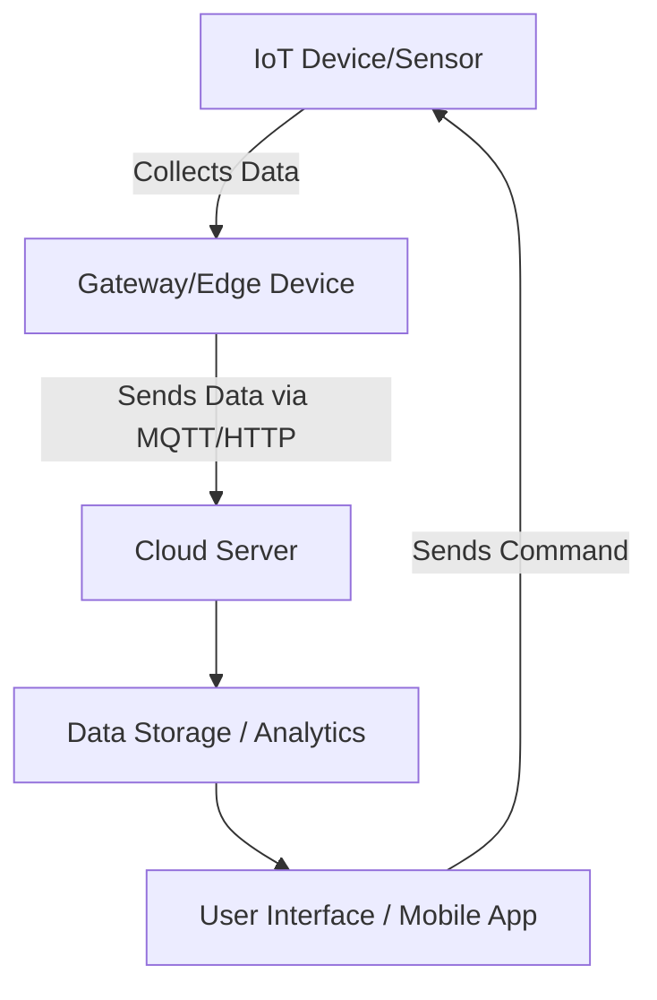
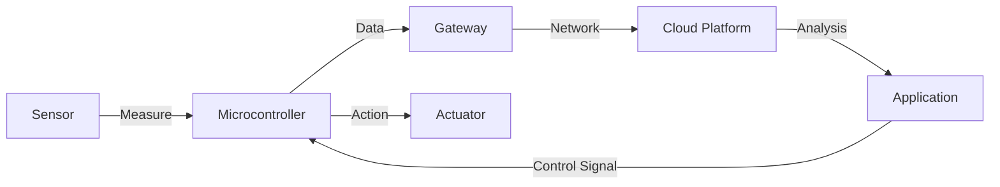
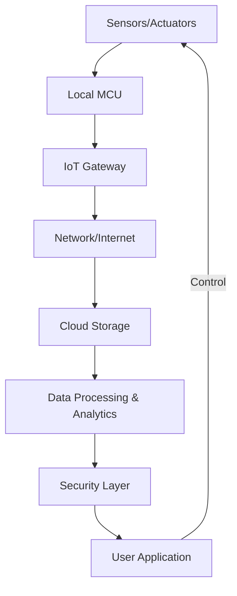

# Unit - 1

## Introduction to Internet of Things
- Definition & Characteristics of IoT
- Physical Design of IoT
- IoT Functional Blocks

- Communication Models
- IoT Communication APIs

- IoT Enabling Technologies
- Wireless Sensor Networks
- Cloud Computing
- Big Data Analytics
- Communication Protocols
- RFID basics

- Enbedded Systems
- IoT Levels & Deployment Templetes

---
---

# 🌐 Definition & Characteristics of IoT

---

## 🔹 Definition of IoT

**Internet of Things (IoT)** is a **network of physical objects (“things”)** — such as sensors, actuators, appliances, vehicles, and machines — that are **embedded with electronics, software, and network connectivity**, enabling them to **collect, exchange, and act upon data** over the Internet **without human intervention**.

### 💡 Example Definition (as per ITU & IEEE):

> “IoT is a global infrastructure for the information society, enabling advanced services by interconnecting (physical and virtual) things based on existing and evolving interoperable information and communication technologies.”

---

## 🔹 Concept Overview

IoT bridges the gap between the **physical world** and the **digital world**.

```
[Physical World]
   ↓  (Sensors)
Data Collection
   ↓  (Communication)
Data Transmission
   ↓  (Cloud / Edge Processing)
Data Analysis
   ↓  (Actuators)
Action / Control
```

IoT allows **“Things” → “Internet” → “People/Applications”** to interact intelligently.

---

## 🔹 Key Components (at a glance)

| Component                 | Description                         | Examples                                    |
| ------------------------- | ----------------------------------- | ------------------------------------------- |
| **Sensors**               | Collect data from the environment   | Temperature, motion, humidity               |
| **Actuators**             | Perform actions based on decisions  | Motor, relay, valve                         |
| **Microcontrollers**      | Process sensor data and communicate | Arduino, ESP32, STM32                       |
| **Connectivity Modules**  | Provide communication to network    | Wi-Fi, ZigBee, BLE, LoRa                    |
| **Cloud / Edge Platform** | Store, process, and analyze data    | AWS IoT, Google IoT Core                    |
| **Applications**          | Use IoT data to create insights     | Smart homes, wearables, industry automation |

---

## 🔹 Characteristics of IoT

Below is a detailed explanation of **main IoT characteristics**, which define its nature and design requirements.

| **Characteristic**         | **Explanation**                                                                    | **Example**                                |
| -------------------------- | ---------------------------------------------------------------------------------- | ------------------------------------------ |
| **1. Connectivity**        | All “things” must be able to connect and communicate with each other and the cloud | Smart lightbulb connected via Wi-Fi        |
| **2. Sensing**             | Devices sense physical data from the environment                                   | Temperature sensor in a smart thermostat   |
| **3. Intelligence**        | Devices can process and make local decisions                                       | Smart fan turns on when room temp rises    |
| **4. Real-time Operation** | IoT often needs instant data transmission and action                               | Fire alarm system                          |
| **5. Heterogeneity**       | IoT integrates diverse devices, networks, and data formats                         | Wi-Fi camera + BLE fitness band            |
| **6. Scalability**         | Must handle millions of connected devices                                          | Smart city with thousands of sensors       |
| **7. Interoperability**    | Devices from different vendors should work together                                | Alexa controlling multiple brands of bulbs |
| **8. Security & Privacy**  | Protect data, identity, and system integrity                                       | Encryption, authentication, firewalls      |
| **9. Energy Efficiency**   | Many IoT nodes are battery-powered                                                 | Sleep modes in wireless sensors            |
| **10. Dynamic Adaptation** | IoT adapts to environment or user behavior                                         | Smart thermostat learns daily schedule     |

---

## 🔹 IoT System View

### 📊 Simple IoT Architecture Diagram



**Flow:**
1️⃣ Sensors collect → 2️⃣ Gateway sends → 3️⃣ Cloud stores & analyzes → 4️⃣ App controls actuators.

---

## 🔹 Real-world Example

### 🏠 Smart Home IoT Example

| Component    | Device                | Function                   |
| ------------ | --------------------- | -------------------------- |
| Sensor       | Motion sensor         | Detects movement           |
| Controller   | ESP32 microcontroller | Processes motion data      |
| Connectivity | Wi-Fi                 | Sends data to cloud        |
| Cloud        | Firebase / AWS IoT    | Stores and analyzes        |
| Actuator     | Smart light           | Turns ON/OFF automatically |
| Application  | Mobile App            | User monitoring & control  |

**Scenario:**
When motion is detected at night → data sent to cloud → cloud triggers actuator → smart light turns ON → logs event in app.

---

## 🔹 Code Example: Simple IoT Temperature Publisher (Python + MQTT)

```python
# pip install paho-mqtt
import time, json, random
import paho.mqtt.client as mqtt

BROKER = "test.mosquitto.org"
TOPIC = "iot/classroom/temperature"

client = mqtt.Client("temp_sensor")
client.connect(BROKER, 1883, 60)

while True:
    temperature = round(random.uniform(20, 30), 2)
    payload = json.dumps({"temperature": temperature})
    client.publish(TOPIC, payload)
    print("Sent:", payload)
    time.sleep(3)
```

**Explanation:**

* Simulates a temperature sensor publishing readings every 3 seconds.
* Can be visualized using an MQTT dashboard like **HiveMQ WebSocket Client**.

---

## 🔹 IoT Challenges Related to Characteristics

| **Challenge**         | **Description**                          | **Example**                 |
| --------------------- | ---------------------------------------- | --------------------------- |
| **Scalability**       | Billions of devices → large data traffic | Smart cities                |
| **Security**          | Unauthorized device access               | Hacked smart cameras        |
| **Interoperability**  | Proprietary formats                      | Devices can’t communicate   |
| **Data Management**   | Massive unstructured data                | Sensor readings per second  |
| **Energy Management** | Battery drain in nodes                   | Remote agricultural sensors |

---

## 🔹 Summary Table — IoT in a Nutshell

| **Aspect**              | **IoT Summary**                                         |
| ----------------------- | ------------------------------------------------------- |
| **Definition**          | Network of interconnected smart devices exchanging data |
| **Goal**                | Automation, efficiency, intelligence                    |
| **Core Components**     | Sensors, Actuators, Connectivity, Cloud, Applications   |
| **Key Characteristics** | Connectivity, Sensing, Real-time, Security, Scalability |
| **Examples**            | Smart homes, Industry 4.0, Wearables, Smart cities      |

---

## 🔹 Quick Revision Points

* IoT = Sensors + Connectivity + Cloud + Application.
* Focus on **data-driven automation**.
* Main goal → **Reduce human effort and increase efficiency**.
* Must support **interoperability** and **security**.
* Works across **domains** (home, industry, city, healthcare).

---

## 🔹 Common Exam Questions

| **Question**                              | **Short Answer / Hint**                                                     |
| ----------------------------------------- | --------------------------------------------------------------------------- |
| Define IoT.                               | Network of interconnected smart devices that communicate and exchange data. |
| List five characteristics of IoT.         | Connectivity, Intelligence, Sensing, Scalability, Security.                 |
| Why is interoperability important in IoT? | Enables communication between different vendors’ devices.                   |
| What are the major challenges in IoT?     | Security, privacy, energy, scalability, interoperability.                   |

---

## 🔹 Conclusion

The **Internet of Things** revolutionizes how the world connects and communicates by embedding intelligence into everyday objects. Its core **characteristics — sensing, connectivity, intelligence, and automation —** define its ability to transform industries, cities, and homes into **smart, data-driven ecosystems**.

---

# ⚙️ Physical Design of IoT

---

## 🔹 1. Introduction

The **Physical Design of IoT** focuses on the **actual hardware components** and **physical entities** that make up an IoT system — devices, sensors, actuators, controllers, connectivity modules, and communication interfaces.

It answers the question:

> “What *physical components* make an IoT system possible?”

---

## 🔹 2. IoT Physical World

The **physical layer** of IoT interacts directly with the **real environment**.
It senses data (temperature, humidity, motion, etc.) and acts upon it (switch, move, open/close).

```
[Environment] → [Sensors] → [Controllers] → [Actuators]
```

---

## 🔹 3. Components of Physical Design

| **Component**                      | **Function**                                        | **Examples**                               |
| ---------------------------------- | --------------------------------------------------- | ------------------------------------------ |
| **1. Things / Devices**            | Physical objects that have sensors or actuators     | Smart bulb, wearable, air-quality monitor  |
| **2. Sensors**                     | Convert physical parameters into electrical signals | Temperature, humidity, motion, gas sensors |
| **3. Actuators**                   | Perform physical actions                            | Motor, relay, valve, LED, buzzer           |
| **4. Microcontroller / Processor** | Controls sensors, processes data                    | Arduino, ESP32, Raspberry Pi, STM32        |
| **5. Power Supply**                | Provides energy to devices                          | Battery, solar, PoE, DC adapter            |
| **6. Communication Module**        | Enables data transmission                           | Wi-Fi, BLE, Zigbee, LoRa, Cellular         |
| **7. Gateway / Edge Node**         | Aggregates data and connects to cloud               | Raspberry Pi, Industrial gateway           |
| **8. Cloud / Server**              | Stores, analyzes, and visualizes data               | AWS IoT Core, Google Cloud IoT, OpenIoT    |

---

## 🔹 4. IoT Physical Design Layers

| **Layer**             | **Role**                               | **Example Technologies**   |
| --------------------- | -------------------------------------- | -------------------------- |
| **Device Layer**      | Physical sensors & actuators           | Arduino, ESP8266           |
| **Gateway Layer**     | Connects local network to Internet     | Raspberry Pi, Intel Edison |
| **Network Layer**     | Transfers data packets                 | Wi-Fi, LTE, LoRa           |
| **Cloud Layer**       | Data storage, analytics, control logic | Azure IoT Hub, AWS IoT     |
| **Application Layer** | User interface, dashboards             | Web app, mobile app        |

---

## 🔹 5. IoT Device Types (Based on Role)

| **Type**                 | **Role in System**         | **Example**          |
| ------------------------ | -------------------------- | -------------------- |
| **Sensor Node**          | Measures data              | Temperature node     |
| **Actuator Node**        | Performs action            | Smart relay          |
| **Sensor-Actuator Node** | Combined                   | Smart thermostat     |
| **Gateway Node**         | Bridges device to Internet | Edge Raspberry Pi    |
| **Cloud Node**           | Manages storage/analytics  | Cloud VM or platform |

---

## 🔹 6. Typical IoT Device Architecture

```mermaid
graph TD
A[Sensor(s)] --> B[Analog/Digital Interface]
B --> C[Microcontroller/Processor]
C --> D[Communication Module<br/>(Wi-Fi/BLE/LoRa)]
C --> E[Actuator(s)]
C --> F[Power Supply]
D --> G[Internet / Cloud]
```

### ⚙️ Explanation

1. **Sensors** measure parameters → analog/digital signals.
2. **Controller** (e.g., ESP32) reads via GPIO/ADC.
3. **Communication** sends data via wireless protocol.
4. **Cloud** stores, analyzes, and returns control signals.
5. **Actuators** perform required actions (e.g., turn ON light).

---

## 🔹 7. Example: Smart Home Temperature System

| **Module**    | **Hardware** | **Function**                   |
| ------------- | ------------ | ------------------------------ |
| Sensor        | DHT11        | Measure temperature & humidity |
| Controller    | ESP8266      | Process data                   |
| Communication | Wi-Fi        | Send data to cloud             |
| Actuator      | Relay module | Turn ON/OFF fan                |
| Cloud         | Firebase     | Store & visualize data         |
| App           | Android app  | Display readings               |

**Data Flow:**

```text
DHT11 → ESP8266 → Wi-Fi → Cloud → Mobile App → Relay → Fan
```

---

## 🔹 8. Example Circuit Diagram (Simplified ASCII)

```
+-----------------------+
|     ESP8266 MCU       |
|  A0 <--- Temp Sensor  |
|  D1 ---> Relay (Fan)  |
|  Wi-Fi ---> Cloud     |
|  5V ---> Power Supply |
+-----------------------+
```

---

## 🔹 9. Basic IoT Code Example

*(ESP8266 Arduino – Reading Temperature and Sending to Cloud)*

```cpp
#include <DHT.h>
#include <ESP8266WiFi.h>
#include <WiFiClient.h>
#include <ThingSpeak.h>

#define DHTPIN 2
#define DHTTYPE DHT11

DHT dht(DHTPIN, DHTTYPE);
WiFiClient client;

const char* ssid = "MyWiFi";
const char* password = "password";
unsigned long channel = 123456;
const char* writeAPI = "XYZ123";

void setup() {
  Serial.begin(9600);
  WiFi.begin(ssid, password);
  dht.begin();
  ThingSpeak.begin(client);
}

void loop() {
  float temp = dht.readTemperature();
  Serial.println(temp);
  ThingSpeak.writeField(channel, 1, temp, writeAPI);
  delay(20000);
}
```

🧠 *This code reads temperature from DHT11, connects to Wi-Fi, and uploads data to ThingSpeak cloud.*

---

## 🔹 10. Design Considerations

| **Aspect**       | **Design Concern**             | **Typical Solution**                       |
| ---------------- | ------------------------------ | ------------------------------------------ |
| **Power**        | Devices may run on battery     | Use low-power chips, sleep modes           |
| **Connectivity** | Range, bandwidth, interference | Choose right protocol (LoRa > BLE > Wi-Fi) |
| **Cost**         | Mass-scale deployment          | Optimize BOM and use open hardware         |
| **Security**     | Unauthorized access            | TLS, encryption, OTA updates               |
| **Maintenance**  | Firmware updates               | Implement OTA firmware mechanism           |
| **Scalability**  | Number of devices              | Use gateways & cloud scalability features  |

---

## 🔹 11. Example: Physical Design of a Smart Agriculture IoT Node

| **Module**         | **Description**                      | **Example Hardware** |
| ------------------ | ------------------------------------ | -------------------- |
| **Sensors**        | Soil moisture, humidity, temperature | YL-69, DHT22         |
| **Controller**     | Collects & transmits data            | Arduino UNO          |
| **Communication**  | Long-range                           | LoRa Module (SX1278) |
| **Power Source**   | Solar + Li-ion battery               | 5 V solar charger    |
| **Cloud Platform** | Receives and analyzes data           | AWS IoT / Firebase   |
| **Actuators**      | Controls irrigation pump             | Relay Module         |

---

## 🔹 12. Summary of IoT Physical Design

| **Design Element** | **Purpose**                | **Example**           |
| ------------------ | -------------------------- | --------------------- |
| Sensors            | Data collection            | DHT11, PIR, LDR       |
| Actuators          | Control actions            | Motor, LED            |
| Controller         | Processing & communication | ESP32, Arduino        |
| Network            | Data transmission          | Wi-Fi, ZigBee         |
| Cloud              | Storage & analysis         | AWS IoT, Azure IoT    |
| Application        | User interaction           | Dashboard, Mobile App |

---

## 🔹 13. Key Takeaways

* **Physical Design** = tangible layer of IoT: *Sensors → Controllers → Connectivity → Actuators*.
* Selecting proper **sensors, power, and communication modules** is crucial.
* Physical design determines **performance, scalability, and cost**.
* It interacts directly with the **environment** and passes data up the IoT stack.

---

## 🔹 14. Quick Revision Points

* IoT physical design includes: **Things**, **Devices**, **Gateways**, **Networks**.
* Example physical design: Smart home, smart agriculture, smart health.
* IoT device includes **Sensors**, **MCU**, **Communication**, **Actuator**, **Power**.
* **Design parameters:** Power, cost, range, environment, reliability.

---

## 🔹 15. Common Exam Questions

| **Question**                                     | **Answer Hint**                                                            |
| ------------------------------------------------ | -------------------------------------------------------------------------- |
| What is meant by physical design of IoT?         | The hardware structure and physical components that form IoT.              |
| List components involved in IoT physical design. | Sensors, actuators, microcontrollers, power supply, communication modules. |
| Mention key design considerations.               | Power, security, scalability, connectivity, maintenance.                   |
| Draw the architecture of an IoT system.          | Include sensor, MCU, network, cloud, and app layers.                       |

---

## 🔹 16. Diagram Summary — IoT End-to-End View



---

## ✅ Conclusion

The **Physical Design of IoT** forms the **foundation** for every IoT project. It defines the **hardware structure**, **data flow**, and **communication mechanisms** that make sensing and automation possible.
A well-designed physical layer ensures **reliability, energy efficiency, scalability, and security**, enabling seamless integration with the digital (cloud) world.

---

# 🧩 IoT Functional Blocks

---

## 🔹 1. Introduction

The **Internet of Things (IoT)** system is made up of **multiple building blocks**, each performing a specific function such as **data collection, communication, processing, and application**.

These are called **IoT Functional Blocks**, and together they define **how IoT systems operate end-to-end** — from sensing data in the real world to delivering actionable insights to the user.

---

## 🔹 2. Definition

> **IoT Functional Blocks** are the essential logical components or modules that define the operation of an IoT system, including sensing, communication, data processing, actuation, and application services.

Each functional block interacts with others through **standard communication interfaces** and **protocols**.

---

## 🔹 3. The 7 Major IoT Functional Blocks

| **Block**                            | **Description**                                               | **Example**                             |
| ------------------------------------ | ------------------------------------------------------------- | --------------------------------------- |
| **1. Devices (Sensors & Actuators)** | Sense the physical environment and perform actions            | DHT11 (sensor), Relay module (actuator) |
| **2. Communication**                 | Transfers data between devices and the cloud                  | Wi-Fi, Bluetooth, ZigBee, LoRa          |
| **3. IoT Gateway**                   | Collects data from local devices and connects to the Internet | Raspberry Pi, Intel Edison              |
| **4. Data Storage**                  | Stores raw and processed IoT data                             | AWS S3, InfluxDB, Firebase              |
| **5. Data Processing / Analytics**   | Processes, analyzes, and visualizes data                      | AWS Lambda, Azure IoT Hub               |
| **6. Security**                      | Protects data, devices, and communication                     | TLS, SSL, AES encryption                |
| **7. Application**                   | Provides user-facing interface and control                    | Mobile apps, dashboards, web portals    |

---

## 🔹 4. IoT Functional Block Diagram

```mermaid
graph LR
A[Physical Devices<br/>(Sensors/Actuators)] --> B[Communication<br/>Protocols]
B --> C[IoT Gateway]
C --> D[Cloud/Edge Data Storage]
D --> E[Data Processing & Analytics]
E --> F[Security Block]
E --> G[Application Services<br/>(Dashboard/Mobile App)]
G -->|Control Commands| A
```

---

## 🔹 5. Detailed Explanation of Each Functional Block

---

### 🧱 **1. Devices / Sensors / Actuators**

**Function:**

* **Sensors** collect data (temperature, humidity, motion, etc.).
* **Actuators** perform physical actions based on received commands.

**Examples:**

* Sensors → DHT11 (temperature), MQ-2 (gas), PIR (motion)
* Actuators → Relay, Servo motor, LED

**Code Example:**

```cpp
int sensorPin = A0;
int val = analogRead(sensorPin);
if(val > 500)
  digitalWrite(LED_BUILTIN, HIGH);
else
  digitalWrite(LED_BUILTIN, LOW);
```

🧠 *Simple IoT control logic connecting a sensor and an actuator.*

---

### 📡 **2. Communication Block**

**Purpose:**
Transfers data between IoT devices and the cloud via wired or wireless media.

| **Type**                   | **Protocol / Tech**    | **Use-case Example**      |
| -------------------------- | ---------------------- | ------------------------- |
| **Short-range**            | Bluetooth, ZigBee, NFC | Wearables, Smart homes    |
| **Medium-range**           | Wi-Fi, Ethernet        | Smart appliances          |
| **Long-range / Low Power** | LoRa, Sigfox, NB-IoT   | Smart cities, agriculture |

**Communication Models:**

* **Device-to-Device (D2D)**
* **Device-to-Gateway (D2G)**
* **Device-to-Cloud (D2C)**
* **Back-End Data Sharing**

---

### 🖥️ **3. IoT Gateway**

**Function:**
Acts as a **bridge** between local devices (sensors) and cloud platforms.

* Aggregates local data
* Performs edge processing
* Handles multiple communication protocols
* Provides security and buffering

**Example:**
Raspberry Pi receiving data via BLE and sending via MQTT to AWS.


---

### ☁️ **4. Data Storage**

**Role:**
Stores both real-time and historical IoT data for analysis.

| **Type**          | **Storage Examples**                     | **Purpose**                 |
| ----------------- | ---------------------------------------- | --------------------------- |
| **Cloud Storage** | AWS S3, Azure Blob, Google Cloud Storage | Long-term archival          |
| **Database**      | InfluxDB, Firebase, MongoDB              | Real-time queries           |
| **Edge Storage**  | On gateways                              | Local cache for low latency |

---

### 🧮 **5. Data Processing / Analytics**

**Purpose:**
Transforms raw data into useful information and decisions.

| **Type**        | **Examples**                     | **Output**      |
| --------------- | -------------------------------- | --------------- |
| **Rule-based**  | IF temp > 30 → Turn Fan ON       | Action          |
| **Analytical**  | Average, correlation, prediction | Reports         |
| **AI/ML-based** | Predictive maintenance           | Future insights |

**Example (Python + MQTT processing):**

```python
if temperature > 30:
    publish("iot/actuator/fan", "ON")
else:
    publish("iot/actuator/fan", "OFF")
```

---

### 🔐 **6. Security Block**

**Objective:**
Ensures **confidentiality, integrity, and availability** of IoT data.

| **Security Layer**    | **Methods**                                 |
| --------------------- | ------------------------------------------- |
| **Device Layer**      | Secure boot, hardware encryption            |
| **Network Layer**     | TLS/SSL, VPN, HTTPS                         |
| **Application Layer** | Authentication, access control              |
| **Data Layer**        | Encryption (AES, RSA), token-based identity |

**Example:**
Use of **MQTT over SSL** to encrypt IoT messages.

---

### 📱 **7. Application Layer**

**Purpose:**
Delivers the final interface for users, allowing **monitoring and control** of IoT devices.

| **Form**            | **Example**         | **Function**         |
| ------------------- | ------------------- | -------------------- |
| **Mobile App**      | Blynk, IoT Remote   | Monitor home devices |
| **Web Dashboard**   | ThingSpeak, Grafana | Visualize analytics  |
| **Voice Assistant** | Alexa, Google Home  | Voice-based control  |

---

## 🔹 6. Functional Flow Example

Let’s take **Smart Street Lighting** as an example:

| **Step** | **Function Block** | **Action**                         |
| -------- | ------------------ | ---------------------------------- |
| 1        | Sensor             | LDR detects darkness               |
| 2        | Communication      | Sends “dark” signal to controller  |
| 3        | Gateway            | Sends data to cloud                |
| 4        | Cloud Storage      | Logs time and brightness data      |
| 5        | Analytics          | Determines if lights should be ON  |
| 6        | Security           | Ensures only authorized command    |
| 7        | Application        | City dashboard shows street status |
| 8        | Actuator           | Lamp turns ON automatically        |

---

## 🔹 7. Example Architecture Diagram (End-to-End)



---

## 🔹 8. Advantages of Modular Functional Blocks

* Clear **system separation** → easier debugging
* Better **scalability** and **upgradability**
* Enhanced **security control** per layer
* Supports **interoperability** between heterogeneous systems

---

## 🔹 9. Summary Table

| **Functional Block** | **Core Function** | **Technology Example**    |
| -------------------- | ----------------- | ------------------------- |
| Devices              | Sensing & acting  | Arduino, ESP32            |
| Communication        | Connectivity      | Wi-Fi, MQTT               |
| Gateway              | Edge aggregation  | Raspberry Pi              |
| Data Storage         | Store data        | Firebase, MongoDB         |
| Data Processing      | Analyze data      | AWS Lambda, TensorFlow    |
| Security             | Protect system    | SSL, AES, OAuth           |
| Application          | User interaction  | Web dashboard, mobile app |

---

## 🔹 10. Quick Revision Points

* **Functional Blocks = Logical modules of IoT architecture.**
* **7 Major blocks:** Devices, Communication, Gateway, Storage, Processing, Security, Application.
* **Data flow:** Sensor → Communication → Gateway → Cloud → Analytics → Application → Actuator.
* **Security** must be integrated across all blocks.
* **Applications** represent the visible face of IoT.

---

## 🔹 11. Common Exam Questions

| **Question**                                          | **Answer Hint**                                                             |
| ----------------------------------------------------- | --------------------------------------------------------------------------- |
| Define IoT Functional Blocks.                         | Logical modules that define operation of IoT system.                        |
| List and explain the functional blocks of IoT.        | Devices, communication, gateway, storage, analytics, security, application. |
| Draw and explain the functional block diagram of IoT. | Use flow: Sensor → Communication → Cloud → App.                             |
| Why is the security block essential?                  | To protect data, identity, and integrity of IoT system.                     |
| What is the role of IoT Gateway?                      | Acts as a bridge between local devices and the Internet.                    |

---

## ✅ Conclusion

The **IoT Functional Blocks** together create the backbone of any IoT system.
From data sensing to intelligent decision-making and user interaction, each block plays a **distinct yet interconnected role**.
Understanding these blocks helps design IoT systems that are **modular, secure, and scalable** — suitable for domains like **smart homes, healthcare, and industrial automation**.

---

# 🌐 Communication Models in IoT

IoT devices **interact and exchange data** using various communication models depending on the **network topology**, **device roles**, and **application requirements**.
These models define **how IoT devices, gateways, and servers communicate** with each other.

---

## 🧩 1. Overview

IoT communication models describe **how messages are exchanged** between:

* **Devices (Things)** — sensors, actuators, microcontrollers
* **Gateways** — interface between local IoT network and cloud
* **Cloud Servers** — perform data storage, analytics, and control
* **Applications / Users** — visualize data, control devices

---

## ⚙️ 2. The Four Main Communication Models

| Communication Model                        | Description                                                         | Typical Example                                           |
| ------------------------------------------ | ------------------------------------------------------------------- | --------------------------------------------------------- |
| **Device-to-Device (D2D)**                 | Two or more devices communicate directly without intermediary.      | Smart bulb communicating directly with smart switch       |
| **Device-to-Cloud (D2C)**                  | Device connects to a cloud service to send/receive data.            | Smart thermostat sending data to Google Cloud             |
| **Device-to-Gateway (D2G)**                | Device communicates with a gateway that forwards data to the cloud. | Wearable fitness band → Mobile App → Cloud                |
| **Back-End Data Sharing (Cloud-to-Cloud)** | Multiple cloud services share IoT data among each other.            | Smart home data shared with third-party analytics service |

---

## 🔹 2.1 Device-to-Device (D2D)

**Definition:**
Devices communicate directly using local network technologies **without cloud involvement**.

**Technologies Used:**

* Bluetooth, ZigBee, Z-Wave, Wi-Fi Direct, NFC

**Diagram:**

```
+-----------+      +-----------+
|  Device A | <--> |  Device B |
+-----------+      +-----------+
```

**Example:**

* Smart light automatically turns on when motion sensor detects movement.

**Advantages:**

* Low latency (fast communication)
* No Internet dependency

**Disadvantages:**

* Limited range and scalability

---

## 🔹 2.2 Device-to-Cloud (D2C)

**Definition:**
IoT device connects directly to a **cloud service** (via Internet) for data storage, processing, or management.

**Technologies Used:**

* Wi-Fi, Ethernet, Cellular (4G/5G), MQTT over TCP/IP, HTTPS (REST API)

**Diagram:**

```
+-----------+        Internet        +----------------+
|   Device  | ---------------------> |   Cloud Server |
+-----------+                        +----------------+
```

**Example:**

* A smart thermostat sending temperature data to AWS IoT Core for analysis.

**Advantages:**

* Centralized data control
* Easy access from anywhere

**Disadvantages:**

* Dependent on Internet
* Higher latency and power usage

---

## 🔹 2.3 Device-to-Gateway (D2G)

**Definition:**
The device sends data to a **local gateway**, which performs local computation, filtering, or security before sending it to the cloud.

**Technologies Used:**

* Local: Bluetooth, ZigBee
* Gateway to Cloud: Wi-Fi, Ethernet, Cellular

**Diagram:**

```
+-----------+      +-----------+       Internet       +----------------+
|   Device  | ---> |  Gateway  | -------------------> |   Cloud Server |
+-----------+      +-----------+                      +----------------+
```

**Example:**

* A wearable health tracker sends heart rate data to a smartphone app (gateway), which forwards it to a cloud health server.

**Advantages:**

* Gateway can perform data preprocessing
* Supports devices with limited power or protocol capability
* Enhanced security

**Disadvantages:**

* Requires gateway setup and maintenance

---

## 🔹 2.4 Back-End Data Sharing (Cloud-to-Cloud)

**Definition:**
Data collected by one IoT cloud platform is shared with another service for analytics, machine learning, or visualization.

**Diagram:**

```
+----------------+     Data Exchange     +----------------+
|  Cloud Service | <-------------------> |  Cloud Service |
|     A (IoT)    |                      |   B (Analytics) |
+----------------+                      +----------------+
```

**Example:**

* Smart home data from Amazon Alexa shared with Google Home for better integration.

**Advantages:**

* Enables collaboration between different ecosystems
* Improved analytics and interoperability

**Disadvantages:**

* Security and privacy challenges
* Requires standard APIs and agreements

---

## 🧠 Summary Table

| Model                 | Local or Cloud | Latency         | Example             |
| --------------------- | -------------- | --------------- | ------------------- |
| Device-to-Device      | Local          | Very Low        | Smart switch ↔ Bulb |
| Device-to-Cloud       | Cloud          | Moderate        | Smart thermostat    |
| Device-to-Gateway     | Local + Cloud  | Low to Moderate | Wearable to app     |
| Back-End Data Sharing | Cloud          | Variable        | Alexa ↔ Google Home |

---

## 💬 Real Example Code (Device → Cloud via MQTT)

Here’s a small Python code example to publish IoT data to a cloud MQTT broker:

```python
import paho.mqtt.client as mqtt
import time
import random

broker = "test.mosquitto.org"
topic = "iot/home/temperature"

client = mqtt.Client("IoT_Device")
client.connect(broker)

while True:
    temp = random.uniform(25.0, 30.0)
    client.publish(topic, f"Temperature: {temp:.2f}°C")
    print(f"Data sent → {temp:.2f}°C")
    time.sleep(2)
```

📘 *Explanation:*
This code simulates an IoT device sending temperature data to a public MQTT broker (acting as cloud).

---

## 🧩 Key Takeaways

* Communication models define **how IoT devices share data** within the ecosystem.
* Choice depends on **application type**, **scalability**, and **security** needs.
* **D2D → simplest**, **Cloud-to-Cloud → most complex** but powerful.

---

# 🌐 IoT Communication APIs

---

## 🧩 1. What are IoT Communication APIs?

**API (Application Programming Interface)** is a **set of rules and protocols** that allows different IoT components — devices, gateways, servers, and applications — to **communicate and exchange data** with each other.

In IoT:

* APIs act as **bridges** between **hardware (sensors)** and **software (cloud/app)**.
* They define **how data is sent, received, and interpreted**.

---

## ⚙️ 2. Why APIs are Needed in IoT

| Purpose              | Description                                                 |
| -------------------- | ----------------------------------------------------------- |
| **Integration**      | Connects IoT devices, cloud, and applications.              |
| **Interoperability** | Allows devices from different manufacturers to communicate. |
| **Scalability**      | Enables easy addition of new devices or services.           |
| **Automation**       | Devices can automatically send/receive commands via APIs.   |
| **Remote Access**    | APIs allow monitoring and control from anywhere.            |

---

## 🧱 3. Types of IoT Communication APIs

IoT mainly uses **two major types** of communication APIs:

| API Type                               | Description                                                                       | Protocol Examples |
| -------------------------------------- | --------------------------------------------------------------------------------- | ----------------- |
| **REST-based APIs (HTTP/HTTPS)**       | Resource-oriented, stateless, uses standard web methods (GET, POST, PUT, DELETE). | REST, CoAP        |
| **Messaging APIs (Publish/Subscribe)** | Event-driven model for lightweight device communication.                          | MQTT, AMQP, XMPP  |

Let’s understand both in detail 👇

---

## 🌍 4. REST-based APIs

### 🧠 Concept:

REST = **Representational State Transfer**

It uses **HTTP methods** for communication between IoT devices and servers.

### 🧩 Working:

Each IoT device data is treated as a **resource** identified by a **URI** (Uniform Resource Identifier).

| HTTP Method | Purpose       | Example                   |
| ----------- | ------------- | ------------------------- |
| `GET`       | Read data     | `/api/device/temperature` |
| `POST`      | Send new data | `/api/device/data`        |
| `PUT`       | Update data   | `/api/device/config`      |
| `DELETE`    | Delete data   | `/api/device/id`          |

---

### 🔧 Example Diagram

```
+-----------+       HTTP/HTTPS        +----------------+
| IoT Device| <---------------------> | Cloud REST API |
+-----------+                         +----------------+
        ↑                                   ↑
   Sensor Data                         Web Dashboard
```

---

### 💻 Example: REST API in Python (Client Side)

```python
import requests
import json

url = "https://api.my-iot-server.com/device/update"
data = {"device_id": "temp_01", "temperature": 28.6}

response = requests.post(url, data=json.dumps(data), headers={"Content-Type": "application/json"})

print("Response:", response.status_code, response.text)
```

📘 **Explanation:**

* IoT device (client) sends temperature data to the cloud REST API.
* Cloud can respond with acknowledgment or configuration update.

---

### 🌿 Features of REST APIs in IoT

| Feature     | Description                                                        |
| ----------- | ------------------------------------------------------------------ |
| Simplicity  | Uses standard web protocols (HTTP)                                 |
| Scalability | Easy to expand with new devices                                    |
| Flexibility | Works with any language/platform                                   |
| Drawback    | Overhead due to HTTP headers; not ideal for very low-power devices |

---

## 📡 5. Messaging APIs (Publish/Subscribe)

### 🧠 Concept:

Messaging APIs follow a **Pub/Sub (Publish–Subscribe)** model, which is **asynchronous** and **lightweight** — perfect for low-power IoT devices.

Common protocols:
👉 **MQTT (Message Queuing Telemetry Transport)**
👉 **AMQP (Advanced Message Queuing Protocol)**
👉 **XMPP (Extensible Messaging and Presence Protocol)**

---

### 🔧 How It Works

```
+-----------+       Publish       +-----------+       Deliver        +-----------+
|  Device A | ------------------> |   Broker  | ------------------> |  Device B |
| (Publisher)|                    | (Server)  |                     |(Subscriber)|
+-----------+                     +-----------+                     +-----------+
```

🧩 Explanation:

* **Publisher:** Sends messages to a topic (e.g., `iot/room/temp`)
* **Broker:** Receives and routes messages
* **Subscriber:** Listens to topics of interest

---

### 💻 Example: MQTT Communication

#### Publisher (IoT Sensor)

```python
import paho.mqtt.client as mqtt
import time
import random

broker = "test.mosquitto.org"
topic = "iot/sensor/temp"

client = mqtt.Client("TempPublisher")
client.connect(broker)

while True:
    temp = random.uniform(20.0, 30.0)
    client.publish(topic, f"{temp:.2f}")
    print(f"Published: {temp:.2f}°C")
    time.sleep(2)
```

#### Subscriber (Dashboard)

```python
import paho.mqtt.client as mqtt

def on_message(client, userdata, msg):
    print(f"Received: {msg.payload.decode()} from {msg.topic}")

broker = "test.mosquitto.org"
topic = "iot/sensor/temp"

client = mqtt.Client("TempSubscriber")
client.connect(broker)
client.subscribe(topic)

client.on_message = on_message
client.loop_forever()
```

📘 *Explanation:*

* Publisher (sensor) sends data to MQTT broker.
* Subscriber (dashboard) listens and receives data instantly.

---

### ⚖️ REST vs. MQTT Comparison

| Feature            | REST API             | MQTT API                |
| ------------------ | -------------------- | ----------------------- |
| Communication Type | Request–Response     | Publish–Subscribe       |
| Protocol           | HTTP/HTTPS           | TCP/IP                  |
| Data Format        | JSON                 | Binary or Text          |
| Power Efficiency   | Moderate             | High (very lightweight) |
| Ideal For          | Cloud-based systems  | Constrained IoT devices |
| Example Use        | Smart thermostat API | Home automation sensors |

---

## 🏗️ 6. CoAP (Constrained Application Protocol)

### 🧠 Concept:

* REST-like API designed for **constrained devices and networks** (low power, low bandwidth).
* Works over **UDP** (faster, less overhead than TCP).

**Example:**

```
GET coap://device.local/sensor/temp
```

**Used In:** Smart lighting, industrial sensors, and smart cities.

---

## 🌉 7. API Gateways in IoT

An **IoT API Gateway** acts as a bridge between IoT devices and cloud services.

### 🧩 Functions:

* Handles **authentication & encryption**
* Manages **protocol translation** (e.g., MQTT ↔ HTTPS)
* Controls **traffic routing and load balancing**
* Provides **logging and analytics**

**Example:**
AWS IoT Core, Azure IoT Hub, Google Cloud IoT Core

---

## 🧠 8. Summary

| API Type      | Transport  | Model             | Used For                | Example            |
| ------------- | ---------- | ----------------- | ----------------------- | ------------------ |
| **REST API**  | HTTP/HTTPS | Request–Response  | Cloud data access       | Web dashboard      |
| **CoAP**      | UDP        | Request–Response  | Constrained IoT devices | Smart lighting     |
| **MQTT**      | TCP/IP     | Publish–Subscribe | Real-time IoT messaging | Smart home sensors |
| **AMQP/XMPP** | TCP/IP     | Publish–Subscribe | Enterprise IoT systems  | Industrial IoT     |

---

## 🧩 9. Visualization Diagram

```
         +-------------------+
         |   IoT Application |
         +---------+---------+
                   |
         REST / MQTT / CoAP APIs
                   |
    +--------------+--------------+
    |                             |
+---+---+                   +-----+-----+
| Device |                   |   Gateway |
+---+---+                   +-----+-----+
    |                             |
    +-------------+---------------+
                  |
             Cloud / Broker
```

---

## ✅ Key Takeaways

* **APIs are the “language” of IoT** — they allow devices, gateways, and clouds to talk.
* **REST APIs** are web-friendly and easy for cloud integration.
* **MQTT APIs** are lightweight and ideal for low-power IoT communication.
* **CoAP** bridges the gap between REST and constrained networks.
* **API Gateways** provide secure and managed connectivity.

---

# 🌐 IoT Enabling Technologies

---

## 🧩 1. Introduction

**Definition:**
IoT Enabling Technologies are the **hardware, software, and communication systems** that allow IoT devices to **collect data**, **connect to networks**, **process information**, and **take intelligent actions**.

They act as **the building blocks** of IoT.

---

## ⚙️ 2. Major IoT Enabling Technologies

| Category                      | Enabling Technology                                         | Role                                          |
| ----------------------------- | ----------------------------------------------------------- | --------------------------------------------- |
| **Sensing & Data Collection** | Sensors & Actuators                                         | Sense environment and perform actions         |
| **Communication**             | Wireless Sensor Networks (WSN), RFID, NFC, Bluetooth, Wi-Fi | Enable device interconnection                 |
| **Processing & Intelligence** | Embedded Systems, Microcontrollers, Edge Computing          | Perform data processing and control           |
| **Storage & Analytics**       | Cloud Computing, Big Data Analytics                         | Store, manage, and analyze data               |
| **Networking & Management**   | Internet Protocols, SDN, NFV                                | Ensure data flow, management, and scalability |

Let’s discuss each in detail 👇

---

## 🛰️ 3. Wireless Sensor Networks (WSN)

### 📖 Definition:

A **Wireless Sensor Network (WSN)** is a network of **spatially distributed sensors** that collect and transmit data wirelessly to a central system.

### 🔧 Components:

| Component                 | Description                                                   |
| ------------------------- | ------------------------------------------------------------- |
| **Sensor Nodes**          | Measure physical parameters (temperature, humidity, etc.)     |
| **Gateway (Sink Node)**   | Collects data from multiple sensors and sends it to the cloud |
| **Base Station / Server** | Processes and stores data                                     |
| **Communication Links**   | Wireless (ZigBee, Wi-Fi, Bluetooth, LoRa, etc.)               |

### 📊 Architecture:

```
[Sensor Node 1] \
[Sensor Node 2] ---> [Gateway] ---> [Internet/Cloud] ---> [User Application]
[Sensor Node 3] /
```

### 🌿 Example:

* Smart agriculture: Soil moisture sensors send data via WSN to a control system that automates irrigation.

### ✅ Features:

* Low power consumption
* Self-configuring mesh topology
* Suitable for remote or harsh environments

---

## ☁️ 4. Cloud Computing

### 📖 Definition:

**Cloud computing** provides **on-demand computing resources** — like servers, storage, and software — over the Internet for IoT devices.

### ⚙️ IoT + Cloud Integration:

IoT devices → send data → Cloud → processes, stores, and visualizes data.

### 📊 IoT Cloud Layers:

| Layer                 | Function                    |
| --------------------- | --------------------------- |
| **Device Layer**      | Sensors collect data        |
| **Network Layer**     | Transfers data to cloud     |
| **Cloud Layer**       | Stores and analyzes data    |
| **Application Layer** | User interface or dashboard |

### 🔧 Example:

* A smart thermostat uploads data to AWS IoT or Azure IoT Hub for processing and user access.

### 🌿 Advantages:

* Scalable infrastructure
* Remote access and control
* Data backup and analytics integration

---

## 📈 5. Big Data Analytics

### 📖 Definition:

**Big Data Analytics** refers to techniques used to **process, analyze, and extract insights** from the massive amounts of data generated by IoT devices.

### ⚙️ Features:

| Aspect       | Description                                        |
| ------------ | -------------------------------------------------- |
| **Volume**   | Huge data from millions of IoT sensors             |
| **Velocity** | Data generated in real time                        |
| **Variety**  | Structured, semi-structured, and unstructured data |
| **Veracity** | Ensures data accuracy and reliability              |
| **Value**    | Extracting meaningful insights                     |

### 🔧 Example:

* Predictive maintenance in factories — analyzing sensor data to predict equipment failures.

### 📊 Tools Used:

| Category           | Tools              |
| ------------------ | ------------------ |
| Data Processing    | Hadoop, Spark      |
| Data Storage       | MongoDB, Cassandra |
| Data Visualization | Power BI, Tableau  |

---

## 🛰️ 6. Communication Protocols

### 📖 Definition:

IoT Communication Protocols define **how devices exchange data** efficiently and securely.

| Type                  | Protocols              | Description                       |
| --------------------- | ---------------------- | --------------------------------- |
| **Network Layer**     | IPv4, IPv6, 6LoWPAN    | Routing and addressing            |
| **Transport Layer**   | TCP, UDP               | Data transmission reliability     |
| **Application Layer** | MQTT, CoAP, AMQP, HTTP | Message and control communication |

### 🧩 Example:

* MQTT used in smart homes for real-time messaging between sensors and cloud.

### 📊 Diagram:

```
Application Layer → MQTT, CoAP
Transport Layer   → TCP/UDP
Network Layer     → IPv6/6LoWPAN
Link Layer        → Wi-Fi, ZigBee, BLE
Physical Layer    → Radio Signals
```

---

## 🪪 7. RFID (Radio Frequency Identification)

### 📖 Definition:

RFID is a **wireless identification technology** that uses **radio waves** to identify and track objects or people automatically.

### 🧩 Components:

| Component       | Description                                    |
| --------------- | ---------------------------------------------- |
| **RFID Tag**    | Attached to an object; stores unique ID        |
| **RFID Reader** | Sends and receives signals from tags           |
| **Antenna**     | Transmits radio signals between reader and tag |
| **Database**    | Stores tag information                         |

### 📊 Working Diagram:

```
[Tag] <~~~> [Reader] ---> [Computer/Database]
```

### 🔧 Example:

* RFID tags used in warehouses for automatic inventory tracking.

### 🌿 Advantages:

* No line-of-sight required
* Fast and automated data capture
* Can track multiple items simultaneously

---

## 💻 8. Embedded Systems

### 📖 Definition:

An **embedded system** is a **dedicated computing system** designed to perform a **specific function** within a larger system — like reading sensor data or controlling actuators.

### ⚙️ Components:

| Component                       | Description                               |
| ------------------------------- | ----------------------------------------- |
| **Microcontroller / Processor** | Executes control logic                    |
| **Sensors**                     | Collect input from the environment        |
| **Actuators**                   | Perform actions (motor, relay, LED)       |
| **Communication Module**        | Connects to network (Wi-Fi, ZigBee, etc.) |
| **Software**                    | Controls device operations                |

### 🔧 Example:

* Arduino-based smart irrigation system.

### 📊 Simple Embedded IoT Example (Arduino Code):

```cpp
int sensorPin = A0;
int led = 13;
void setup() {
  pinMode(led, OUTPUT);
  Serial.begin(9600);
}
void loop() {
  int val = analogRead(sensorPin);
  Serial.println(val);
  if(val > 500)
    digitalWrite(led, HIGH);
  else
    digitalWrite(led, LOW);
  delay(1000);
}
```

📘 *Explanation:*
The Arduino reads a sensor value and turns on an LED if a condition is met — this is a classic embedded IoT control mechanism.

---

## 🧱 9. Edge Computing (Optional Advanced Enabler)

### 📖 Definition:

Edge computing brings **data processing closer to the device** (edge of network), reducing latency and bandwidth use.

### 🔧 Example:

* Smart camera analyzing motion locally before sending alerts to cloud.

### 🌿 Benefits:

* Real-time response
* Reduced cloud dependency
* Enhanced security

---

## 🧩 10. Summary Table

| Enabling Technology     | Function                     | Example                 |
| ----------------------- | ---------------------------- | ----------------------- |
| Wireless Sensor Network | Data collection              | Soil moisture sensors   |
| Cloud Computing         | Data storage & remote access | AWS IoT, Azure IoT      |
| Big Data Analytics      | Insight extraction           | Predictive maintenance  |
| Communication Protocols | Connectivity & data exchange | MQTT, CoAP, HTTP        |
| RFID                    | Object identification        | Inventory management    |
| Embedded Systems        | Control & processing         | Arduino, Raspberry Pi   |
| Edge Computing          | Local data processing        | Smart cameras, gateways |

---

## 🧠 Key Takeaways

* IoT Enabling Technologies form the **foundation of IoT systems**.
* **WSN** enables data collection,
  **Cloud & Big Data** enable storage and analytics,
  **Embedded systems** provide control and automation,
  **RFID and Protocols** enable connectivity.
* Together, they transform IoT from **simple sensors** into **intelligent, connected ecosystems**.

---

# 🌐 **Wireless Sensor Networks (WSN)**

## 🧩 **Definition**

A **Wireless Sensor Network (WSN)** is a network of **spatially distributed autonomous sensor nodes** that use wireless communication to **collect, process, and transmit data** about physical or environmental conditions such as temperature, humidity, pressure, vibration, etc., to a **central system or cloud**.

### Example:

Imagine hundreds of temperature sensors deployed in a city.
Each sensor measures temperature and sends data wirelessly to a central base station → the base station sends the data to a cloud server for analytics (like detecting heatwave zones).

---

## ⚙️ **Architecture of WSN**

```
+---------------------------------------------------------------+
|                     Cloud / Internet                          |
|               (Data Storage, Analytics, Dashboard)            |
+---------------------------------------------------------------+
                              ↑
                       (Gateway / Sink Node)
                              ↑
                  Wireless Communication (ZigBee, Wi-Fi)
                              ↑
    -------------------------------------------------------------
    |     |      |       |        |         |         |          |
 [Sensor Node 1][Sensor Node 2]...[Sensor Node N]  (Sensing area)
```

### **Explanation of Layers:**

| **Layer**                  | **Description**                                                             |
| -------------------------- | --------------------------------------------------------------------------- |
| **Sensor Nodes**           | Devices equipped with sensors, microcontrollers, and wireless transceivers. |
| **Communication Network**  | Wireless medium that connects nodes (ZigBee, Wi-Fi, LoRa, etc.).            |
| **Base Station / Gateway** | Collects data from sensor nodes and sends to the cloud.                     |
| **Cloud / Server**         | Performs storage, analytics, and visualization.                             |

---

## 🧠 **Components of a Sensor Node**

| **Component**       | **Function**                                                          |
| ------------------- | --------------------------------------------------------------------- |
| **Sensor**          | Measures environmental parameters (e.g., temperature, humidity, gas). |
| **Microcontroller** | Processes sensor data locally and controls other components.          |
| **Transceiver**     | Enables wireless communication (ZigBee, LoRa, Wi-Fi, BLE).            |
| **Power Source**    | Usually a battery or energy harvesting module (solar).                |
| **Memory**          | Stores temporary sensor readings or local code execution.             |

### Diagram:

```
+----------------------------+
|       Sensor Node          |
|----------------------------|
|  Sensors  | Microcontroller|
|------------|----------------|
| Transceiver| Power Source   |
|------------|----------------|
|     Memory (RAM/Flash)     |
+----------------------------+
```

---

## 🛰️ **Communication Topologies in WSN**

| **Topology** | **Description**                                                     | **Use Case**                |
| ------------ | ------------------------------------------------------------------- | --------------------------- |
| **Star**     | All sensor nodes communicate directly with a central hub (gateway). | Smart Home (short range)    |
| **Tree**     | Nodes communicate through parent nodes to the root.                 | Agricultural monitoring     |
| **Mesh**     | Each node can communicate with others dynamically (multi-hop).      | Industrial IoT, large areas |

### Diagram (Mesh Example):

```
Node A ↔ Node B ↔ Node C
   ↕          ↕
 Node D ↔ Node E ↔ Node F
```

---

## 🔌 **Communication Technologies Used**

| **Protocol / Technology**      | **Range** | **Power Consumption** | **Data Rate** | **Use Case**                    |
| ------------------------------ | --------- | --------------------- | ------------- | ------------------------------- |
| **ZigBee (IEEE 802.15.4)**     | 10–100 m  | Low                   | 250 kbps      | Home automation, smart lighting |
| **LoRa / LoRaWAN**             | 2–15 km   | Very Low              | < 50 kbps     | Agriculture, smart cities       |
| **Wi-Fi**                      | 50–100 m  | High                  | Up to 1 Gbps  | Industrial control              |
| **Bluetooth Low Energy (BLE)** | 10–30 m   | Very Low              | 1 Mbps        | Wearables                       |
| **NB-IoT**                     | 5–10 km   | Low                   | < 250 kbps    | Smart metering                  |

---

## 📊 **WSN Data Flow in IoT**

1. **Data Acquisition** → Sensors detect environmental data.
2. **Data Processing** → Microcontroller filters or aggregates readings.
3. **Data Transmission** → Transceiver sends data wirelessly.
4. **Data Reception** → Gateway receives and forwards to the cloud.
5. **Data Analysis** → Cloud services analyze and visualize it.

---

## 🔐 **Challenges in WSN**

| **Challenge**        | **Explanation**                                                  |
| -------------------- | ---------------------------------------------------------------- |
| **Power Management** | Battery life is limited; energy-efficient protocols are crucial. |
| **Data Security**    | Wireless communication can be intercepted; encryption is needed. |
| **Scalability**      | Thousands of sensors must operate reliably.                      |
| **Fault Tolerance**  | Network must continue even if some nodes fail.                   |
| **Latency**          | Real-time systems (e.g., healthcare) need low delay.             |

---

## 💡 **Applications of WSN in IoT**

| **Domain**            | **Example Application**                                           |
| --------------------- | ----------------------------------------------------------------- |
| **Smart Home**        | Motion and temperature sensors controlling appliances.            |
| **Smart Agriculture** | Soil moisture, humidity, and light sensors optimizing irrigation. |
| **Industrial IoT**    | Machine vibration sensors for predictive maintenance.             |
| **Healthcare**        | Body sensor networks for patient monitoring.                      |
| **Environment**       | Air quality, forest fire detection, and weather monitoring.       |

---

## 🧮 **Example: Temperature Monitoring using Arduino + DHT11 Sensor**

### **Circuit:**

* DHT11 sensor → Arduino → Wi-Fi module (ESP8266)

### **Code Example (Arduino C++)**

```cpp
#include <DHT.h>
#define DHTPIN 2
#define DHTTYPE DHT11
DHT dht(DHTPIN, DHTTYPE);

void setup() {
  Serial.begin(9600);
  dht.begin();
}

void loop() {
  float temp = dht.readTemperature();
  float hum = dht.readHumidity();
  
  Serial.print("Temp: ");
  Serial.print(temp);
  Serial.print("°C  Humidity: ");
  Serial.print(hum);
  Serial.println("%");
  
  delay(2000);
}
```

**Explanation:**

* The sensor measures temperature and humidity.
* The Arduino reads the values and prints them.
* These values can be sent to an IoT cloud platform (like ThingSpeak).

---

## 📘 **Summary**

| **Aspect**          | **Details**                                                                    |
| ------------------- | ------------------------------------------------------------------------------ |
| **Definition**      | WSN is a collection of wireless sensor nodes for monitoring and communication. |
| **Main Components** | Sensor, Microcontroller, Transceiver, Power Source                             |
| **Topologies**      | Star, Tree, Mesh                                                               |
| **Protocols**       | ZigBee, LoRa, Wi-Fi, BLE                                                       |
| **Applications**    | Smart homes, industries, agriculture, healthcare                               |
| **Challenges**      | Power, security, scalability, latency                                          |

---

# ☁️ **Cloud Computing in IoT**

---

## 🌐 **1. Introduction**

**Cloud Computing** is an **on-demand network access model** that allows users to store, manage, and process data remotely on **internet-based servers** rather than on local computers.

In the **Internet of Things (IoT)**, cloud computing provides:
- **Massive data storage** for sensor data,  
- **Powerful computation** for analytics and AI,  
- **Anywhere-anytime access** to IoT systems.

---

## ⚙️ **2. Relationship Between IoT and Cloud**

IoT devices generate large amounts of real-time data that require storage and analysis.  
Cloud computing provides the **infrastructure** and **services** to handle this data efficiently.

| **IoT Component** | **Cloud Role** |
|--------------------|----------------|
| Sensors & Devices | Generate raw data |
| Network | Transmits data securely to the cloud |
| Cloud Storage | Stores large-scale IoT data |
| Cloud Processing | Performs analytics, AI/ML tasks |
| Cloud Applications | Present results via dashboards or APIs |

---

## 🏗️ **3. IoT–Cloud Architecture**

### Diagram:
```
+-----------------------------------------------------------+
|                    Cloud Layer                            |
|  - Data Storage (Databases)                               |
|  - Data Analytics (AI/ML, Big Data)                       |
|  - Application Servers (APIs, Dashboards)                 |
+-----------------------------------------------------------+
                           ↑
                    Internet / WAN
                           ↑
+-----------------------------------------------------------+
|                    Gateway Layer                          |
|  - Edge devices, routers                                   |
|  - Protocol translation (MQTT ↔ HTTP)                      |
|  - Data aggregation and preprocessing                      |
+-----------------------------------------------------------+
                           ↑
                 Local Network (Wi-Fi, ZigBee)
                           ↑
+-----------------------------------------------------------+
|                    IoT Device Layer                       |
|  - Sensors, Actuators, Microcontrollers                   |
|  - Collect and transmit data                              |
+-----------------------------------------------------------+
```

---

## 🧩 **4. Components of Cloud Computing in IoT**

| **Component** | **Function** |
|----------------|--------------|
| **Data Collection** | IoT devices send raw sensor data to the cloud. |
| **Data Storage** | Cloud servers store structured and unstructured data. |
| **Data Processing** | Analytical engines extract meaningful insights. |
| **Visualization** | Dashboards and apps display results to users. |
| **Control & Feedback** | Commands are sent back to IoT devices (e.g., turn off motor). |

---

## ☁️ **5. Cloud Service Models Used in IoT**

| **Service Model** | **Meaning** | **IoT Use Case Example** |
|--------------------|-------------|---------------------------|
| **IaaS** (Infrastructure as a Service) | Provides virtualized computing resources (servers, storage, networks). | AWS EC2 instances for IoT data storage. |
| **PaaS** (Platform as a Service) | Provides a development platform and environment. | Google Cloud IoT Core for managing IoT devices. |
| **SaaS** (Software as a Service) | Provides ready-to-use applications via the internet. | ThingSpeak, Blynk, Ubidots dashboards. |

---

## ☁️ **6. Cloud Deployment Models**

| **Deployment Type** | **Description** | **Example** |
|----------------------|----------------|--------------|
| **Public Cloud** | Shared cloud resources provided by a third party. | AWS IoT, Microsoft Azure IoT Hub |
| **Private Cloud** | Dedicated to one organization. | Enterprise-level IoT systems |
| **Hybrid Cloud** | Combination of private + public clouds. | Industrial IoT with private data storage and public analytics |
| **Community Cloud** | Shared among organizations with similar needs. | Smart city collaborations between municipalities |

---

## ⚙️ **7. IoT Cloud Platforms**

| **Platform** | **Description** | **Features** |
|---------------|----------------|---------------|
| **AWS IoT Core** | Secure connection between IoT devices and AWS services. | MQTT support, analytics, machine learning integration |
| **Google Cloud IoT Core** | Connects and manages IoT devices globally. | Pub/Sub messaging, BigQuery analytics |
| **Microsoft Azure IoT Hub** | Central messaging hub for IoT communication. | Bi-directional communication, device twins |
| **IBM Watson IoT Platform** | Advanced data analytics and AI integration. | Predictive maintenance, anomaly detection |
| **ThingSpeak** | Open-source IoT platform for data logging and visualization. | MATLAB analytics, REST API support |

---

## 📈 **8. Advantages of Cloud Computing in IoT**

| **Advantage** | **Explanation** |
|----------------|----------------|
| **Scalability** | Easily handle millions of IoT devices and data streams. |
| **Cost-Effective** | Pay only for resources used (no hardware cost). |
| **Remote Access** | Monitor and control IoT systems from anywhere. |
| **High Availability** | Cloud ensures data redundancy and uptime. |
| **Integration with AI/ML** | Cloud enables predictive analytics and automation. |
| **Security & Backup** | Built-in encryption, authentication, and data recovery. |

---

## ⚠️ **9. Challenges**

| **Challenge** | **Explanation** |
|----------------|----------------|
| **Data Privacy** | Sensitive IoT data stored on third-party servers. |
| **Latency Issues** | Real-time response may be affected by network delay. |
| **Connectivity Dependency** | Requires constant internet connectivity. |
| **Interoperability** | Different IoT devices and cloud APIs may not be compatible. |
| **Data Overload** | Managing and filtering massive data streams. |

---

## 🌍 **10. Example Workflow: Smart Agriculture using Cloud IoT**

1. **Sensors** → Measure soil moisture, temperature, humidity.  
2. **Microcontroller** → Arduino/ESP32 processes readings.  
3. **Communication** → Sends data via MQTT over Wi-Fi to cloud.  
4. **Cloud Platform** → Stores data on ThingSpeak or AWS IoT.  
5. **Visualization** → Dashboard shows current soil conditions.  
6. **Automation** → If soil is dry, cloud triggers actuator → water pump ON.

---

## 🧮 **Example: Sending IoT Data to ThingSpeak Cloud**

### **Arduino + ESP8266 Code**
```cpp
#include <ESP8266WiFi.h>
#include <DHT.h>
#include "ThingSpeak.h"

const char* ssid = "Your_SSID";
const char* password = "Your_PASSWORD";
unsigned long channelID = 123456; 
const char* writeAPIKey = "YOUR_WRITE_API_KEY";

WiFiClient client;
DHT dht(D2, DHT11);

void setup() {
  Serial.begin(115200);
  WiFi.begin(ssid, password);
  dht.begin();
  ThingSpeak.begin(client);
}

void loop() {
  float temp = dht.readTemperature();
  float hum = dht.readHumidity();

  ThingSpeak.setField(1, temp);
  ThingSpeak.setField(2, hum);

  ThingSpeak.writeFields(channelID, writeAPIKey);

  Serial.println("Data Sent to Cloud!");
  delay(20000);
}
```

**Explanation:**
- Reads temperature & humidity from DHT11.  
- Connects to Wi-Fi.  
- Sends data to ThingSpeak every 20 seconds.  
- Data appears on a cloud dashboard.

---

## 📘 **11. Summary**

| **Aspect** | **Details** |
|-------------|-------------|
| **Definition** | Cloud computing provides remote storage and computation for IoT systems. |
| **Architecture Layers** | IoT Devices → Gateway → Cloud → Application |
| **Service Models** | IaaS, PaaS, SaaS |
| **Deployment Models** | Public, Private, Hybrid, Community |
| **Advantages** | Scalability, low cost, real-time analytics |
| **Challenges** | Privacy, latency, connectivity, data overload |

---

## 📊 **Diagram Summary**

```
[IoT Devices] → [Gateway] → [Cloud Storage & Processing] → [User Dashboard]
         ↑              ↑
    Sensors       MQTT/HTTP/CoAP
```

---

# 📊 **Big Data Analytics in IoT**

---

## 🌐 **1. Introduction**

**Big Data Analytics** in IoT refers to the process of **collecting, storing, processing, and analyzing** the massive volume of data generated by IoT devices to **extract meaningful insights**, make **predictions**, and enable **automated decisions**.

> 💡 In short:
> **IoT = Data Producer**,
> **Big Data Analytics = Data Analyzer**

---

## 📈 **2. Why Big Data is Needed in IoT**

IoT systems involve **millions of devices** continuously sending data — temperature, humidity, motion, location, etc.
This creates a **huge stream of real-time data** that is:

| **Property** | **Description**                                | **Example**                     |
| ------------ | ---------------------------------------------- | ------------------------------- |
| **Volume**   | Massive data from millions of devices          | Smart city sensors              |
| **Velocity** | High-speed data generation and transfer        | Traffic monitoring in real-time |
| **Variety**  | Structured, semi-structured, unstructured data | JSON logs, images, sensor data  |
| **Veracity** | Data quality and accuracy issues               | Faulty sensor readings          |
| **Value**    | Extracting useful insights from raw data       | Predictive maintenance alerts   |

These are called the **5 V’s of Big Data**.

---

## ⚙️ **3. Big Data Analytics Architecture in IoT**

### Diagram:

```
+------------------------------------------------------------+
|                        Application Layer                   |
|     (Dashboards, Alerts, Visualization, AI Decisions)      |
+------------------------------------------------------------+
                              ↑
+------------------------------------------------------------+
|                    Analytics Layer                         |
| (Machine Learning, Data Mining, Predictive Modeling)       |
+------------------------------------------------------------+
                              ↑
+------------------------------------------------------------+
|                 Data Processing Layer                      |
|  (Batch Processing - Hadoop, Real-time - Spark, Kafka)     |
+------------------------------------------------------------+
                              ↑
+------------------------------------------------------------+
|                    Data Storage Layer                      |
| (HDFS, NoSQL Databases, Data Lakes, Cloud Storage)         |
+------------------------------------------------------------+
                              ↑
+------------------------------------------------------------+
|                     Data Collection Layer                  |
|  (Sensors → Gateways → Cloud APIs → Data Pipeline)         |
+------------------------------------------------------------+
```

---

## 🧩 **4. Key Components of Big Data Analytics in IoT**

| **Component**       | **Description**                              | **Examples**                 |
| ------------------- | -------------------------------------------- | ---------------------------- |
| **Data Sources**    | IoT devices generating raw data              | Sensors, cameras, GPS        |
| **Data Ingestion**  | Capturing and importing data into the system | MQTT, Apache Kafka           |
| **Data Storage**    | Large-scale storage system                   | Hadoop HDFS, MongoDB, AWS S3 |
| **Data Processing** | Handling and transforming data for analysis  | Apache Spark, Flink, Storm   |
| **Data Analytics**  | Applying algorithms to find patterns         | Machine Learning models      |
| **Visualization**   | Showing results in human-readable form       | Power BI, Grafana, Tableau   |

---

## 🧠 **5. Types of Big Data Analytics**

| **Type**                   | **Purpose**                | **IoT Example**                    |
| -------------------------- | -------------------------- | ---------------------------------- |
| **Descriptive Analytics**  | Understand what happened   | Show past temperature data         |
| **Diagnostic Analytics**   | Understand why it happened | Analyze reason for machine failure |
| **Predictive Analytics**   | Forecast future outcomes   | Predict when a sensor will fail    |
| **Prescriptive Analytics** | Suggest actions            | Automatically schedule maintenance |

---

## 🧮 **6. Big Data Analytics Workflow in IoT**

1. **Data Collection:** IoT devices capture raw data.
2. **Data Transmission:** Data sent to the cloud or big data platform via gateways.
3. **Data Storage:** Stored in data lakes or distributed file systems (e.g., HDFS).
4. **Data Processing:** Cleaned, transformed, and analyzed in real-time or batch.
5. **Analytics & Visualization:** Insights visualized on dashboards (Power BI, Grafana).
6. **Decision Making:** Automated or manual decisions based on analytics.

---

## ⚙️ **7. Technologies Used in IoT Big Data Analytics**

| **Category**              | **Technology**                    | **Purpose**                                   |
| ------------------------- | --------------------------------- | --------------------------------------------- |
| **Data Collection**       | MQTT, CoAP, HTTP                  | Communication between IoT devices and servers |
| **Data Streaming**        | Apache Kafka, Flume               | Real-time data ingestion                      |
| **Data Storage**          | HDFS, Cassandra, MongoDB          | Scalable storage systems                      |
| **Processing Frameworks** | Apache Spark, Hadoop, Storm       | Distributed data processing                   |
| **Machine Learning**      | TensorFlow, PyTorch, Scikit-learn | Predictive and AI analysis                    |
| **Visualization Tools**   | Grafana, Power BI, Kibana         | Dashboards and insights                       |

---

## 💡 **8. Example Use Case: Smart Factory**

### **Scenario:**

* 1000 machines send vibration data every second.
* Goal: Detect faulty machines before they fail.

### **Workflow:**

| **Step**        | **Description**                | **Tool/Tech** |
| --------------- | ------------------------------ | ------------- |
| Data Collection | Vibration sensors on machines  | MQTT          |
| Data Ingestion  | Stream data to server          | Apache Kafka  |
| Data Storage    | Save in distributed system     | HDFS          |
| Processing      | Clean and aggregate data       | Apache Spark  |
| Analytics       | Predict failure using ML model | TensorFlow    |
| Visualization   | Show alerts and dashboards     | Grafana       |

---

### **Diagram: Smart Factory Big Data Pipeline**

```
[Sensors] 
   ↓
[Gateway]
   ↓ (MQTT)
[Kafka Broker]
   ↓
[HDFS / NoSQL Database]
   ↓
[Apache Spark + ML Model]
   ↓
[Grafana Dashboard → Predictive Alerts]
```

---

## 📊 **9. Advantages of Big Data Analytics in IoT**

| **Advantage**                 | **Description**                          |
| ----------------------------- | ---------------------------------------- |
| **Predictive Maintenance**    | Detect failures before they occur.       |
| **Operational Efficiency**    | Optimize energy, traffic, and logistics. |
| **Real-time Decision Making** | Immediate action based on live data.     |
| **Personalization**           | Smart homes adapt to user habits.        |
| **Improved Security**         | Detect anomalies or attacks early.       |

---

## ⚠️ **10. Challenges in IoT Big Data**

| **Challenge**          | **Explanation**                                 |
| ---------------------- | ----------------------------------------------- |
| **Data Volume**        | Billions of sensor readings per day.            |
| **Data Velocity**      | Data generated faster than it can be processed. |
| **Data Variety**       | Different data formats (JSON, video, text).     |
| **Data Quality**       | Inaccurate or missing data from faulty sensors. |
| **Security & Privacy** | Sensitive IoT data must be protected.           |

---

## 🧮 **11. Example: IoT Data Analysis using Python (Mini Demo)**

```python
import pandas as pd
import matplotlib.pyplot as plt

# Simulated IoT temperature data
data = {'Time': range(1, 11), 'Temperature': [28, 29, 30, 33, 35, 34, 36, 37, 38, 39]}
df = pd.DataFrame(data)

# Basic Analytics
avg_temp = df['Temperature'].mean()
print("Average Temperature:", avg_temp)

# Visualization
plt.plot(df['Time'], df['Temperature'], marker='o')
plt.title('IoT Temperature Data')
plt.xlabel('Time')
plt.ylabel('Temperature (°C)')
plt.grid(True)
plt.show()
```

**Explanation:**

* The code reads simulated IoT data.
* Calculates average temperature.
* Visualizes data trends (useful for analytics dashboards).

---

## 🧠 **12. Integration of Big Data with IoT Cloud**

| **IoT Cloud Platform**  | **Big Data Service**   |
| ----------------------- | ---------------------- |
| AWS IoT Core            | AWS Kinesis, AWS EMR   |
| Microsoft Azure IoT Hub | Azure Stream Analytics |
| Google Cloud IoT Core   | Google BigQuery        |
| IBM Watson IoT          | IBM Analytics Engine   |

---

## 📘 **13. Summary**

| **Aspect**            | **Details**                                                    |
| --------------------- | -------------------------------------------------------------- |
| **Definition**        | Big Data Analytics extracts insights from large IoT data sets. |
| **5 V’s**             | Volume, Velocity, Variety, Veracity, Value                     |
| **Main Technologies** | Hadoop, Spark, Kafka, TensorFlow                               |
| **Applications**      | Smart cities, industry, healthcare, environment                |
| **Advantages**        | Real-time analytics, predictive maintenance, optimization      |
| **Challenges**        | Data volume, quality, security, interoperability               |

---

## 📊 **Diagram Summary**

```
IoT Devices → Data Gateway → Big Data Platform (Hadoop/Spark)
          → Machine Learning → Dashboard / Action
```

---

# 🌐 **Communication Protocols in IoT**

### **Definition**

Communication protocols in IoT define the **rules, formats, and processes** that devices use to **exchange data** over networks — ensuring **reliability, security, and efficiency** of communication between IoT devices, gateways, and cloud servers.

IoT communication can happen through **short-range, medium-range, or long-range networks**, depending on application requirements such as **power, range, data rate, and cost**.

---

## 🧩 **Classification of IoT Communication Protocols**

IoT communication protocols are broadly divided into **two layers**:

1. **Network (Communication) Protocols** – Responsible for data transfer over the network.
2. **Application Protocols** – Define how data is formatted, transmitted, and interpreted between applications.

---

## 🛰️ **1. Network (Communication) Protocols**

These protocols handle **device-to-device** or **device-to-gateway** communication at lower layers (Physical, MAC, Network).

| Protocol                                       | Range    | Frequency      | Key Features                           | Use Case                         |
| ---------------------------------------------- | -------- | -------------- | -------------------------------------- | -------------------------------- |
| **Wi-Fi (IEEE 802.11)**                        | ~100m    | 2.4GHz / 5GHz  | High data rate, IP-based, power-hungry | Smart homes, Cameras             |
| **Bluetooth / BLE (Bluetooth Low Energy)**     | ~10–100m | 2.4GHz         | Low power, short-range, quick pairing  | Wearables, Health devices        |
| **Zigbee (IEEE 802.15.4)**                     | ~10–100m | 2.4GHz         | Mesh network, low power, secure        | Home automation                  |
| **Z-Wave**                                     | ~30–100m | Sub-GHz        | Reliable mesh, low interference        | Smart lighting, security systems |
| **LoRa / LoRaWAN**                             | 2–15 km  | Sub-GHz        | Long-range, low power, low data rate   | Smart cities, agriculture        |
| **NFC (Near Field Communication)**             | <10cm    | 13.56 MHz      | Very short range, secure               | Payments, access control         |
| **Cellular (2G/3G/4G/5G/NB-IoT/LTE-M)**        | km-range | Licensed bands | Wide coverage, high reliability        | Smart grids, fleet tracking      |
| **6LoWPAN (IPv6 over Low-Power Wireless PAN)** | ~100m    | 2.4GHz         | Enables IPv6 over IEEE 802.15.4        | Smart metering, industrial IoT   |
| **Ethernet**                                   | LAN      | Wired          | High-speed, reliable, no interference  | Industrial IoT                   |

---

## 📡 **2. Application Layer Protocols**

These protocols run on top of TCP/IP and define **how IoT data is sent and received** by applications, gateways, or cloud services.

| Protocol                                              | Transport | Features                                                          | Use Case                       |
| ----------------------------------------------------- | --------- | ----------------------------------------------------------------- | ------------------------------ |
| **MQTT (Message Queuing Telemetry Transport)**        | TCP       | Lightweight, publish/subscribe model, low bandwidth               | Remote sensors, IoT gateways   |
| **CoAP (Constrained Application Protocol)**           | UDP       | REST-based, works like HTTP but optimized for constrained devices | Smart home, low-power devices  |
| **HTTP / HTTPS**                                      | TCP       | Universal, secure (HTTPS), but heavy for constrained IoT          | Web-based IoT apps             |
| **AMQP (Advanced Message Queuing Protocol)**          | TCP       | Reliable, secure, queue-based                                     | Cloud messaging, financial IoT |
| **XMPP (Extensible Messaging and Presence Protocol)** | TCP       | Real-time messaging                                               | IoT chat, monitoring systems   |
| **DDS (Data Distribution Service)**                   | TCP/UDP   | Real-time, peer-to-peer data sharing                              | Robotics, autonomous vehicles  |
| **SMQTT (Secure MQTT)**                               | TCP + TLS | Adds encryption and authentication to MQTT                        | Secure IoT applications        |

---

## ⚙️ **3. Protocol Stack Example**

Example for a **Smart Home Sensor Node**:

| Layer       | Protocol Example |
| ----------- | ---------------- |
| Application | MQTT             |
| Transport   | TCP              |
| Network     | IPv6             |
| Data Link   | 6LoWPAN          |
| Physical    | IEEE 802.15.4    |

---

## 🔒 **4. Key Characteristics of IoT Protocols**

* **Low Power Consumption** – Important for battery-powered devices.
* **Scalability** – Support for thousands of connected devices.
* **Reliability** – Data delivery with minimal packet loss.
* **Security** – Encryption, authentication, and access control.
* **Interoperability** – Ability to work across multiple vendors and systems.
* **Latency Sensitivity** – Critical for real-time applications.

---

## 🌍 **5. Choosing the Right Protocol**

| Requirement                | Suitable Protocols |
| -------------------------- | ------------------ |
| **Short range, low power** | BLE, Zigbee        |
| **Long range, low power**  | LoRaWAN, NB-IoT    |
| **High data rate**         | Wi-Fi, LTE         |
| **Low latency**            | MQTT, CoAP         |
| **High security**          | HTTPS, SMQTT, AMQP |

---

## 📘 **Summary**

| Type                      | Examples                                | Purpose                       |
| ------------------------- | --------------------------------------- | ----------------------------- |
| **Network Protocols**     | Wi-Fi, Bluetooth, Zigbee, LoRa, 6LoWPAN | Device connectivity           |
| **Application Protocols** | MQTT, CoAP, HTTP, AMQP                  | Data exchange and messaging   |
| **Transport Protocols**   | TCP, UDP                                | Reliable or fast transmission |
| **Security Protocols**    | TLS, DTLS, SSL                          | Secure communication          |

---

### ✅ **In Short**

IoT Communication Protocols form the **backbone** of IoT systems, enabling devices to connect, exchange data, and operate seamlessly — from **sensors to the cloud**, ensuring **efficiency, reliability, and scalability** in connected environments.

---

# 🏷️ **RFID (Radio Frequency Identification) — Basics**

### **Definition**

**RFID (Radio Frequency Identification)** is a **wireless technology** that uses **radio waves** to **identify and track objects, animals, or people** automatically.
It is a key **enabling technology** for the **Internet of Things (IoT)**, allowing physical objects to communicate their identity without human intervention.

---

## ⚙️ **Basic Components of RFID System**

An RFID system consists of **three main components**:

| Component                         | Description                                                                                                                      |
| --------------------------------- | -------------------------------------------------------------------------------------------------------------------------------- |
| **1. RFID Tag (Transponder)**     | Attached to the object to be identified. Contains a **microchip** (for storing data) and an **antenna** (for communication).     |
| **2. RFID Reader (Interrogator)** | Sends **radio waves** to communicate with the tag and **read or write data** to it.                                              |
| **3. Backend System / Database**  | Stores, processes, and manages information received from readers. Can be connected to IoT cloud platforms or enterprise systems. |

---

## 🧲 **Working Principle of RFID**

1. The **RFID reader** emits **radio frequency signals** through its antenna.
2. The **RFID tag** (when within range) receives this energy through its antenna.
3. The tag responds by **sending back its stored data** (such as a unique ID).
4. The reader receives this data and sends it to a **computer system** for processing.

---

## 🔋 **Types of RFID Tags**

| Type                                        | Power Source                                    | Range           | Cost   | Example Use                    |
| ------------------------------------------- | ----------------------------------------------- | --------------- | ------ | ------------------------------ |
| **Passive Tags**                            | No internal battery; powered by reader’s signal | Few cm to ~10 m | Low    | Access cards, supply chain     |
| **Active Tags**                             | Have internal battery to power communication    | Up to 100 m     | High   | Vehicles, containers           |
| **Semi-Passive (Battery-Assisted Passive)** | Battery powers the chip, but not transmission   | ~10–30 m        | Medium | Temperature sensors, logistics |

---

## 📡 **Frequency Ranges Used in RFID**

| Frequency Band                 | Frequency   | Range       | Characteristics                          | Applications                        |
| ------------------------------ | ----------- | ----------- | ---------------------------------------- | ----------------------------------- |
| **Low Frequency (LF)**         | 125–134 kHz | <10 cm      | Short range, not affected by metal/water | Animal tracking, access control     |
| **High Frequency (HF)**        | 13.56 MHz   | <1 m        | Moderate speed, cost-effective           | Library books, NFC, smart cards     |
| **Ultra-High Frequency (UHF)** | 860–960 MHz | Up to 12 m  | Long range, fast read rate               | Supply chain, logistics             |
| **Microwave Frequency**        | 2.45 GHz    | Up to 100 m | Very high speed                          | Toll collection, real-time tracking |

---

## 🧩 **RFID vs. Barcode**

| Feature                   | RFID                 | Barcode               |
| ------------------------- | -------------------- | --------------------- |
| **Technology**            | Radio waves          | Optical (laser)       |
| **Line-of-sight needed?** | No                   | Yes                   |
| **Read multiple tags?**   | Yes (simultaneously) | No                    |
| **Data storage**          | More (up to KBs)     | Limited               |
| **Durability**            | High                 | Can be damaged easily |
| **Cost**                  | Higher               | Cheaper               |

---

## 🌍 **Applications of RFID**

| Domain                    | Examples                                              |
| ------------------------- | ----------------------------------------------------- |
| **Retail & Supply Chain** | Inventory tracking, theft prevention                  |
| **Transportation**        | Electronic toll collection (FASTag), vehicle tracking |
| **Healthcare**            | Patient identification, medical asset tracking        |
| **Agriculture**           | Livestock tracking                                    |
| **Security**              | Access control, employee ID badges                    |
| **Libraries**             | Automated book checkout and return                    |
| **Manufacturing**         | Tracking components in production lines               |

---

## 🔐 **Advantages of RFID**

* ✅ **No line-of-sight required**
* ✅ **Automatic & fast identification**
* ✅ **Can store and update data**
* ✅ **Multiple tags can be read at once**
* ✅ **Durable and reusable**

---

## ⚠️ **Disadvantages of RFID**

* ❌ **Higher cost** (than barcodes)
* ❌ **Signal interference** (from metal or water)
* ❌ **Privacy concerns** (tags can be read secretly)
* ❌ **Standardization issues** (different frequency bands globally)

---

## 🧠 **Example – RFID in IoT**

> In a **smart warehouse**, every product is tagged with an **RFID tag**.
> RFID readers installed at entrances automatically **scan items** and send data to a **cloud-based inventory system**.
> This allows **real-time tracking**, **automatic billing**, and **loss prevention** — all without human effort.

---

## 📘 **Summary**

| Aspect              | Description                                                        |
| ------------------- | ------------------------------------------------------------------ |
| **Full Form**       | Radio Frequency Identification                                     |
| **Main Components** | Tag, Reader, Backend system                                        |
| **Tag Types**       | Passive, Active, Semi-passive                                      |
| **Frequencies**     | LF, HF, UHF, Microwave                                             |
| **Key Advantage**   | Automatic, contactless identification                              |
| **IoT Relevance**   | Enables tracking and monitoring of physical objects in IoT systems |

---

# ⚙️ **Embedded Systems in IoT**

---

## 🧩 **Definition**

An **Embedded System** is a **combination of hardware and software** designed to perform a **specific dedicated function** within a larger system.

In simple words:

> 🧠 It’s a **mini-computer built into a device** to control its operation or interact with the environment — often with limited resources (memory, power, etc.).

---

## 🔍 **Example**

| Device           | Embedded System Function                                 |
| ---------------- | -------------------------------------------------------- |
| Smartwatch       | Measures steps, heart rate, sleep cycles                 |
| Smart Thermostat | Monitors temperature and adjusts AC/heater               |
| Washing Machine  | Controls wash cycles, sensors, and motors                |
| Smart Home Hub   | Connects and controls IoT devices via Wi-Fi or Bluetooth |

---

## 🧠 **Why Embedded Systems Are Important for IoT**

* IoT devices = **smart, connected embedded systems**.
* They collect data, process it locally, and communicate with the cloud or other devices.

**Example:**
A **smart temperature sensor** has:

* A microcontroller (embedded system),
* Temperature sensor (input),
* Wi-Fi module (communication),
* Firmware/software to send readings to the cloud.

---

## 🧱 **Architecture of Embedded Systems**

```
     ┌───────────────────────────┐
     │      Application Layer     │
     │ (IoT Logic / Control Logic)│
     ├───────────────────────────┤
     │   Firmware / Embedded OS   │
     │ (Device Drivers, Schedulers)│
     ├───────────────────────────┤
     │  Microcontroller / SoC     │
     │ (CPU + Memory + I/O Ports) │
     ├───────────────────────────┤
     │   Sensors / Actuators      │
     │ (Input / Output Interface) │
     └───────────────────────────┘
```

---

## 🔧 **Components of an Embedded System**

| Component                      | Description                                                         | Example                            |
| ------------------------------ | ------------------------------------------------------------------- | ---------------------------------- |
| **1. Hardware**                | Physical components like microcontrollers, sensors, actuators, etc. | Arduino, ESP32, Raspberry Pi       |
| **2. Software (Firmware)**     | Embedded programs that control the hardware                         | C/C++ code, RTOS tasks             |
| **3. Memory**                  | Stores program (ROM/Flash) and data (RAM)                           | EEPROM, Flash Memory               |
| **4. Input Devices**           | Sensors to collect data from environment                            | Temperature, motion, light sensors |
| **5. Output Devices**          | Actuators that perform actions                                      | Motors, LEDs, alarms               |
| **6. Communication Interface** | Enables device connectivity                                         | UART, SPI, I²C, Wi-Fi, Bluetooth   |
| **7. Power Supply**            | Provides required voltage and current                               | Battery, USB, Power adapter        |

---

## 🧮 **Classification of Embedded Systems**

| Type                      | Description                             | Example                             |
| ------------------------- | --------------------------------------- | ----------------------------------- |
| **Small Scale**           | Simple 8-bit or 16-bit microcontrollers | Toys, calculators                   |
| **Medium Scale**          | Uses 32-bit microcontrollers or DSPs    | Smart home appliances               |
| **Complex / Large Scale** | Uses microprocessors, RTOS, high memory | Industrial robots, autonomous cars  |
| **Real-Time Systems**     | Must respond within strict time limits  | Airbag controller, medical monitors |

---

## 🕹️ **Microcontroller vs Microprocessor**

| Feature               | Microcontroller                     | Microprocessor            |
| --------------------- | ----------------------------------- | ------------------------- |
| **Definition**        | CPU + Memory + I/O in a single chip | Only CPU on chip          |
| **Purpose**           | Dedicated control tasks             | General-purpose computing |
| **Cost**              | Low                                 | High                      |
| **Power Consumption** | Low                                 | High                      |
| **Example**           | Arduino, ESP8266, STM32             | Intel i5, AMD Ryzen       |

---

## 📡 **Embedded Systems in IoT Devices**

| IoT Device             | Embedded Component            | Function                             |
| ---------------------- | ----------------------------- | ------------------------------------ |
| Smart Bulb             | ESP8266                       | Wi-Fi control, dimming               |
| Smartwatch             | ARM Cortex-M                  | Health data collection               |
| Smart Car              | ECU (Electronic Control Unit) | Engine and safety monitoring         |
| Smart Fridge           | Raspberry Pi / MCU            | Temperature control, internet alerts |
| Industrial Sensor Node | STM32 + LoRa                  | Environmental monitoring             |

---

## 💻 **Example Code (Arduino-based IoT Sensor)**

Here’s a **small embedded C++ program** that reads a temperature sensor and sends data via serial (can later be connected to an IoT gateway):

```cpp
#include <DHT.h>

#define DHTPIN 2
#define DHTTYPE DHT11
DHT dht(DHTPIN, DHTTYPE);

void setup() {
  Serial.begin(9600);
  dht.begin();
}

void loop() {
  float temp = dht.readTemperature();
  float hum = dht.readHumidity();

  Serial.print("Temperature: ");
  Serial.print(temp);
  Serial.print("°C | Humidity: ");
  Serial.println(hum);

  delay(2000); // Read every 2 seconds
}
```

🔹 This is the **firmware** of a simple **embedded IoT device**.
It can send readings to a **NodeMCU (ESP8266)** which uploads them to the **cloud**.

---

## 🔁 **Role of Embedded Systems in IoT Architecture**

| IoT Layer             | Embedded System Role                                 |
| --------------------- | ---------------------------------------------------- |
| **Perception Layer**  | Collects data using sensors                          |
| **Network Layer**     | Sends data to gateways/cloud via Wi-Fi, Zigbee, etc. |
| **Application Layer** | Executes control logic and user interfaces           |

---

## ⚡ **Advantages**

* ✅ Low power consumption
* ✅ Real-time response
* ✅ Compact size
* ✅ Reliable operation
* ✅ Cost-effective

---

## ⚠️ **Disadvantages**

* ❌ Limited memory and processing power
* ❌ Hard to update or reprogram remotely (without IoT)
* ❌ Security vulnerabilities if not properly designed

---

## 🌍 **Examples of Embedded Systems in IoT Domains**

| IoT Domain                | Embedded Application                         |
| ------------------------- | -------------------------------------------- |
| **Smart Home**            | Smart locks, thermostats, lighting           |
| **Healthcare**            | Wearable heart rate sensors                  |
| **Agriculture**           | Soil moisture & temperature sensors          |
| **Industrial IoT (IIoT)** | Robotic arms, predictive maintenance systems |
| **Transportation**        | GPS tracking units, vehicle control units    |

---

## 🧠 **Summary**

| Aspect                    | Description                                                      |
| ------------------------- | ---------------------------------------------------------------- |
| **Definition**            | Dedicated system with specific control and sensing functions     |
| **Key Components**        | Hardware (MCU, sensors), Software (firmware)                     |
| **Programming Languages** | C, C++, Embedded Python                                          |
| **IoT Integration**       | Forms the physical layer of IoT devices                          |
| **Example**               | Arduino controlling temperature sensor and sending data to cloud |

---

# 🌐 **IoT Levels & Deployment Templates**

---

## 🔹 **1️⃣ Introduction**

When designing an IoT system, **not all applications require the same level of complexity**.
For example:

* A **smart bulb** needs only local control.
* A **smart city traffic system** requires cloud servers, analytics, and distributed sensors.

So, based on **complexity**, **scale**, and **data flow**, IoT systems are classified into **different levels** — each defining **how devices, gateways, cloud, and users interact**.

These are called **IoT Levels** or **Deployment Templates**.

---

## 🔸 **2️⃣ What Are IoT Levels?**

IoT Levels describe **how data flows** between:

* **Sensors / Actuators**
* **Gateways**
* **Cloud / Edge Servers**
* **Applications / Users**

Each level adds **more intelligence, communication range, and control**.

---

## 🧱 **3️⃣ IoT System Levels**

### **Level 1 – Device-to-Device (D2D)**

---

### 🧩 **Architecture**

```
[Sensor/Device A] ⇄ [Sensor/Device B]
```

### **Description**

* Devices communicate **directly** without cloud or gateway.
* Works on short-range communication like **Bluetooth, Zigbee, or NFC**.
* Used when data processing is local and simple.

| Feature             | Description                                          |
| ------------------- | ---------------------------------------------------- |
| **Communication**   | Direct (peer-to-peer)                                |
| **Cloud Required?** | ❌ No                                                 |
| **Latency**         | Very low                                             |
| **Example**         | Smart light controlled by a smartphone via Bluetooth |

**✅ Advantages:** Simple, low cost, low delay
**❌ Disadvantages:** Limited range, cannot scale to many devices

---

### **Level 2 – Device-to-Cloud**

---

### 🧩 **Architecture**

```
[IoT Device] ⇄ [Cloud Server] ⇄ [User App]
```

### **Description**

* Devices connect directly to a **cloud platform** using internet (Wi-Fi, LTE, etc.).
* Cloud handles storage, processing, and remote access.

| Feature            | Description                                                          |
| ------------------ | -------------------------------------------------------------------- |
| **Communication**  | Device → Cloud                                                       |
| **Protocols**      | HTTP, MQTT                                                           |
| **Cloud Platform** | AWS IoT, Azure IoT, Google Cloud IoT                                 |
| **Example**        | Smart thermostat sending data to cloud and controlled via mobile app |

**✅ Advantages:** Remote access, centralized storage
**❌ Disadvantages:** Internet dependency, privacy concerns

---

### **Level 3 – Device-to-Gateway**

---

### 🧩 **Architecture**

```
[IoT Devices] ⇄ [Local Gateway] ⇄ [Cloud Server] ⇄ [User App]
```

### **Description**

* Devices connect to a **local gateway** (like Raspberry Pi or Edge Node).
* The gateway **aggregates, preprocesses, or filters** data before sending it to the cloud.

| Feature          | Description                                                                                              |
| ---------------- | -------------------------------------------------------------------------------------------------------- |
| **Gateway Role** | Data collection, conversion, security                                                                    |
| **Protocols**    | Zigbee, BLE → MQTT/HTTP                                                                                  |
| **Example**      | Smart home system where multiple sensors connect to a central hub (gateway) that communicates with cloud |

**✅ Advantages:** Saves bandwidth, improves security
**❌ Disadvantages:** Adds hardware cost and complexity

---

### **Level 4 – Cloud-to-Cloud**

---

### 🧩 **Architecture**

```
[IoT System A (Cloud)] ⇄ [IoT System B (Cloud)] ⇄ [User]
```

### **Description**

* Multiple cloud systems communicate to **share data or functionality**.
* Used when integrating **different IoT platforms**.

| Feature           | Description                                                                   |
| ----------------- | ----------------------------------------------------------------------------- |
| **Data Exchange** | Between multiple clouds                                                       |
| **Use Case**      | Smart city data sharing between utilities, traffic, weather systems           |
| **Example**       | Smart parking (system A) shares data with smart traffic management (system B) |

**✅ Advantages:** Cross-domain integration, analytics across systems
**❌ Disadvantages:** Data privacy, complex APIs, latency

---

### **Level 5 – Complex System (Hybrid / Enterprise IoT)**

---

### 🧩 **Architecture**

```
[Sensors] ⇄ [Edge/Gateway] ⇄ [Cloud(s)] ⇄ [Enterprise / Users / Apps]
```

### **Description**

* Used for **large-scale, multi-service IoT ecosystems**.
* Involves **edge computing**, **multiple gateways**, **clouds**, and **enterprise platforms**.
* Integrates everything — devices, users, analytics, automation, and AI.

| Feature     | Description                                             |
| ----------- | ------------------------------------------------------- |
| **Scale**   | Very large (millions of devices)                        |
| **Control** | Centralized and automated                               |
| **Example** | Smart city, Industrial IoT (IIoT), connected healthcare |

**✅ Advantages:** Scalable, intelligent, efficient
**❌ Disadvantages:** Expensive, high maintenance, complex design

---

## ⚙️ **4️⃣ IoT Deployment Templates**

Deployment templates define **standard patterns** to design and deploy IoT systems based on level and functionality.

| Template Type                     | Description                             | Example                        |
| --------------------------------- | --------------------------------------- | ------------------------------ |
| **1. Standalone IoT System**      | Simple system with direct communication | Smart bulb with mobile control |
| **2. Cloud-based IoT System**     | Devices connect directly to cloud       | Smart thermostat               |
| **3. Gateway-based System**       | Uses gateway for data collection        | Smart home hub                 |
| **4. Edge + Cloud System**        | Edge preprocessing + cloud analytics    | Industrial automation          |
| **5. Enterprise / Hybrid System** | Multi-domain integration                | Smart city infrastructure      |

---

## 📊 **5️⃣ Comparison of IoT Levels**

| Feature                | Level 1          | Level 2      | Level 3              | Level 4     | Level 5              |
| ---------------------- | ---------------- | ------------ | -------------------- | ----------- | -------------------- |
| **Communication Type** | D2D              | Device–Cloud | Device–Gateway–Cloud | Cloud–Cloud | Hybrid / Multi-cloud |
| **Complexity**         | Low              | Medium       | Medium–High          | High        | Very High            |
| **Latency**            | Very Low         | Medium       | Low                  | High        | Medium               |
| **Scalability**        | Low              | High         | High                 | Very High   | Extremely High       |
| **Cost**               | Low              | Medium       | Medium               | High        | Very High            |
| **Example**            | Smartwatch–Phone | Smart bulb   | Smart home           | Smart city  | Industrial IoT       |

---

## 🧠 **6️⃣ Real-Life Examples by Level**

| IoT Level   | Example Application         | Technology Used       |
| ----------- | --------------------------- | --------------------- |
| **Level 1** | Smart Door Lock (Bluetooth) | BLE                   |
| **Level 2** | Smart Thermostat            | Wi-Fi + Cloud         |
| **Level 3** | Smart Home Hub              | Zigbee + MQTT         |
| **Level 4** | Smart Transportation System | Cloud-to-Cloud APIs   |
| **Level 5** | Smart City                  | Multi-cloud + Edge AI |

---

## 🖼️ **7️⃣ Diagram: Overview of IoT Levels**

```
+---------------------------------------------------+
|                 User / Application Layer          |
+---------------------------------------------------+
|                   Cloud Services                  |
+---------------------------------------------------+
|             Edge / Gateway Processing Layer       |
+---------------------------------------------------+
|                IoT Devices / Sensors              |
+---------------------------------------------------+
|             Environment / Physical World          |
+---------------------------------------------------+
```

Each higher **IoT level** adds **more layers** from bottom to top.

---

## 🧾 **8️⃣ Summary**

| Term                    | Meaning                                                   |
| ----------------------- | --------------------------------------------------------- |
| **IoT Level**           | Defines architecture complexity and data flow pattern     |
| **Deployment Template** | Predefined design model for implementing IoT systems      |
| **Lower Levels**        | Simple, local IoT (short range, no cloud)                 |
| **Higher Levels**       | Complex, large-scale IoT (cloud + analytics + automation) |

---

✅ **In short:**

* **Level 1–2 → Simple consumer IoT**
* **Level 3–4 → Intermediate (smart homes, buildings)**
* **Level 5 → Enterprise-grade IoT (smart cities, industries)**

---
